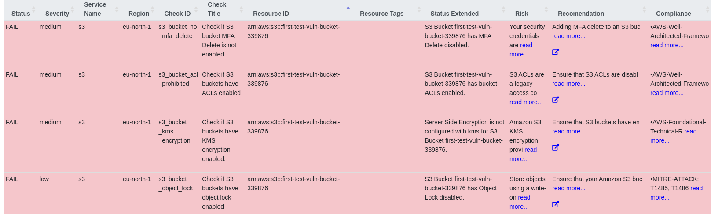
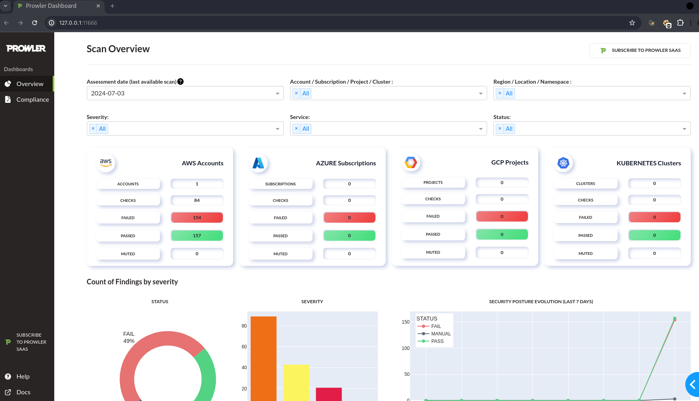

# AWS CSPM WITH PROWLER

## Abstract
[*Prowler*](https://github.com/prowler-cloud/prowler) is an open-source security tool designed to assess and enhance the security posture of *Amazon Web Services* and other cloud providers. 
By performing comprehensive audits, it identifies vulnerabilities and misconfigurations across various services.  
For red teamers, Prowler serves as a valuable asset, enabling them to simulate potential attack vectors, discover security gaps, and understand the implications of misconfigured resources.  
It provides detailed reports on compliance with industry standards, helping red teamers craft more effective strategies for exploiting weaknesses and ultimately strengthening an organization's defenses.  

## AWS CSPM with prowler
Cloud Security Posture Management (CSPM) tools like *Prowler* are crucial for red teamers as they provide comprehensive visibility and control over cloud infrastructure security.  
CSPM solutions continuously monitor and assess cloud environments for adherence to security best practices, compliance with regulations, and identification of misconfigurations and vulnerabilities. 
In this PoC we will execute a CSPM against an aws account by using prowler.  

## Instructions

Install prowler with pip and check the version:  
```sh
pip install prowler && prowler -v
```  

If you prefer can also [*run prowler with docker*](https://github.com/prowler-cloud/prowler?tab=readme-ov-file#containers). 

To know all the available options for the `aws provider` run:  

```sh
prowler aws -h
```  

Make sure to take a look at the [*requirements section*](https://docs.prowler.com/projects/prowler-open-source/en/latest/getting-started/requirements/) before launching a prowler scan. 

In particular you need to associated the following IAM policies to the user that you will use with prowler: 

- `arn:aws:iam::aws:policy/SecurityAudit`  
- `arn:aws:iam::aws:policy/job-function/ViewOnlyAccess`  

Now launch the aws scan by specifying your user or profile:  

```sh
prowler aws -p cspm
```  

The scan will start and, since we didnt specify a list of aws services, it will scan them all:  

```console
 _ __  _ __ _____      _| | ___ _ __
| '_ \| '__/ _ \ \ /\ / / |/ _ \ '__|
| |_) | | | (_) \ V  V /| |  __/ |
| .__/|_|  \___/ \_/\_/ |_|\___|_|v4.2.4
|_| the handy multi-cloud security tool

Date: 2024-07-03 10:38:59

-> Using the AWS credentials below:
  · AWS-CLI Profile: cspm
  · AWS Regions: all
  · AWS Account: <ACCOUNT-ID>
  · User Id: <USER-ID>
  · Caller Identity ARN: arn:aws:iam::<ACCOUNT-ID>:user/redteam

-> Using the following configuration:
  · Config File: /home/r3d/.local/lib/python3.11/site-packages/prowler/config/config.yaml
  · Mutelist File: /home/r3d/.local/lib/python3.11/site-packages/prowler/config/aws_mutelist.yaml
  · Scanning unused services and resources: False

Executing 359 checks, please wait...
-> Scanning drs service |▉▉▉▉▉▉▉▉▉▉▉▎                            | / 101/359 [28%] in 2:19
```  

After some minutes the scan has finished and printed all the findings to stdout:  

```sh
Overview Results:
╭─────────────────────┬────────────────────┬────────────────╮
│ 49.04% (154) Failed │ 50.0% (157) Passed │ 0.0% (0) Muted │
╰─────────────────────┴────────────────────┴────────────────╯

Account 654654171946 Scan Results (severity columns are for fails only):
╭────────────┬───────────────────┬───────────┬────────────┬────────┬──────────┬───────┬─────────╮
│ Provider   │ Service           │ Status    │   Critical │   High │   Medium │   Low │   Muted │
├────────────┼───────────────────┼───────────┼────────────┼────────┼──────────┼───────┼─────────┤
│ aws        │ accessanalyzer    │ FAIL (17) │          0 │      0 │        0 │    17 │       0 │
├────────────┼───────────────────┼───────────┼────────────┼────────┼──────────┼───────┼─────────┤
│ aws        │ account           │ PASS (0)  │          0 │      0 │        0 │     0 │       0 │
├────────────┼───────────────────┼───────────┼────────────┼────────┼──────────┼───────┼─────────┤
│ aws        │ backup            │ FAIL (1)  │          0 │      0 │        0 │     1 │       0 │
├────────────┼───────────────────┼───────────┼────────────┼────────┼──────────┼───────┼─────────┤
│ aws        │ cloudtrail        │ FAIL (36) │          0 │     17 │        0 │    19 │       0 │
├────────────┼───────────────────┼───────────┼────────────┼────────┼──────────┼───────┼─────────┤
│ aws        │ cloudwatch        │ FAIL (15) │          0 │      0 │       15 │     0 │       0 │
├────────────┼───────────────────┼───────────┼────────────┼────────┼──────────┼───────┼─────────┤
│ aws        │ config            │ FAIL (17) │          0 │      0 │       17 │     0 │       0 │
├────────────┼───────────────────┼───────────┼────────────┼────────┼──────────┼───────┼─────────┤
│ aws        │ ec2               │ PASS (34) │          0 │      0 │        0 │     0 │       0 │
├────────────┼───────────────────┼───────────┼────────────┼────────┼──────────┼───────┼─────────┤
│ aws        │ emr               │ PASS (17) │          0 │      0 │        0 │     0 │       0 │
├────────────┼───────────────────┼───────────┼────────────┼────────┼──────────┼───────┼─────────┤
│ aws        │ eventbridge       │ PASS (51) │          0 │      0 │        0 │     0 │       0 │
├────────────┼───────────────────┼───────────┼────────────┼────────┼──────────┼───────┼─────────┤
│ aws        │ guardduty         │ FAIL (17) │          0 │      0 │       17 │     0 │       0 │
├────────────┼───────────────────┼───────────┼────────────┼────────┼──────────┼───────┼─────────┤
│ aws        │ iam               │ FAIL (20) │          1 │      3 │       13 │     3 │       0 │
├────────────┼───────────────────┼───────────┼────────────┼────────┼──────────┼───────┼─────────┤
│ aws        │ organizations     │ FAIL (3)  │          0 │      0 │        2 │     1 │       0 │
├────────────┼───────────────────┼───────────┼────────────┼────────┼──────────┼───────┼─────────┤
│ aws        │ resourceexplorer2 │ FAIL (1)  │          0 │      0 │        0 │     1 │       0 │
├────────────┼───────────────────┼───────────┼────────────┼────────┼──────────┼───────┼─────────┤
│ aws        │ s3                │ FAIL (9)  │          0 │      1 │        7 │     1 │       0 │
├────────────┼───────────────────┼───────────┼────────────┼────────┼──────────┼───────┼─────────┤
│ aws        │ securityhub       │ FAIL (17) │          0 │      0 │       17 │     0 │       0 │
├────────────┼───────────────────┼───────────┼────────────┼────────┼──────────┼───────┼─────────┤
│ aws        │ vpc               │ FAIL (1)  │          0 │      0 │        1 │     0 │       0 │
╰────────────┴───────────────────┴───────────┴────────────┴────────┴──────────┴───────┴─────────╯
* You only see here those services that contains resources.
```  


It will also create a local `output` folder containing detailed reports in html, csv and json:  

  


With the `prowler dashboard` command you can also spin up a local, self hosted dashboard to show scan results and current posture:  

  


