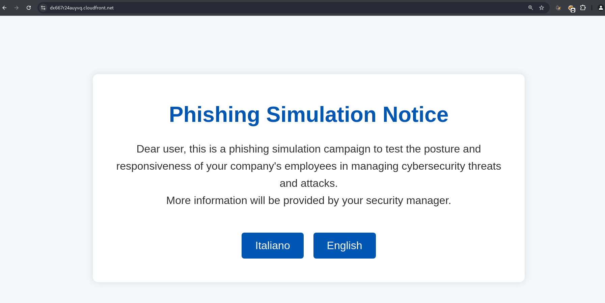

# AWS RED TEAM INFRASTRUCTURE


This document contains guidelines on deploying aws infrastructure that can be useful for red teaming campaigns.  

## Deploying a secure static website via AWS S3 and CloudFront  

The following Terraform configuration enables the seamless deployment of a static website to AWS S3 in a single step.   
The only prerequisites are an AWS account and an HTML landing page for the site (*index.hml* file, in the same root as the terraform manifest).  

This setup is particularly useful for red teaming campaigns, serving multiple purposes such as hosting payloads, creating phishing pages or redirects, providing command-and-control (C2) infrastructure, or staging files and logs for exfiltration scenarios.  


The resulting website already comes with TLS termination out of the box and it's hosted on the "*.cloudfront.net*" domain:  
AWS domains are typically not blocked or filtered by corporate firewalls.  


Terraform manifest (*main.tf*):  

```hcl
provider "aws" {
  region = "eu-north-1"
}

resource "random_string" "bucket_suffix" {
  length  = 6
  special = false
  upper   = false
  lower   = true
  numeric = true
}

resource "aws_s3_bucket" "static_site" {
  bucket = "your-bucket-name-here-${random_string.bucket_suffix.result}"
}

resource "aws_s3_object" "terraform_index" {
  bucket = aws_s3_bucket.static_site.id
  key    = "index.html"
  source = "index.html"
  content_type = "text/html"
  etag = filemd5("index.html")
}

resource "aws_s3_bucket_ownership_controls" "example" {
  bucket = aws_s3_bucket.static_site.id

  rule {
    object_ownership = "BucketOwnerPreferred"
  }
}

resource "aws_s3_bucket_website_configuration" "blog" {
  bucket = aws_s3_bucket.static_site.id
  index_document {
    suffix = "index.html"
  }
}

resource "aws_s3_bucket_public_access_block" "public_access" {
  bucket = aws_s3_bucket.static_site.id

  block_public_acls       = true
  ignore_public_acls      = true
  block_public_policy     = true
  restrict_public_buckets = true
}

# S3 bucket policy for CloudFront access
resource "aws_cloudfront_origin_access_control" "cf-s3-oac" {
  name                              = "CloudFront-S3-OAC"
  description                       = "CloudFront S3 OAC"
  origin_access_control_origin_type = "s3"
  signing_behavior                  = "always"
  signing_protocol                  = "sigv4"
}

resource "aws_s3_bucket_policy" "static_site_bucket_policy" {
  bucket = aws_s3_bucket.static_site.id

  policy = jsonencode({
    Version = "2012-10-17"
    Statement = [
      {
        Effect = "Allow"
        Principal = {
          Service = "cloudfront.amazonaws.com"
        }
        Action = "s3:GetObject"
        Resource = "${aws_s3_bucket.static_site.arn}/*"
        Condition = {
          StringEquals = {
            "AWS:SourceArn" = aws_cloudfront_distribution.cf-dist.arn
          }
        }
      }
    ]
  })
}

resource "aws_cloudfront_distribution" "cf-dist" {
  enabled             = true
  default_root_object = "index.html"

  origin {
    domain_name              = aws_s3_bucket.static_site.bucket_regional_domain_name
    origin_id                = aws_s3_bucket.static_site.bucket
    origin_access_control_id = aws_cloudfront_origin_access_control.cf-s3-oac.id
  }

  default_cache_behavior {
    allowed_methods  = ["GET", "HEAD"]
    cached_methods   = ["GET", "HEAD"]
    target_origin_id = aws_s3_bucket.static_site.bucket
    forwarded_values {
      query_string = false

      cookies {
        forward = "none"
      }
    }
    viewer_protocol_policy = "redirect-to-https"
    min_ttl                = 0
    default_ttl            = 3600
    max_ttl                = 86400
  }

  price_class = "PriceClass_All"

  restrictions {
    geo_restriction {
      restriction_type = "whitelist"
      locations        = ["IT"]
    }
  }

  viewer_certificate {
    cloudfront_default_certificate = true
  }

  tags = {
    Name = "cloudfront-distribution"
  }
}

output "website_url" {
  value = "https://${aws_cloudfront_distribution.cf-dist.domain_name}"
}

```  

Launch deployment:  
```sh
terraform init && terraform plan && terraform apply
```  

Example static website:  
  
