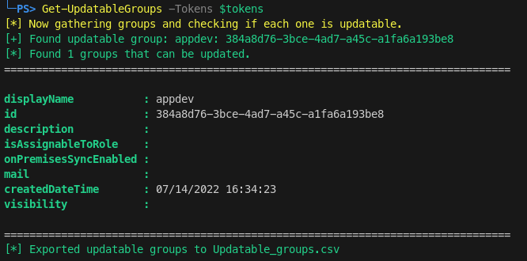

# Pentesting Azure with Graph Runner

## Abstract
This guides demonstrate how to pentest an Entra ID environment by leveraging the GraphRunner too.  
[*GraphRunner*](https://github.com/dafthack/GraphRunner) is an exploitation toolset for interacting with the Microsoft Graph API.  
It provides various tools for performing reconnaissance, persistence, and pillaging of data from a Microsoft Entra ID (Azure AD) account.  


## Instructions
You can use the tool on your (attacker) linux host, but you first need to [*install powershell*](https://learn.microsoft.com/en-us/powershell/scripting/install/installing-powershell-on-linux?view=powershell-7.5).  

Once you have powershell installed, clone the repository:  
```sh
git clone https://github.com/dafthack/GraphRunner.git && cd GraphRunner
```  

Now launch powershell on linux: 

```sh
pwsh
```  

Now import the main module:   
```sh
Import-Module .\GraphRunner.ps1
```  

  

You can list all sub-modules with the `List-GraphRunnerModules` command:  
  


The first step is gaining initial access and for this we need to authenticate as a user to Microsoft Graph.  
For example you can use the `Get-GraphTokens` to get the device code from Microsoft Endpoint and send it to target (eg. via a phishing email):  

  
  
  
  


During your assessment, your tokens (victim tokens) will expire. 
You should renew them periodically, that can be done via `Invoke-RefreshGraphTokens`.  

Now that you have valid tokens you can procede and leverage the sub modules of GraphRunner, for example you can list all the updatable groups  
(you can add your victim user in these groups with its privileges and search for more sensitive datas in other teams chat/outlook and OneDrive files):   

```sh
Get-UpdatableGroups -Tokens $tokens
```  

  

Inside the cloned repo there is also an html file, `GraphRunnerGUI.html` that you can use as a GUI:  

  


 
