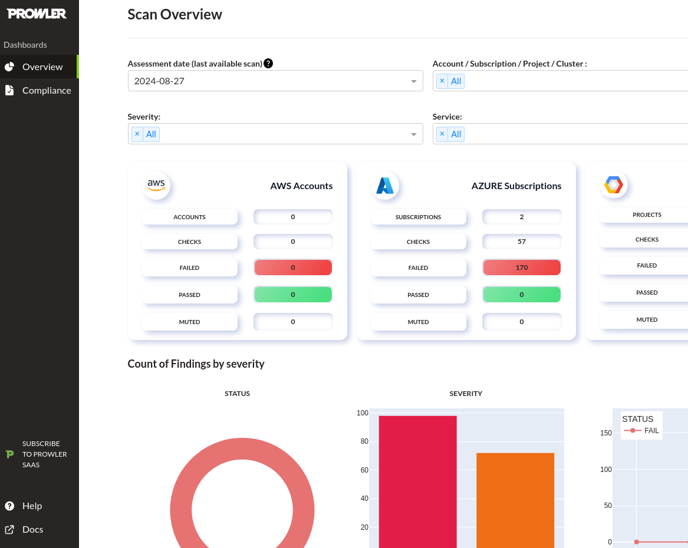

# AZURE CSPM WITH PROWLER

## Abstract  

[*Prowler*](https://github.com/prowler-cloud/prowler) is an open-source security tool designed to assess and enhance the security posture of Azure and other cloud providers.  
By performing comprehensive audits, it identifies vulnerabilities and misconfigurations across various services.   
For red teamers, Prowler serves as a valuable asset, enabling them to simulate potential attack vectors, discover security gaps, and understand the implications of misconfigured resources.   
It provides detailed reports on compliance with industry standards, helping red teamers craft more effective strategies for exploiting weaknesses and ultimately strengthening an organization's defenses.  


## Azure CSPM with prowler  

Cloud Security Posture Management (CSPM) tools like Prowler are crucial for red teamers as they provide comprehensive visibility and control over cloud infrastructure security.  
CSPM solutions continuously monitor and assess cloud environments for adherence to security best practices, compliance with regulations, and identification of misconfigurations and vulnerabilities.  

In this PoC we will execute a CSPM against an azure account by using prowler.  


## Instructions  
Install prowler with pip and check the version:  
```sh
pip install prowler && prowler -v
```  

If you prefer can also [*run prowler with docker*](https://github.com/prowler-cloud/prowler?tab=readme-ov-file#containers).  

To know all the available options for the azure provider run:  
```sh
prowler azure -h
```   

Make sure to take a look at the [*requirements*](https://docs.prowler.com/projects/prowler-open-source/en/latest/getting-started/requirements/#azure) section before launching a prowler scan.  

Now launch the azure scan by specifying all the required env vars:  
```sh
export AZURE_CLIENT_ID="<CLIENT-ID-HERE>" 
export AZURE_TENANT_ID="<TENANT-ID-HERE>"
export AZURE_CLIENT_SECRET="<CLIENT-SECRET-HERE>"
export AZURE_SUBSCRIPTION_ID="<SUBSCRIPTION-ID-HERE>"

prowler azure --status FAIL --severity critical high medium --sp-env-auth --subscription-ids $AZURE_SUBSCRIPTION_ID
```  

The scan will start and, since we didn't specify a list of azure services, it will scan them all:  
```sh

                         _
 _ __  _ __ _____      _| | ___ _ __
| '_ \| '__/ _ \ \ /\ / / |/ _ \ '__|
| |_) | | | (_) \ V  V /| |  __/ |
| .__/|_|  \___/ \_/\_/ |_|\___|_|v4.3.3
|_| the handy multi-cloud security tool

Date: 2024-08-27 11:53:17

-> Using the Azure credentials below:
  · Azure Tenant Domain: testmail.example.com Azure Tenant ID: a873fdfe-4ba0-4ead-b2ca-d3b521751a45
  · Azure Region: AzureCloud
  · Azure Subscriptions: ['Example: d71d20de-ab72-658a-74e6-fe376638ed3e']
  · Azure Identity Type: Service Principal Azure Identity ID: 03d61eed-6246-3afe-8697-89acffca7be0

-> Using the following configuration:
  · Config File: ~/.local/lib/python3.11/site-packages/prowler/config/config.yaml

Executing 128 checks, please wait...
Something went wrong in iam_custom_role_has_permissions_to_administer_resource_locks, please use --log-level ERROR
-> Scanning keyvault service |▉▉▉▉▉▉▉▉▉▉▉▉▉▉▉▉▉▉▉                     | - 61/128 [48%] in 37s                         | / 101/359 [28%] in 2:19
```  

After some minutes the scan has finished and printed all the findings to stdout:  
```sh
Tenant Domain testmail.example.com Scan Results (severity columns are for fails only):
╭────────────┬───────────┬───────────┬────────────┬────────┬──────────┬───────┬─────────╮
│ Provider   │ Service   │ Status    │   Critical │   High │   Medium │   Low │   Muted │
├────────────┼───────────┼───────────┼────────────┼────────┼──────────┼───────┼─────────┤
│ azure      │ app       │ FAIL (10) │          0 │      0 │       10 │     0 │       0 │
├────────────┼───────────┼───────────┼────────────┼────────┼──────────┼───────┼─────────┤
│ azure      │ defender  │ FAIL (10) │          0 │      7 │        3 │     0 │       0 │
├────────────┼───────────┼───────────┼────────────┼────────┼──────────┼───────┼─────────┤
│ azure      │ entra     │ FAIL (26) │          0 │     18 │        8 │     0 │       0 │
├────────────┼───────────┼───────────┼────────────┼────────┼──────────┼───────┼─────────┤
│ azure      │ keyvault  │ FAIL (54) │          0 │     52 │        2 │     0 │       0 │
├────────────┼───────────┼───────────┼────────────┼────────┼──────────┼───────┼─────────┤
│ azure      │ monitor   │ FAIL (12) │          0 │     10 │        2 │     0 │       0 │
├────────────┼───────────┼───────────┼────────────┼────────┼──────────┼───────┼─────────┤
│ azure      │ network   │ FAIL (3)  │          0 │      1 │        2 │     0 │       0 │
├────────────┼───────────┼───────────┼────────────┼────────┼──────────┼───────┼─────────┤
│ azure      │ sqlserver │ FAIL (6)  │          0 │      0 │        6 │     0 │       0 │
├────────────┼───────────┼───────────┼────────────┼────────┼──────────┼───────┼─────────┤
│ azure      │ storage   │ FAIL (48) │          0 │      9 │       39 │     0 │       0 │
├────────────┼───────────┼───────────┼────────────┼────────┼──────────┼───────┼─────────┤
│ azure      │ vm        │ FAIL (1)  │          0 │      1 │        0 │     0 │       0 │
╰────────────┴───────────┴───────────┴────────────┴────────┴──────────┴───────┴─────────╯
```  

It will also create a local output folder containing detailed reports in html, csv and json.

 You can also run `prowler dashboard` to display the resutls in a web UI:  

  


