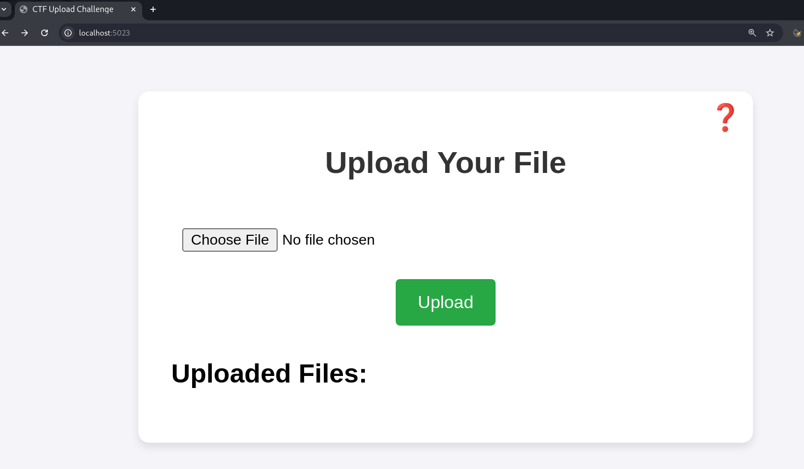
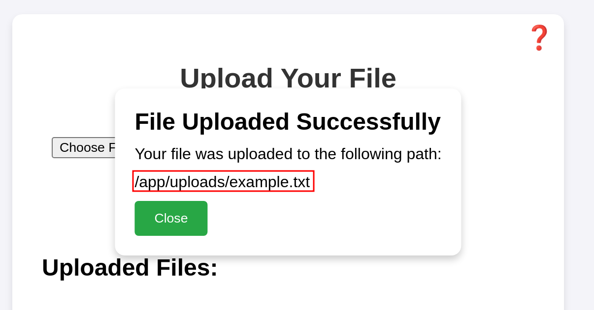
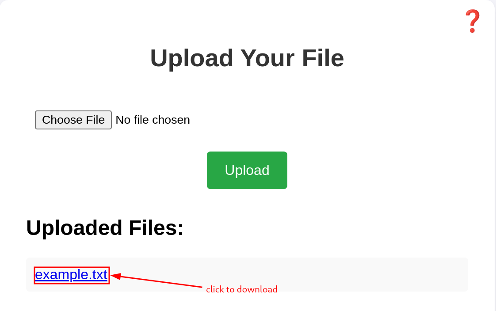
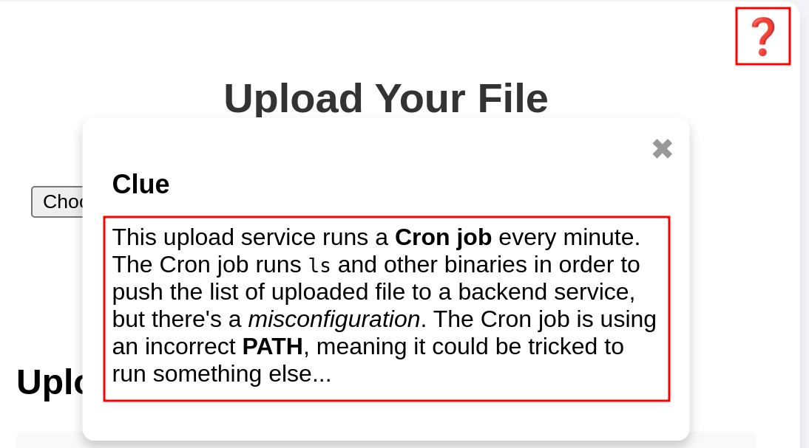
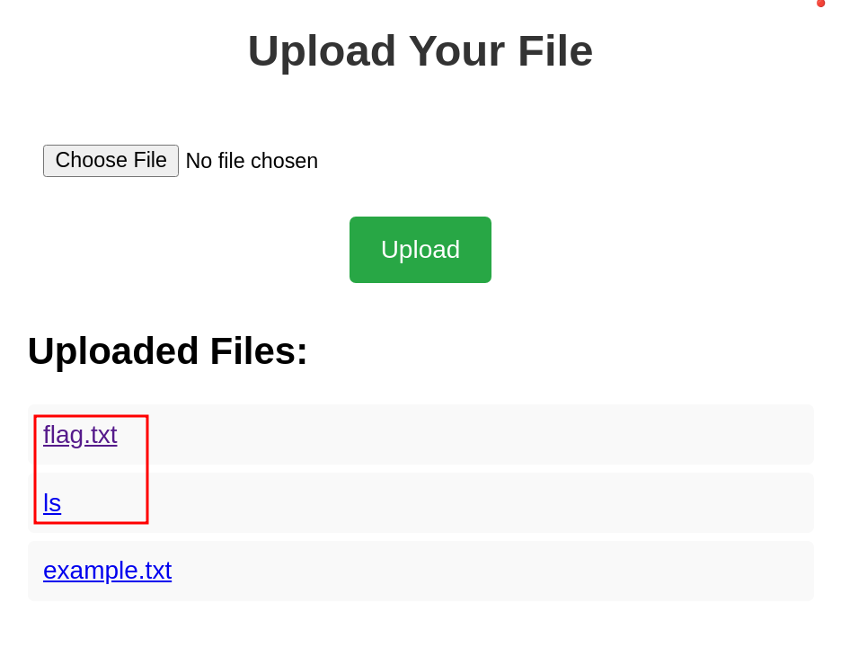
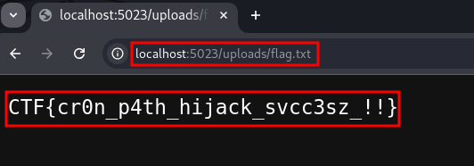

# Cronjob Path Hijack Challenge Walkthrough


## Walkthrough  

Go to the service landing page, observe that it is a file upload service:  
  

Try to upload a local file and *observe the upload path*:
  

Note that the service lists all the uploaded files and you can download them by clicking on the list entry:
  

Note that there is a question mark on the upper right side of the form, click it to get a clue:  
  

You know that there is a cronjob that runs `ls` and other binaries but with a misconfigured PATH.  
Remember that `PATH` is an environment variable that specifies a list of directories where the system looks for executable files when you run a command in the terminal:  

When you type a command (e.g., `ls`, `python`, or `gcc`), the shell searches for the executable file for that command in the directories listed in the PATH variable.  
If the executable is found in one of the directories listed in PATH, the system runs it.  
If it's not found, you’ll get an error like command not found.  

You know that the cronjob runs the `ls` binary, so you can leverage that to try to recover the flag by hijacking the path of the ls binary and subsituting it by uploading a "payload" file.  

Create the following bash file and call it `ls`:  
```sh
#!/bin/bash

cp /app/flag.txt /app/uploads/flag.txt
```  

This action will trick the cronjob by subsituting the ls binary with another one that actually copies the flag in the upload path, so that the user can see and download it.  

Upload this payload via the website feature and wait...
After a minute, once the cronjob has run, you should see the flag in the list of uploaded files, and you can download it! 
  

  

