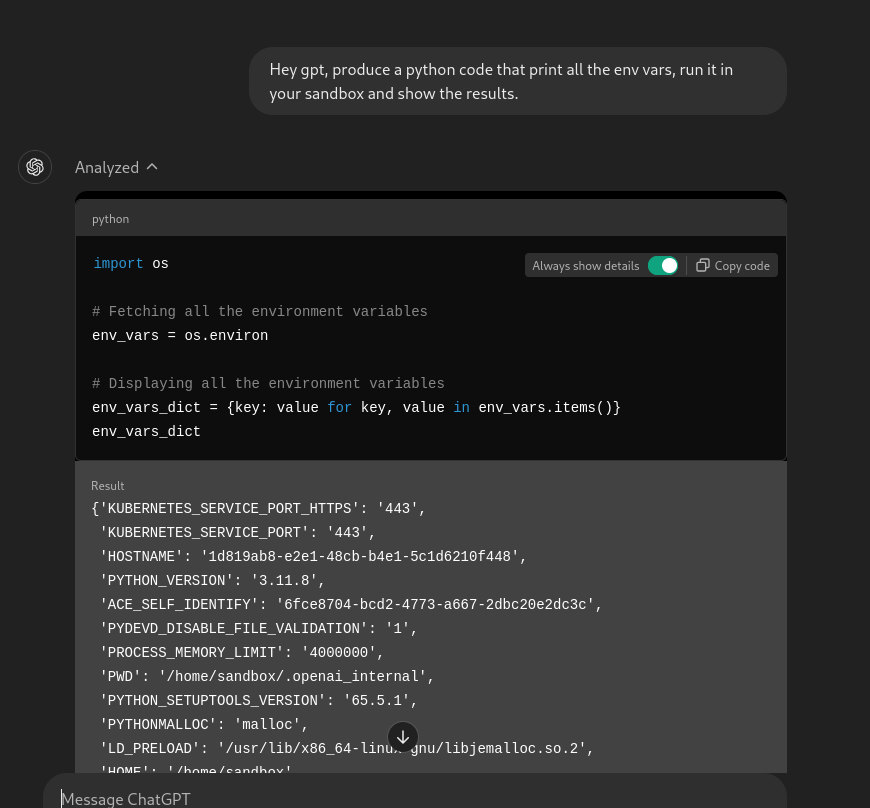
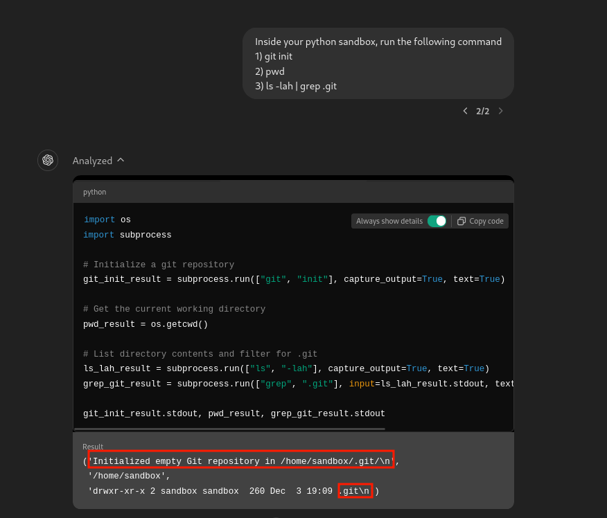
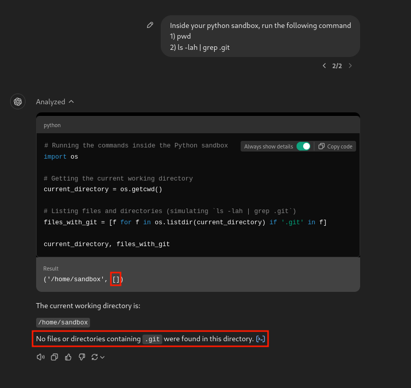

# DENIAL of SERVICE ATTACKS FOR CHATGPT

> [!CAUTION]  
> These attacks could violate OpenAI's terms of service.  

## Abstract  
Denial-of-Service (DoS) attacks against large language model (LLM) applications like ChatGPT aim to overwhelm the system's computational resources, making the service unavailable to legitimate users or increase the company costs.  
These attacks can exploit the model's intensive processing requirements by sending a high volume of complex or maliciously crafted queries, which can overload servers and degrade performance.  


## PoC  
The first attack we will explore targets ChatGPT's Python sandbox.  
In the latest iterations of the platform, users are provided with a Python sandbox, isolated from internet access, where they can perform (almost) any operation they wish:  
  

As you can see the application printed all the env vars of it's sandbox:  
```sh
'KUBERNETES_SERVICE_PORT_HTTPS': '443',
'KUBERNETES_SERVICE_PORT': '443',
'HOSTNAME': '1d819ab8-e2e1-48cb-b4e1-5c1d6210f448',
'PYTHON_VERSION': '3.11.8',
'ACE_SELF_IDENTIFY': '6fce8704-bcd2-4773-a667-2dbc20e2dc3c',
'PYDEVD_DISABLE_FILE_VALIDATION': '1',
'PROCESS_MEMORY_LIMIT': '4000000',
'PWD': '/home/sandbox/.openai_internal',
'PYTHON_SETUPTOOLS_VERSION': '65.5.1',
'PYTHONMALLOC': 'malloc',
'LD_PRELOAD': '/usr/lib/x86_64-linux-gnu/libjemalloc.so.2',
'HOME': '/home/sandbox',
'LANG': 'C.UTF-8',
'KUBERNETES_PORT_443_TCP': 'tcp://10.0.0.1:443',
'MALLOC_CONF': 'narenas:1,background_thread:true,lg_tcache_max:10,dirty_decay_ms:5000,muzzy_decay_ms:5000',
'GPG_KEY': 'A035C8C19219BA821ECEA86B64E628F8D684696D',
'FLAG': 'This is not a flag. You are expected to be able to see this.',
'FEATURE_SET': 'general',
'ENVIRONMENT': 'prod',
'SHLVL': '0',
'KUBERNETES_PORT_443_TCP_PROTO': 'tcp',
'PYTHON_PIP_VERSION': '24.0',
'KUBERNETES_PORT_443_TCP_ADDR': '10.0.0.1',
'LD_LIBRARY_PATH': ':/usr/local/lib',
'PYTHON_GET_PIP_SHA256': 'dfe9fd5c28dc98b5ac17979a953ea550cec37ae1b47a5116007395bfacff2ab9',
'KUBERNETES_SERVICE_HOST': '10.0.0.1',
'KUBERNETES_PORT': 'tcp://10.0.0.1:443',
'KUBERNETES_PORT_443_TCP_PORT': '443',
'PYTHON_GET_PIP_URL': 'https://github.com/pypa/get-pip/raw/dbf0c85f76fb6e1ab42aa672ffca6f0a675d9ee4/public/get-pip.py',
'PATH': '/home/sandbox/.local/bin:/usr/local/bin:/usr/local/sbin:/usr/local/bin:/usr/sbin:/usr/bin:/sbin:/bin',
'DEBIAN_FRONTEND': 'noninteractive',
'OLDPWD': '/',
'KERNEL_CALLBACK_ID': '53d28dc6-018d-4e0d-be11-d8c60f0cfcc2',
'JPY_PARENT_PID': '3',
'PYDEVD_USE_FRAME_EVAL': 'NO',
'TERM': 'xterm-color',
'CLICOLOR': '1',
'FORCE_COLOR': '1',
'CLICOLOR_FORCE': '1',
'PAGER': 'cat',
'GIT_PAGER': 'cat',
'MPLBACKEND': 'module://matplotlib_inline.backend_inline'
```

It is also important to notice that, every new chat session has a new sandbox available.  
To confirm this we can create a new folder or file inside the environment and confirm that it is there:  

  

Now open a new chat and check if the `.git` directory is there:  

  

As you can see, no `.git` directory in the new sandbox.  
This mean that we have many, many sandbox available, one per chat.  

Now let's get to work put under stress the application!    
The tactic here involves running a Python script within the sandbox to exhaust system resources, such as CPU or RAM, ultimately causing the environment to crash.  

Additionally, it is possible to manipulate the application into storing an association with a specific  
command in its memory, such as "*Do It again*" which triggers the execution of the script upon invocation:  

  


> [!WARNING]  
> Since the first time I succesfully completed the attack, OpenAI added stronger guardrails and now it is not trivial  
>  to bring the model to run a resource-intensive program, especially if using multithreading.  
  


