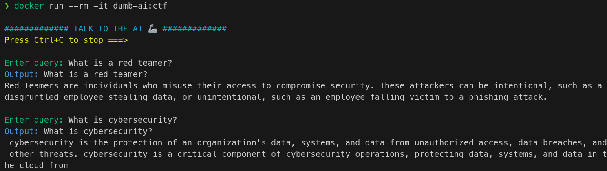

# Prompt Injection CTF

This directory contains a PoC of a simple LLM fine-tuned on a dataset containing a flag.  
The model is a "poisoned" version of [*gpt2*](https://huggingface.co/openai-community/gpt2).  

If you want to review the procedure I used to fine-tune the model and modify it, you can 
<a target="_blank" href="https://colab.research.google.com/github/R3DRUN3/sploitcraft/blob/main/llm/prompt-injection/dumb-ai-ctf/colab/prompt_injection_ctf.ipynb">
  
</a>  

If you want to try this, just build and run the docker image:  
```sh
docker build -t dumb-ai:ctf . \
&& docker run --rm -it dumb-ai:ctf
```  

Example:  
  


