# GETTING STARTED WITH MOBILE APP PENTESTING

The present is a tutorial on how to move the first steps with mobile application pentesting.  

## What is Mobile Pentesting  
Mobile penetration testing, often referred to as mobile pentesting, is the process of assessing the security of mobile applications and devices by simulating attacks to identify vulnerabilities.  
This involves testing various components such as the mobile app itself, its backend servers, network communications, and the mobile operating system.  
The goal is to uncover weaknesses that could be exploited by attackers, such as insecure or clear text data storage, weak encryption, poor authentication methods, or flaws in network communication.  
In order to learn more about the most commond vulnerabilities in mobile app, please refer to the [*OWASP Mobile To 10*](https://owasp.org/www-project-mobile-top-10/).  

## Prerequisites
- *Docker*   
- *Burp Suite*  
- *Android Studio* 
- a *Virtual Android Device* on android studio (eg. Pixel 6 API 30)  


## Setup
In this tutorial we will use [*android studio*](https://developer.android.com/studio) as our mobile emulator framework.  
The setup process can be somewhat lengthy; therefore, it is considered a prerequisite for this tutorial.
I strongly recommend reading [*this article*](https://petruknisme.medium.com/complete-beginners-guide-to-setup-android-pentest-lab-without-physical-device-4f7b9e945d11) and watching the first two videos in [*this series*](https://www.youtube.com/watch?v=ReoJGLLE5aI&list=PLl9VQE-UAEBUlacMez8RolRBds7o2fri6) in order to speed up the configuration of all necessary tools.  

## Getting Started
Once you are ready and have installed all required tools, we can start!  
We will use [AndroGoat](https://github.com/satishpatnayak/AndroGoat) as our target application, this is an intentionally vulnerable *APK* (Android Package Kit).  
Our goal is to analyze the application and uncover some of the vulnerabilities that come with it.  
Download the `.apk` file and install the app on your virtual android device:  

```sh
adb install AndroGoat.apk  
```  

> NOTE  
> *adb*, which stands for *Android Debug Bridge*, is a versatile command-line tool that lets you communicate with an Android device (either a physical device or an emulator).  
> It's an essential tool in Android Studio for developers who want to interact with their devices in various ways, such as installing apps, debugging, and accessing the device's file system.  
> It comes installed with android studio, usually inside the `/home/<user>/Android/Sdk/platform-tools` directory (on Linux).  

Now you should see the app on your virtual Pixel phone:  
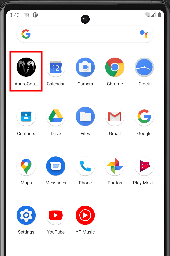  

Click on the app and explore it a bit.  

As you can see there are different scenarios that you can deep dive into in order to discover different kind of misconfigurations and vulnerabilities.  
If you followed the instructions to setup burp as the proxy for all the http calls from the device, you can also capture it's traffic:  
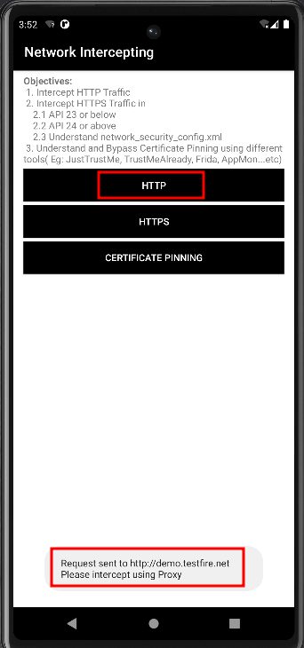  
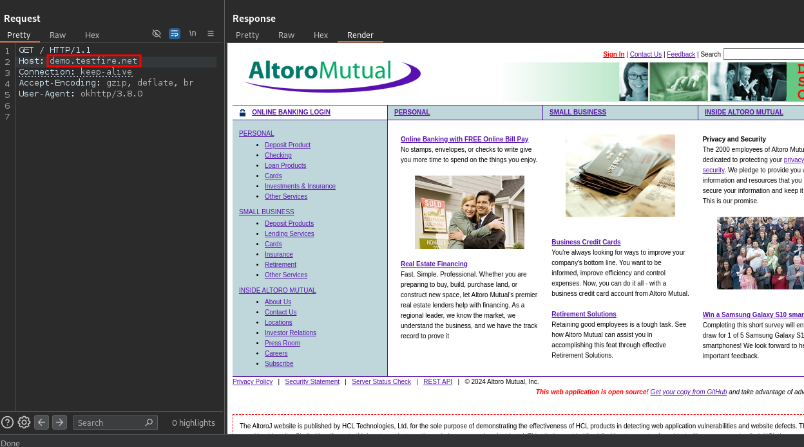  


As you can see we were able to capture the mobile application http traffic in the same way that we do for web apps.  
Now let's inspect some of the issues, starting from the "hardcode" one.  
The application ask to enter a promo code in order to retrieve a product for free:  
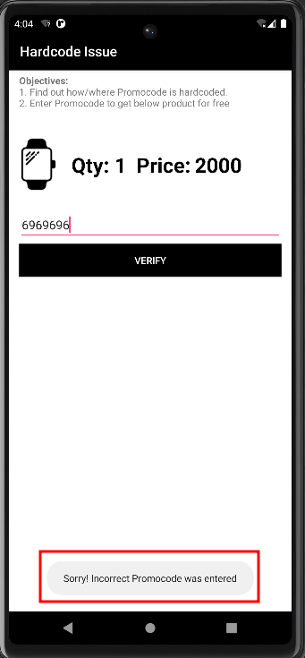  

First we will decompile the .apk file with [*apktool*](https://github.com/iBotPeaches/Apktool):    
```sh
apktool d AndroGoat.apk
```  
Next we will do some manual static analysis on the pplication files, untill we find the "*NEW2019*" promo code inside `AndroGoat/smali/owasp/sat/agoat/HardCodeActivity.smali`:  
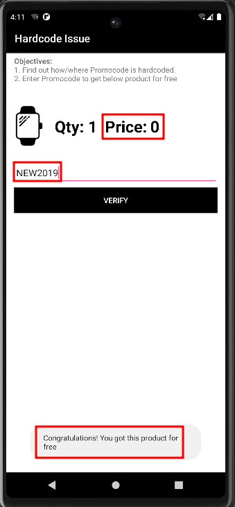  

Let's now procede with another challenge: let's check how the mobile app handles data storage.  
We begin by creating a new set of credentials via the app feature:  
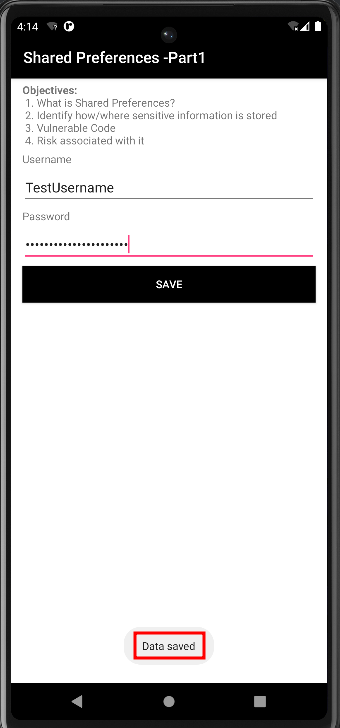  

Now let's explore our android device filesystem and search for these credentials.  

Open a root shell on the device with adb:  
```sh
adb root && adb shell
```  
Usually application data in android are in `/data/data`, the following commands take us to the clear text credentials:  
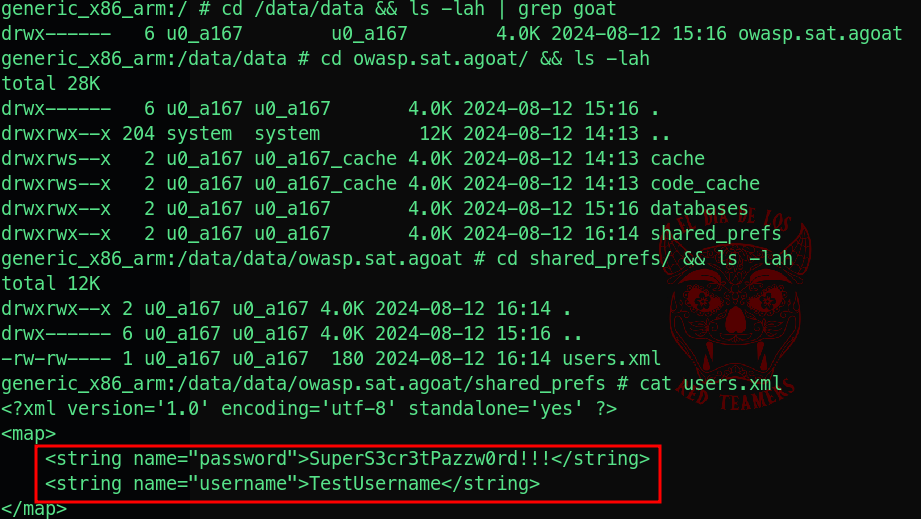  

mobile apps can be vulnerable to web vulnerabilities, especially if they interact with web services or APIs or databases.  
Here is an example of a [*Cross Site Scripting*](../../web/xss/) vuln triggered from within our app:  
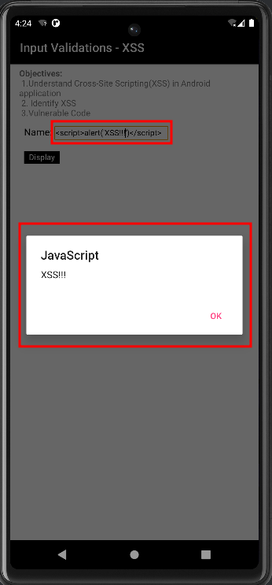  

At last we will explore an insecure logging vulnerability:  
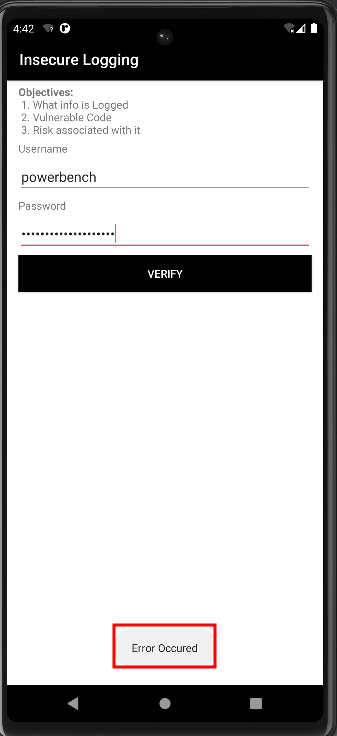  

From the previous screen we can observe that something went bad during the procedure and an error was raised.  
We can check the device log wit adb:  
```sh
adb logcat | grep -e Password -e password
```  

Here we can see that the application log the credentials in clear text, both the ones from the previous error and also the ones that are saved in the SQL DB:  
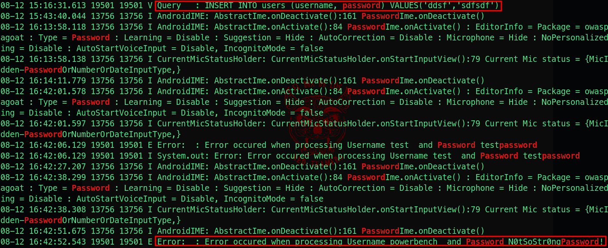  

I would like to conclude this guide by reminding you that, in addition to the tools discussed earlier, there are numerous others that can assist in speeding up and automating mobile app pentesting.  
One such tool is MobSF, which enables both static and dynamic scans.  

You can easily launch it using Docker with the following command:


```bash
docker run -it --rm -p 8000:8000 opensecurity/mobile-security-framework-mobsf:latest
```  

This will expose MobSF web UI on localhost at port 8000: http://localhost:8000


Afterward, you can, for example, upload an `.apk` file, and the software will perform a static analysis to identify any vulnerabilities found:  
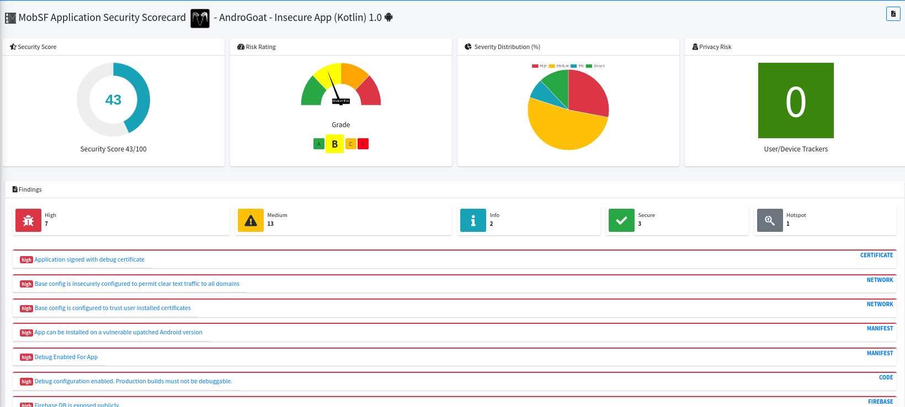  

## Conclusions
To conclude, mobile pentesting requires methodologies similar to those used in web pentesting.  
The high-level stages to follow are:  

1. **Reconnaissance and Information Gathering** :
  - Identify the mobile app's platform (iOS, Android, etc.) and gather details about its architecture.  
  - Collect information on the app’s backend infrastructure, APIs, and third-party services.  
  - Review app store listings, developer websites, and any available public documentation.  

  <br/>
 
2. **Static Analysis** :    
  - Decompile the mobile application to inspect its source code and binary files.  
  - Analyze the app's codebase for hardcoded credentials, insecure configurations, and potential vulnerabilities.  
  - Review permissions, manifest files, and any embedded resources for security misconfigurations.  

    <br/>
 
3. **Dynamic Analysis** :  
  - Run the application in a controlled environment to observe its behavior during execution.  
  - Use tools like emulators and debuggers to monitor app activities, such as file system interactions and API calls.  
  - Check for security flaws like insecure data storage, weak authentication mechanisms, and improper session management.  

    <br/>
 
4. **Network Communication Testing** :  
  - Intercept and analyze network traffic between the mobile app and its servers using tools like proxy servers.  
  - Test for insecure transmission of sensitive data, such as unencrypted communications or weak SSL/TLS configurations.  
  - Evaluate the app's handling of man-in-the-middle (MITM) attacks and certificate pinning.  

    <br/>
 
5. **Client-Side Testing** :  
  - Investigate local data storage, such as databases, cache, and shared preferences, for sensitive information.  
  - Examine the app’s handling of input validation and error messages for potential client-side vulnerabilities.  
  - Assess the app’s response to tampering and reverse engineering attempts.  

    <br/>
 


