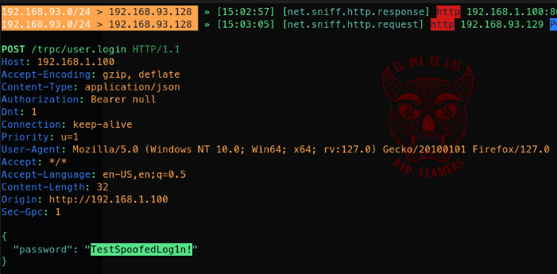

# ARP SPOOFING

ARP spoofing (Address Resolution Protocol spoofing) is a cyber attack where an attacker sends falsified ARP (Address Resolution Protocol) messages over a local network.  
This results in the linking of the attacker's MAC address with the IP address of a legitimate computer or server on the network.  

Consequently, the attacker can intercept, modify, or block data intended for the legitimate IP address, leading to potential data breaches, man-in-the-middle attacks, or network disruptions.  

In this demo we will demonstrate an ARP spoofing attack with [*bettercap*](https://github.com/bettercap/bettercap).   
`Bettercap` is a powerful, flexible, and portable tool created to perform various types of MITM (Man-In-The-Middle)attacks.  
<br/>  
Our setup consist of two virtual machine in the same subnet:  
1. `Kali linux` (attacker machine): 192.168.93.128
1. `Windows 11` (victim machine): 192.168.93.129

## Instructions

**Launch bettercap docker container**:  
```sh
docker run -it --privileged --net=host bettercap/bettercap sudo bettercap -iface eth0
```  
This starts Bettercap, using the specified network interface (e.g., `eth0`). Bettercap will initialize and prepare to monitor and manipulate network traffic.
 
**Configure Bettercap for ARP Spoofing**:

```bash
net.probe on
```
 
This command enables network probing, allowing Bettercap to discover hosts on the network by sending ARP requests and listening for responses.


```bash
net.sniff on
```
 
This enables packet sniffing, making Bettercap capture and display network traffic passing through the network interface.


```bash
set arp.spoof.targets 192.168.93.129
```
 
This command sets the target for the ARP spoofing attack.  
Bettercap will focus on intercepting traffic from the Windows VM with IP address `192.168.93.129`.  


```bash
arp.spoof on
```
 
This enables ARP spoofing, where Bettercap sends ARP packets to the target and the network gateway.  
The packets claim that the Kali VM's MAC address is associated with both the target IP (192.168.93.129) and the gateway's IP.  
This makes the target VM believe the Kali VM is the gateway, and vice versa.
 
**Monitor HTTP Traffic**

```bash
http.proxy on
```
 
This enables Bettercap's HTTP proxy: HTTP traffic passing through the Kali VM will be intercepted and logged.  


```bash
https.proxy.sslstrip on
```
 
This enables SSL stripping, where Bettercap will downgrade HTTPS connections to HTTP whenever possible.  
This allows Bettercap to capture the contents of these connections, including credentials, because the traffic is no longer encrypted.  
 
**Access the HTTP Login Page**
On the Windows 11 VM, we simulate the victim opening a browser and navigating to an HTTP login page (in our case an [*umbrel*](https://github.com/getumbrel/umbrel) node login form) and entering credentials.  
 
The Windows VM sends HTTP requests to the login server.    
These requests pass through the Kali VM (acting as the gateway due to ARP spoofing).    
Bettercap intercepts these requests, logs the traffic, and forwards it to the actual gateway.  
 
**Capture the Credentials**:
Bettercap logs the HTTP traffic, including the login credentials entered on the Windows VM.    
This information is displayed in the Bettercap terminal, allowing you to see the captured credentials:  

  


### Detailed Flow of Network Traffic 
 
- **ARP Spoofing** :
  - Kali VM (Bettercap) sends ARP packets to the Windows VM and the network gateway.

  - The Windows VM updates its ARP cache to associate the gateway's IP with the Kali VM's MAC address.

  - The network gateway updates its ARP cache to associate the Windows VM's IP with the Kali VM's MAC address.
 
- **Traffic Interception** :
  - The Windows VM sends HTTP requests to the login server, thinking it's communicating directly with the gateway.

  - These requests are intercepted by the Kali VM due to the ARP spoofing.

  - Bettercap logs and potentially modifies the traffic, then forwards it to the actual gateway.

  - The responses from the server are intercepted by the Kali VM, logged, and then forwarded to the Windows VM.
 
- **Credential Capture** :
  - When the Windows VM submits credentials on an HTTP login page, the credentials are part of the HTTP POST request.

  - Bettercap captures this HTTP POST request, extracting and logging the credentials before forwarding the request to the actual server.