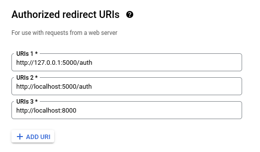
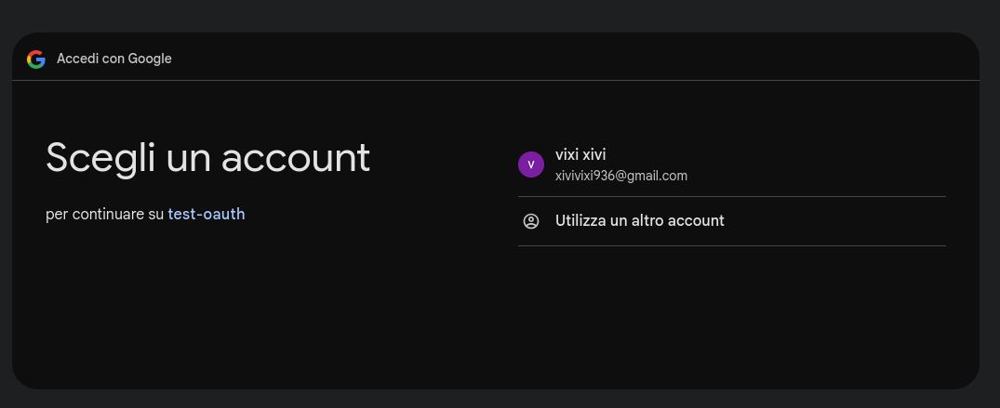
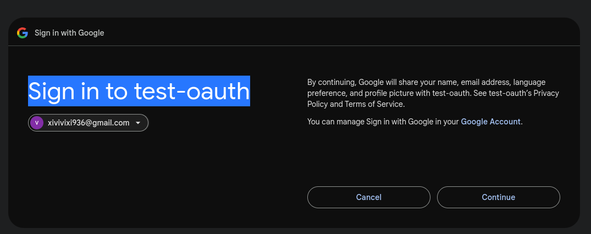
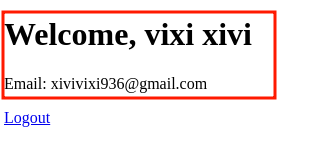
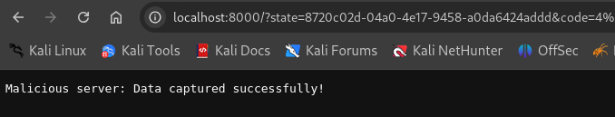
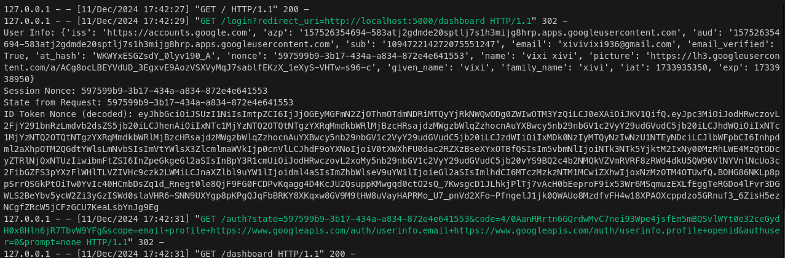

# Open Redirect Vulnerable Web Application 

This project demonstrates a simple Python web application using Flask that is vulnerable to an Open Redirect attack in the OAuth flow.  
The application accepts user input for the redirect URI without validating it, allowing attackers to redirect users to a malicious server to steal sensitive information, such as OAuth tokens.  


---


## Why It Is Vulnerable 
The vulnerability exists because the application dynamically constructs the redirect URI for the OAuth flow based on user-provided input, without verifying whether the URI is valid or trusted.  
This allows an attacker to manipulate the `redirect_uri` parameter and redirect users to malicious servers.  

---


## Type of Vulnerability 
This is an example of an **Open Redirect Vulnerability**.  
In this attack:  
- A user is redirected to an attacker-controlled server due to insufficient validation of redirect URIs.  

- The attacker can intercept sensitive information, such as OAuth tokens, or trick the user into interacting with a malicious server.  


---


## Steps to Launch the App and Test the Vulnerability   

0. **Set Up a Google Oauth App**  
Follow [*this documentation*](https://developers.google.com/identity/protocols/oauth2/web-server) in order to setup all that you need on the google side.   
Remember to specify `web application` as the application type and to set the following as the redirect URIs:  
  
Then copy the client ID and secret and put them in `app.py`:  
```python
# Configuration for OAuth
app.config["GOOGLE_CLIENT_ID"] = "<YOUR-CLIENT-ID>"  
app.config["GOOGLE_CLIENT_SECRET"] = "<YOUR-CLIENT-SECRET>"  
```  


1. **Set Up a Virtual Environment**  

```bash
python -m venv venv
source venv/bin/activate 
```
2. **Install Requirements**  

```bash
pip install -r requirements.txt
```  
3. **Run the Application**  

```bash
python app.py
```  

4. **Set Up a "Malicious" Server**  
```bash
python attacker_server.py
```

5. **Access the Application**  
Open your web browser and navigate to `http://127.0.0.1:5000/login`.  
Test the authentication flow via google:  
  
  
  
  


1. **Test the Vulnerability**  
In order to showcase the vulnerability, use the `/vulnerable-login` endpoint, 
Append the malicious `redirect_uri` parameter to the login URL:

```bash
http://127.0.0.1:5000/vulnerable-login?redirect_uri=http://localhost:8000
```
Observe how the attacker server captures the tokens!  
  
  


---


## Explanation 

In the vulnerable application:
 
1. The `redirect_uri` is retrieved from the query parameters in the `/vulnerable-login` route using `request.args.get("redirect_uri")`.
 
2. The application uses this URI directly in the `google.authorize_redirect` method without validating it.
 
3. This enables attackers to supply any `redirect_uri`, leading to an open redirect vulnerability.

This demonstrates the dangers of improper input validation in redirect-based flows, such as OAuth.


---


## Mitigation 

To prevent Open Redirect vulnerabilities:
 
1. **Whitelist Allowed Redirect URIs** : Only allow pre-approved URIs for redirection.
 
2. **Static Redirect URIs** : Use hardcoded, non-user-controlled redirect URIs in the OAuth flow.
 
3. **Validate User-Provided Input** : Verify that the `redirect_uri` matches an expected pattern or domain.

This PoC highlights the importance of securing redirect-based mechanisms in web applications to protect sensitive data and ensure user trust.  