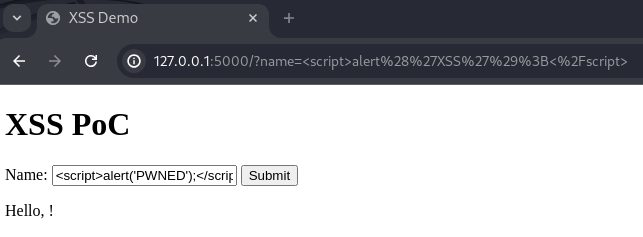
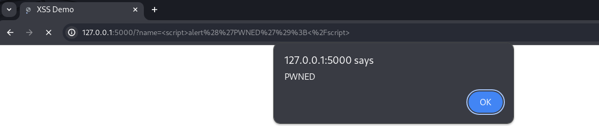

# XSS Vulnerable Web Application 

This project demonstrates a simple Python web application using Flask that is vulnerable to Cross-Site Scripting (XSS).  
The application accepts user input via a form and directly renders it on the web page without proper sanitization, making it vulnerable to XSS attacks.  

## Why It Is Vulnerable 

The vulnerability exists because the application directly inserts user input into the HTML content without escaping or sanitizing it.  
This allows an attacker to inject malicious JavaScript code, which is executed by the browser when the page is loaded.  


## Type of XSS 
This is an example of **Reflected XSS** .  
In reflected XSS, the malicious script is reflected off a web application to the victim's browser.  
It is delivered to the web application via a user input field, typically through an HTTP GET or POST request.  


## Steps to Launch the App and Test the Vulnerability 


1. **Set Up a Virtual Environment:** 

```sh
python -m venv venv
source venv/bin/activate  # On Windows, use `venv\Scripts\activate`
```
 
2. **Install Flask:** 

```sh
pip install Flask
```
 
3. **Run the Application:** 

```sh
python app.py
```
 
4. **Access the Application:** 
Open your web browser and navigate to `http://127.0.0.1:5000`.
 
5. **Test the Vulnerability:**  
  - Enter `<script>alert('WHATEVER YOU WANT');</script>` in the "Name" field.  

  - Click the "Submit" button.  

  - An alert box with the message "XSS" should appear, demonstrating the XSS vulnerability.  


  
 


## Explanation 

In `app.py`, the user input from the form is retrieved using `request.args.get('name', '')` and then directly rendered into the HTML content using the `render_template_string` function.  
The `| safe` filter is applied to the input, explicitly marking it as safe and preventing Flask from escaping it.  
This leads to the execution of the injected JavaScript code, making the application vulnerable to XSS attacks.


This PoC illustrates the dangers of reflected XSS and underscores the importance of proper input validation and sanitization in web applications.