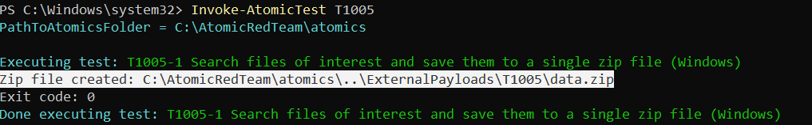
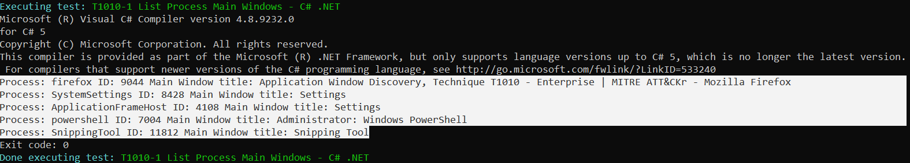
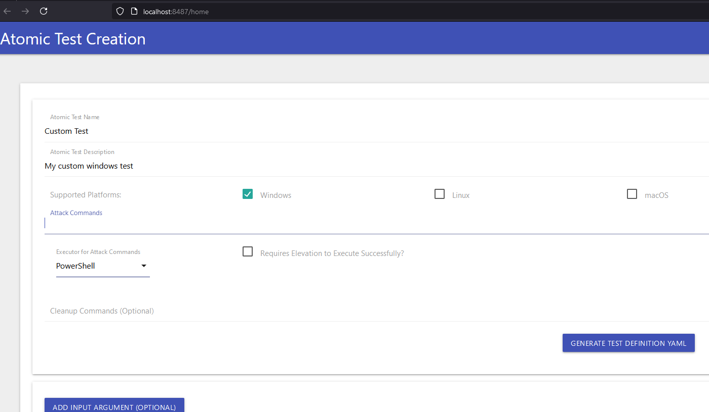

# WINDOWS OFFENSIVE SECURITY WITH ATOMIC RED TEAM

## Introduction

[*Atomic Red Team*](https://github.com/redcanaryco/atomic-red-team) is a framework designed for testing endpoint detection and response (EDR) solutions by simulating adversary behaviors in a controlled manner.  
Developed by Red Canary, it offers a library of small, highly targeted tests called "atomic tests" that mimic specific tactics, techniques, and procedures (TTPs) used by real attackers.  
These tests are mapped 1:1 to the [*MITRE ATT&CK framework*](https://attack.mitre.org/), which categorizes cyber threats based on observed adversary behaviors.  


## Instructions to test

⚠️**WARNING**: It is not recommended to run Atomic Red Team tests on production machines because some tests can be invasive and may compromise system integrity.  
It is advised to conduct these tests on laboratory machines instead.  

Open powershell as administrator.  
Disable defender:  
```sh
Set-MpPreference -DisableRealtimeMonitoring $true
```  

Note that the above only works on windows 10, on windows you you need to:  

1. Select Start and type "*Windows Security*".

1. Select the Windows Security app from the search results, go to Virus & threat protection, and under Virus & threat protection settings select Manage settings. 

1. Switch Real-time protection to Off.  
Note that scheduled scans will continue to run...however, files that are downloaded or installed will not be scanned until the next scheduled scan.  

Ignore security warning prompts:  
```sh
powershell -ExecutionPolicy bypass
```  

Download atomic red team:  
```sh
IEX (New-Object Net.WebClient).DownloadString('https://raw.githubusercontent.com/redcanaryco/invoke-atomicredteam/master/install-atomicredteam.ps1')
```  

Install atomic red team (type 'Y' if asked to install dependencies):  
```sh
 Install-AtomicRedTeam -getAtomics -Force
```  

Now Import the powershell module:  
```sh
Import-Module "C:\AtomicRedTeam\invoke-atomicredteam\Invoke-AtomicRedTeam.psd1" -Force
```  

Type the following command in order to learn how to use the tool:  
```sh
help Invoke-AtomicTest
```  

You can list the available atomic techniques.  
For example if we wanted to see if [T1040](https://attack.mitre.org/techniques/T1040/) (Network Sniffing) is available.
```sh
Invoke-AtomicTest T1040 -ShowDetails
```  

The output above gives us the attack commands that it’ll run as well as the clean up commands.
Some techniques will have a Dependencies section.  
In order to check with the pre-requisites are met, we can run the following command with the technique we want to use:   
```sh
Invoke-AtomicTest T#### -CheckPrereqs
```  

You can also try installing the test's prerequisitess with the `-GetPrereqs` switch:  
```sh
Invoke-AtomicTest T#### -GetPrereqs
```  


Now that you are familiar with the tool, try launching a test:  

```sh
Invoke-AtomicTest T1005
```  

  


The previous test search local system sources, such as file systems and configuration files or local databases, to find files of interest and sensitive data prior to Exfiltration.  

Now let's try another one tehcnique to get a listing of open application windows:  

```sh
Invoke-AtomicTest T1010
```  

  


You can also create your custom tests via the dashboard:
```sh
Start-AtomicGui
```  


You can also create your custom tests via the dashboard:
```sh
Start-AtomicGui
```  

  
