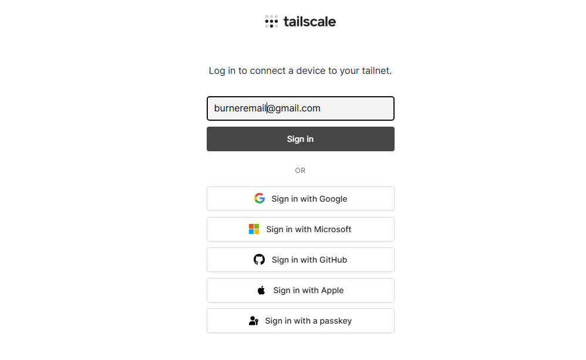
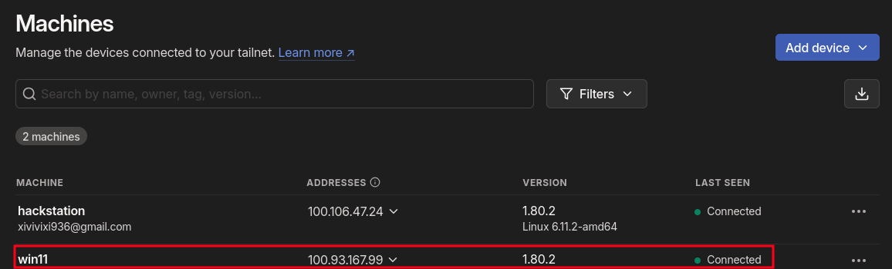
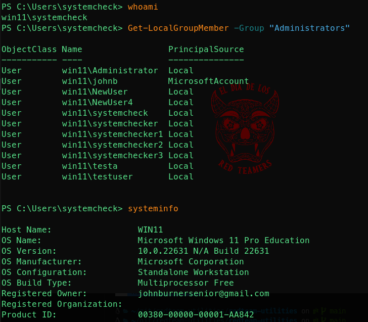

# WINDOWS PERSISTENCE VIA TAILSCALE & SSH

## Abstract  
This directory contains a post-exploitation powershell script to (semi)automate windows persistence via [*tailscale*](https://tailscale.com/) and ssh. 

## Prerequisites  
- a Tailscale account (create this with a burner gmail account)
- Administrator access on the target windows system
  
## Instructions  
On the target machine, copy and launch the `system.ps1` script via powershell.  
> [!NOTE]  
> You will need to enable powershell script execution with `Set-ExecutionPolicy -Scope Process -ExecutionPolicy Bypass`  

This script will:  
- create a new admin user (by default is called `systemcheck` and the password is `letmein`, you can change these in the script)  
- enable SSH  
- download tailscale and install it  

> [!NOTE]  
> As of right now, tailscale configuration on windows is not totally automated like on linux, you will need to login manually to your tailscale account after the installation:  
>   


By authenticating to tailscale on the target machine, you automatically add it to your tailnet:  
  

Now you can connect from your attacker machine via this command:  
```sh
ssh -o IdentitiesOnly=yes systemcheck@<your-target-ip-in-the-tailnet>
```  
  

Even once the target machine is rebooted, you will still maitain access thanks to tailscale.  


