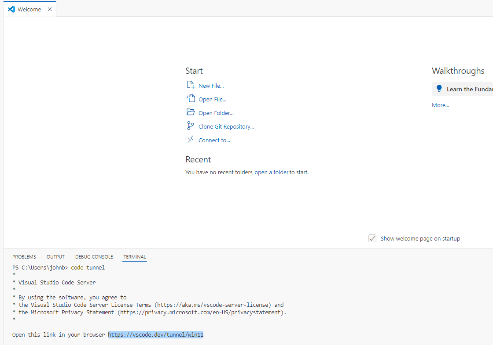
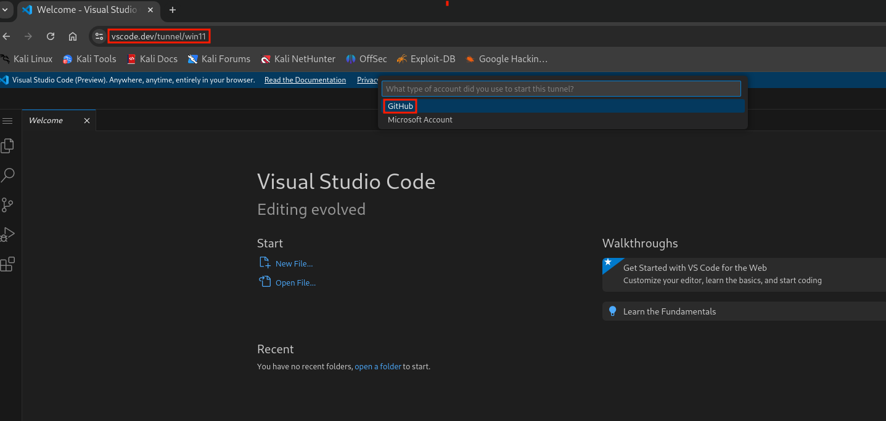
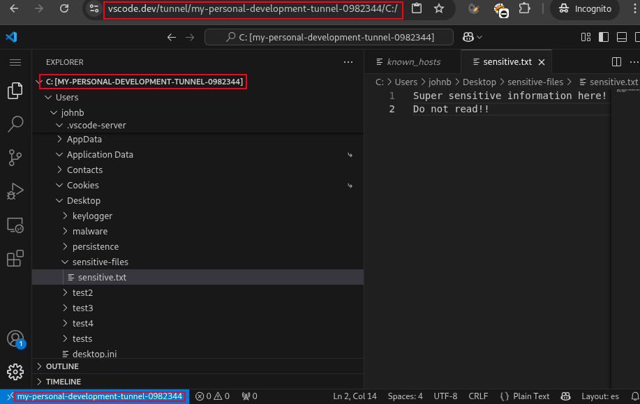

# Windows Persistence via VSCode Tunnels  

## Abstract  
Remote debuggers are not a new concept, but [*only recently*](https://www.bleepingcomputer.com/news/security/chinese-hackers-use-visual-studio-code-tunnels-for-remote-access/) have malicious actors started leveraging legitimate remote debugging tools as methods to maintain persistence on exploited systems.   

In particular, [*Visual Studio Code*](https://code.visualstudio.com/) has become one of the most commonly used tools for this purpose, thanks to its widespread adoption, simplicity, power, and extensive ecosystem of extensions.  

Moreover, VS Code is a Microsoft-signed, fully legitimate tool, which makes it ideal for evading detection and remaining under the radar.   

In this repository, we will showcase a simple Proof of Concept showing how a threat actor could use VS Code to maintain persistent access to a system.  

## Prerequisites
- Windows 11 machine (victim)
- Kali machine (attacker)
- Github account (for tunnel configuration)

## Guide  
Let's say you compromised a windows11 machine, now you need a way to maintain persistence to that machine.  
On the compromised machine download, configure and launch `VSCode portable` by following the documentation [*here*](https://code.visualstudio.com/docs/editor/portable).  

Open the vscode temrinal and type `code tunnel`:  
  

Copy the generated url (and the 8 digit code) and open it in the browser, follow the instructions to authenticate via Github.  
At the end of the authentication, a new url will be generated: this is your tunnel url!  

On the Attacker machine, open the tunnel url from the browser, this will open the web version of vscode.  
Select Github as authentication method and follow the instruction to authenticate with github:  
  

At this point you can open a folder on the victim machine and browse the files from the vscode UI or open a terminal on the compromised machine:  

  

As the last step, the attacker needs to automate the execution of vscode tunnel server on the victim machine, at startup.  

In order to do that, she can use tools like [*Windows Service Wrapper*](https://github.com/winsw/winsw).  

