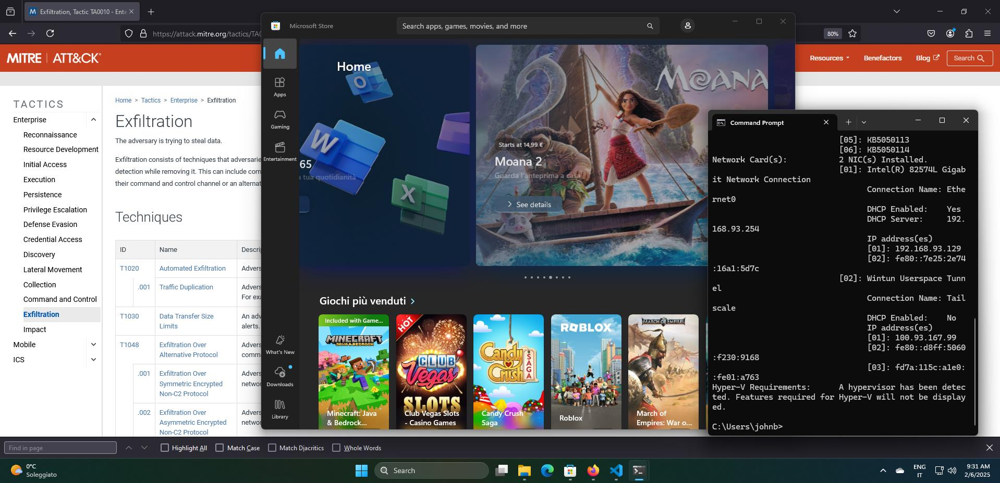

# Capturing and Streaming Screenshots from Windows using PowerShell

## Overview

This repository contains a PowerShell script (`checker.ps1`) that continuously captures screenshots from all connected screens on a Windows system and streams them to a remote HTTP server. The script is designed to work without requiring administrative privileges.

## How It Works

The script leverages the `.NET` framework to interact with screen properties and graphics. It captures screenshots, encodes them, and sends them to a remote server every 3 seconds.

### Key Features:

1. **Multi-Screen Support:** Captures screenshots from all connected screens.
2. **Streaming Mode:** Sends each screenshot immediately to a remote server instead of saving it locally.
3. **User & Host Identification:** Each screenshot is tagged with the current Windows username and hostname.
4. **Non-Blocking & Resilient:** If the server is unreachable, the script discards the screenshot and retries on the next cycle.
5. **No Admin Privileges Required:** Uses built-in environment variables for metadata without elevated permissions.

## PowerShell Script Details

### Steps:

1. **Retrieve All Screens:** The script detects all connected screens using `[System.Windows.Forms.Screen]::AllScreens`.
2. **Capture Screenshots:** It creates a bitmap for each screen, captures its content, and encodes it as a Base64 string.
3. **Attach Metadata:** The screenshot is sent along with the Windows username, hostname, and screen device name.
4. **Stream to Server:** The script sends the data via `Invoke-RestMethod` to a remote Flask server.
5. **Error Handling:** If the server is unreachable, the script simply moves on to the next screenshot.


## Running the Script

### Prerequisites:

- PowerShell (no admin privileges required)
- An active HTTP server to receive screenshots
  
> [!NOTE]  
> In powershell you need to enable script execution with `Set-ExecutionPolicy -Scope Process -ExecutionPolicy Bypass`  

### Running the Script:

1. Open PowerShell.
2. Navigate to the directory where `checker.ps1` is located.
3. Run the script: `.\checker.ps1`  
   
> [!TIP]  
> During a Pentest or Red teaming campaign, you want to set persistence for this script.  

## Server-Side Implementation

A Python Flask server (inside the `server` folder) is used to receive and store the screenshots.  
The server decodes the Base64-encoded images and saves them with filenames that include the username, hostname, and timestamp.  


### Running the Server:

1. Install dependencies:
   ```bash
   pip install flask
   ```
2. Start the server:
   ```bash
   python server.py
   ```  

Example of captured screenshot:  
  


## Notes

- Ensure the server URL in `checker.ps1` is correctly set.  
- The script will retry every 3 seconds and will not store images locally.
- If using a public-facing server, consider securing the endpoint with authentication.

This setup provides a lightweight, automated method to capture and stream screenshots from a Windows machine to a remote server in real time.
